# TizenRT for ARTIK05x

[](LICENSE)
[](https://github.com/SamsungARTIK/TizenRT/releases)
[](https://github.com/SamsungARTIK/TizenRT/releases)
[](https://travis-ci.org/SamsungARTIK/TizenRT)

lightweight RTOS-based platform to support low-end IoT devices.

This project is forking [TizenRT 1.0](https://github.com/Samsung/TizenRT) from [SamsungOpenSource](https://github.com/Samsung). It is intended to support ARTIK05x board stably.

# Samsung ARTIK™ 053/053s/055s

## Contents

> * Home
>   * [Overview](#overview)
>   * [ARTIK053](./build/configs/artik053/README.md)
>   * [ARTIK053s](./build/configs/artik053s/README.md)
>   * [ARTIK055s](./build/configs/artik055s/README.md)
> * Setup Environment
>   * [Ubuntu Development Setting](#ubuntu-development-setting)
>   * [Getting the toolchain](#getting-the-toolchain)
>   * [Set kconfig-frontends](#set-kconfig-frontends)
>   * [Getting the sources](#getting-the-sources)
>   * [On Chip Debugger installation](#on-chip-debugger-installation)
> * Development
>   * [Directory Structure about Source Code](#directory-structure-about-source-code)
>   * [Configuration Sets](#configuration-sets)
>   * [How to Build](#how-to-build)
>   * [How to program a binary](#how-to-program-a-binary)
>   * [How to clear flashed content on a board](#how-to-clear-flashed-content-on-a-board)
>   * [How to use JTAG equiqments](#how-to-use-jtag-equiqments)
>   * [GPIO Mapping](#gpio-mapping)
>   * [SERIAL Mapping](#serial-mapping)
>   * [How to enable Secure shell](#how-to-enable-secure-shell)
>   * [How to save/restore wifi info](#how-to-saverestore-wifi-info)
>   * [How to enable the ARTIK SDK](#how-to-enable-the-artik-sdk)
>   * [How to test OCF certification](#how-to-test-ocf-certification)
>   * [How to enable SLIP](#how-to-enable-slip)
>   * [Thumb Mode Build](#thumb-mode-build)
>   * [Crash Dump Analysis Tool](#crash-dump-analysis-tool)
>   * [ADB(Artik Debug Bridge)](#adbartik-debug-bridge)
> * Security
>   * [ARTIK certificate uuid](#artik-certificate-uuid)
>   * [ARTIK Secure Boot Guide](#artik-secure-boot-guide)
> * Deploy
>   * [Deploying TizenRT for ARTIK05x](#deploying-tizenrt-for-artik05x)
> * Support Tool
>   * [TRACE32](#trace32)
>   * [J-Link](#j-link)
> * ETC
>   * [Factory Reset](#factory-reset)
>   * [OTA](#ota)
>   * [Memory Map](#memory-map)
>   * [U-Boot for ARTIK05x](#u-boot-for-artik05x)
>   * [Configure USB Drivers](#configure-usb-drivers)
> * Support External Features
>   * [AWS IoT Embedded C SDK](./external/aws/README.md)
> * Training
>   * [Sign up for an ARTIK Cloud account](#sign-up-for-an-artik-cloud-account)
>   * [Onboard a device with the ARTIK mobile app](#onboard-a-device-with-the-artik-mobile-app)
>   * [Easily create a simple example](#easily-create-a-simple-example)

<!-- Home -->

## Overview

> * Homepage : https://www.artik.io/modules/artik-05x/

Wi-Fi®-based IoT module with built-in hardware security for single-function “things”.

ARTIK 05x series Smart IoT Modules bring Wi-Fi to things that need compactness and connectivity, but without sacrificing hardware-based security. ARTIK053s and ARTIK055s have built-in, enterprise-grade security for a strong root of trust with Samsung Public Key Infrastructure (PKI) and mutual authentication to ARTIK cloud services.

Each Samsung ARTIK IoT module is a true System on Module (SoM), with CPUs, networking, wireless radios, and full system software stack, all build onto a single, easy-to-integrate package.

The ARTIK 05x family runs Tizen RT, a platform that includes a compact RTOS with built-in TCP/IP stack and support for Lightweight Machine-to-machine (LWM2M) protocol. This also means you can develop for ARTIK 05x using free tools like ARTIK IDE, GCC C/C++ compilers, and OpenOCD.


#### Performance and flexibility

> * 32-bit ARM® Cortex® R4 @ 320MHz for applications
> * 29 dedicated GPIO ports, 2 SPI, 4 UART (2-pin), 4 ADC, 1 JTAG, 2 I2C
> * Input voltage: 3.3VDC (ARTIK055s), 5-12VDC (ARTIK053/053s)

#### Robust security (“s” versions)

> * Completely integrated security subsystem
> * Secure communication with unique, per-device key for authentication
> * Secure boot to make sure only authorized software can run
> * Secure storage protected by physically unclonable function (PUF)

#### Integrated and tested middleware

> * TizenRT with RTOS, Wi-Fi and networking middleware
> * API interface to simplify development process
> * LWM2M support for device management

#### Fully integrated with ARTIK IoT Platform and ARTIK cloud services

> * Mobile reference app to add modules to ARTIK cloud services easily
> * Manage devices, including OTA updates, with ARTIK cloud services

<!-- Setup Environment -->

## Ubuntu Development Setting

Install the most basic packages for using TizenRT.
```bash
$ sudo apt-get update
$ sudo apt-get upgrade
$ sudo apt-get install build-essential openocd git gcc-arm-none-eabi gdb-arm-none-eabi minicom
```

## Getting the toolchain

Get the build in binaries and libraries, [gcc-arm-none-eabi-4_9-2015q3-20150921-linux.tar.bz2](https://launchpad.net/gcc-arm-embedded/4.9/4.9-2015-q3-update/+download/gcc-arm-none-eabi-4_9-2015q3-20150921-linux.tar.bz2)

Untar the archive file.
```bash
$ mv gcc-arm-none-eabi-4_9-2015q3-20150921-linux.tar.bz2 /opt/.
$ cd /opt
$ tar -xvf gcc-arm-none-eabi-4_9-2015q3-20150921-linux.tar.bz2
$ tee -a ~/.bashrc << __EOF__

# cross compiler
export CROSS_COMPILE="/opt/gcc-arm-none-eabi-4_9-2015q3/bin"
export PATH="${CROSS_COMPILE}:${PATH}"

__EOF__

```

and export the path like.
```bash
export PATH=<Your Toolchain PATH>:$PATH
```

## Set kconfig-frontends

This package is used by the TizenRT to configure the build. You can change build environment, what is enabled as peripherals from the SoC and from the board.
```bash
$ sudo apt-get install gperf libncurses5-dev flex bison
$ git clone https://bitbucket.org/nuttx/tools.git tools
$ cd tools/kconfig-frontends
$ ./configure --enable-mconf --disable-gconf --disable-qconf --prefix=/usr
$ make
$ sudo make install
```

## Getting the sources

The main branch is `artik`.
```bash
$ git clone --recursive https://github.com/SamsungARTIK/TizenRT.git
$ cd TizenRT
```
Since then, `TizenRT` means the path where the source was cloned.

## On Chip Debugger installation

OpenOCD is used to program and debug.

OpenOCD v0.10.0 is recommended and can be installed like below, but pre-built OpenOCD binaray on `TizenRT/build/tools/openocd/linux64(or 32)` can be used without installing.
```bash
$ sudo apt-get build-dep openocd
$ git clone --depth 1 -b v0.10.0 https://git.code.sf.net/p/openocd/code openocd-code
$ cd openocd-code
$ ./bootstrap
$ ./configure
$ make
$ sudo make install
```

<!-- Development -->

## Directory Structure about Source Code

This project has the following directory structure.
```
    TizenRT
    ├── apps      : Application Directory
    ├── build     : Build Environment & Output
    ├── external  : External Application
    ├── framework : External APIs
    ├── lib       : Library (libc, libxx)
    ├── os        : Main Kernel & BSP(Build Support Package)
    └── tools     : Useful Tools
```

## Configuration Sets

To build a TizenRT application, use the default configuration files named `defconfig` under `TizenRT/build/configs/<board>/` folder.

After configuration, you can add/remove the configuration you want via menuconfig. If you want to run menuconfig, you need to install `kconfig-frontends`.
```bash
$ cd os
$ make menuconfig
```

#### nettest

This is the basic configuration of ARTIK05x products. You can set and build the following:
```bash
$ cd os
$ ./config.sh artik053/nettest
```

#### onboard

This is the configuration for the production phase of ARTIK05x product. When you download it to the board, the `artik_onboarding` app will start automatically when it boots.
```bash
$ cd os
$ ./config.sh artik053/onboard
```

## How to Build

Configure the build from `TizenRT/os/tools` directory
```bash
$ cd os
$ ./config.sh <board>/<configuration_set>
```
For list of boards and configuration set supported, refer belows.

Above copies the canned configuration-set for the particular board, into the `TizenRT/os` directory.

Configuration can be modified through make menuconfig from `TizenRT/os`.
```bash
$ cd os
$ make menuconfig
```

Finally, initiate build by make from `TizenRT/os`.
```bash
$ cd os
$ make
```

Built binaries are in `TizenRT/build/output/bin`.
```bash
$ cd build/output/bin
$ ls
System.map  tinyara  tinyara.bin  tinyara_head.bin  tinyara.map  tinyara_memstats.txt
```

## How to program a binary

After building TizenRT, follow below steps at `TizenRT/os` folder.

This makes complete set of binaries programmed. `make download`
In additional, the command 'make download' requires partition name which supports multiple parameter. The default is 'ALL'
```bash
$ cd os
$ make download
```

If you want to download only the necessary binaries, use `make download <partition_name ...>` as follows:
```bash
$ cd os
$ make download os
```
```bash
$ cd os
$ make download bl2
```
You can refer to the [partition_map.cfg](build/configs/artik05x/scripts/partition_map.cfg) file for the partition name.

## How to clear flashed content on a board

You can also delete the binaries on the board. You can clean the board with the following command. `make erase`
In additional, the command 'make erase' requires partition name which supports multiple parameter. The default is 'ALL'
```bash
$ cd os
$ make erase
```

You can also erase only specific areas.
```bash
$ cd os
$ make erase os
```

This is especially useful for refreshing the user area (smartfs area). `make erase <partition_name ...>`
```bash
$ cd os
$ make erase user
```

## How to use JTAG equiqments

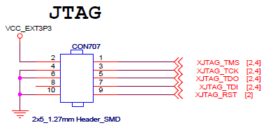

If you are using the Starter Kit, you can use the JTAG pin(CON707).


If you are using only the ARTIK05x module, you can connect it using the JTAG pin output from the module.

## GPIO Mapping

The GPIO PAD name on the schematic differs from the GPIO name of the device. Please refer to the table below.

|    XGPIO0   |    XGPIO1   |    XGPIO2   |    XGPIO3   |    XGPIO4   |    XGPIO5   |    XGPIO6   |    XGPIO7   |
|:-----------:|:-----------:|:-----------:|:-----------:|:-----------:|:-----------:|:-----------:|:-----------:|
| /dev/gpio29 | /dev/gpio30 | /dev/gpio31 | /dev/gpio32 | /dev/gpio33 | /dev/gpio34 | /dev/gpio35 | /dev/gpio36 |

|    XGPIO8   |    XGPIO9   |   XGPIO10   |   XGPIO11   |   XGPIO12   |   XGPIO13   |   XGPIO14   |   XGPIO15   |
|:-----------:|:-----------:|:-----------:|:-----------:|:-----------:|:-----------:|:-----------:|:-----------:|
| /dev/gpio37 | /dev/gpio38 | /dev/gpio39 | /dev/gpio40 | /dev/gpio41 | /dev/gpio42 | /dev/gpio43 | /dev/gpio44 |

|   XGPIO16   |   XGPIO17   |   XGPIO18   |   XGPIO19   |   XGPIO20   |   XGPIO21   |   XGPIO22   |   XGPIO23   |
|:-----------:|:-----------:|:-----------:|:-----------:|:-----------:|:-----------:|:-----------:|:-----------:|
| /dev/gpio45 | /dev/gpio46 | /dev/gpio47 | /dev/gpio48 | /dev/gpio49 | /dev/gpio50 | /dev/gpio51 | /dev/gpio52 |

|   XGPIO24   |   XGPIO25   |   XGPIO26   |   XGPIO27   |   XGPIO28   |    XEINT0   |    XEINT1   |    XEINT2   |
|:-----------:|:-----------:|:-----------:|:-----------:|:-----------:|:-----------:|:-----------:|:-----------:|
| /dev/gpio53 | /dev/gpio54 | /dev/gpio55 | /dev/gpio56 | /dev/gpio20 | /dev/gpio57 | /dev/gpio58 | /dev/gpio59 |

## SERIAL Mapping


You need the following settings in menuconfig.
> * Device Drivers > Serial Driver Support > Serial console

The mapping for the UART changes depending on the selection of the **serial console**. The default setting for the serial console is `UART4`. At this time, the device is set as follows.

|   XUART4   |   XUART0   |   XUART1   |   XUART2   |   XUART3   |
|:----------:|:----------:|:----------:|:----------:|:----------:|
| /dev/ttyS0 | /dev/ttyS1 | /dev/ttyS2 | /dev/ttyS3 | /dev/ttyS4 |

If you change the serial console to UART3, the mapping of the other device changes as follows.

|   XUART3   |   XUART0   |   XUART1   |   XUART2   |   XUART4   |
|:----------:|:----------:|:----------:|:----------:|:----------:|
| /dev/ttyS0 | /dev/ttyS1 | /dev/ttyS2 | /dev/ttyS3 | /dev/ttyS4 |

## How to enable Secure shell

After booting TizenRT, you can put the TASH shell invisible to the user. We call this "Secure Shell". If you want to use this feature, do the following in menuconfig.
> * Application Configuration > Enable Shell > Enable Secure shell

You can specify the password that the user must enter. Use `sha256sum` command to extract sha value as follows.
```bash
$ echo -n TizenRT | sha256sum
436890f31fcd6b154a0e49df9f190bd8b1dcd4b917a7a80b2d928452c22901f7
```

Enter the sha value extracted above from menuconfig.
> * Application Configuration > Enable Shell > SHA256 encrypted password

When you boot TizenRT, you must enter `TizenRT` to see the TASH shell.
```
PASSWORD>>*******              // TizenRT
TASH>>
```

## How to save/restore wifi info


Only in case that file system is available, it stores information as file `/mnt/wifi/slsiwifi.conf`. You need the following settings in menuconfig.
> * Application Configuration > Network Utilities > SLSI Wi-Fi API > Enable "Support filesystem"

NOTE: This feature is not available when onboard is enabled.

```
TASH>> wifi startsta
TASH>> wifi join <ssid> <key> <security>
TASH>>
TASH>> wifi saveconfig                        # save wifi information
TASH>> cat /mnt/wifi/slsiwifi.conf            # check wifi information
TASH>>
TASH>> reboot
TASH>>
TASH>> wifi startsta                          # restore wifi connect
TASH>>
```

NOTE: If there is **spaces** in your ssid, add quotes around ssid.
```
TASH>> wifi join "Test SSID" 1q2w3e4r wpa2_aes
```

## How to enable the ARTIK SDK


If you want to use the `ARTIK SDK`, you need the following settings in menuconfig.
> * External Functions > Enable "ARTIK SDK"
> * Save and exit
> * Launch the build

If you enable ARTIK SDK and then build it, it will automatically download the ARTIK SDK sources from github and build it. You do not need to download additional files.

In addition, to enable the `ARTIK SDK examples`, set the following in menuconfig:
> * Application Configuration > Examples > Enable "ARTIK SDK examples"
> * Press Enter then select all the examples you want to include in the image

## How to test OCF certification

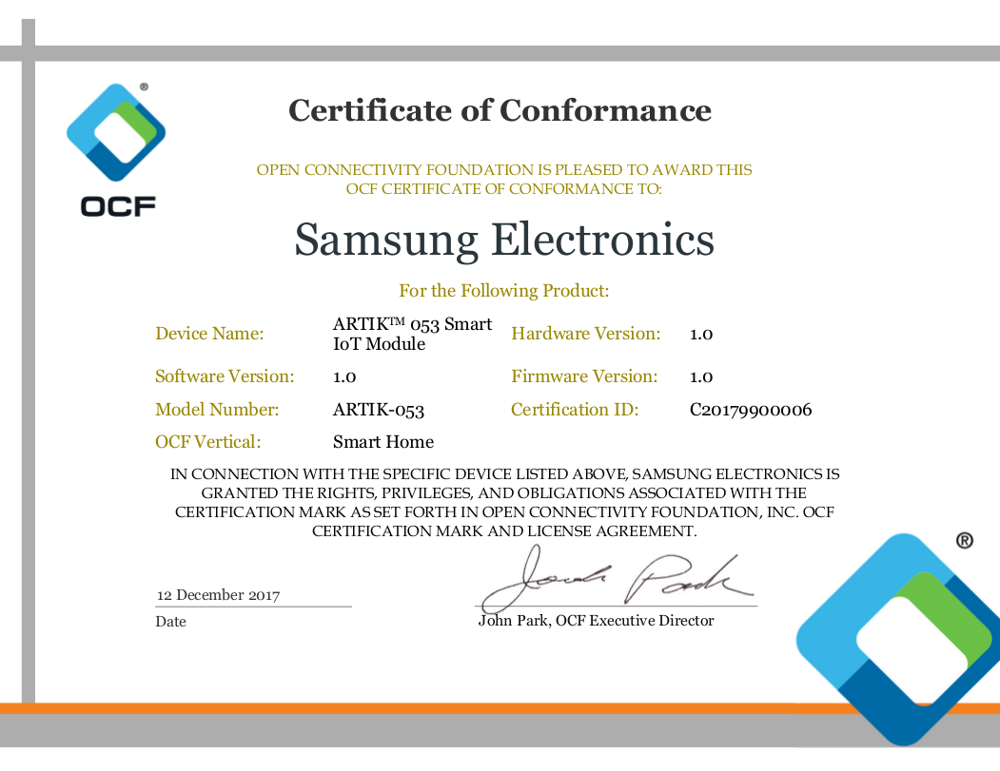

Samsung ARTIK05x becomes the first family of IoT systems-on-module to be certified under Open Connectivity Foundation 1.3 standards. If you want to test OCF certification, you need the following setting in menuconfig.


> * External Functions > IOTIVITY Config Parameters > Enable "enable / disable iotivity stack"
> * Check "iotivity stack version" value to `1.3-rel`
> * Change "Default pthread stack size for the receive-handler thread" value to `32768`
> * Enable "enable iotivity security"

* Iotivity uses `scons`. You have to install `scons` to compile Iotivity.
```bash
$ sudo apt-get install scons
```

For more information on OCF certification, click [here](https://openconnectivity.org/certified-product/artiktm-053-smart-iot-module).

## How to enable SLIP

ARTIK05x supports SLIP (Serial Line IP) interface. To test your SLIP interface, you need to make the following menuconfig changes:

> * Device Drivers > Network Device/PHY Support > Enable "SLIP (serial line) support"
> * Networking Support > LwIP options > Enable "Support serial line IP interface"

The following is the default setting of the ARTIK05x IP to "10.0.0.2". The Linux PC as the host is set to "10.0.0.1" as an example.

```
TASH>>ifconfig
sl2     Link encap: 00:00:00:00:00:00   RUNNING: DOWN   MTU: 1500
        inet addr: 10.0.0.2     Mask: 255.255.255.0

wl1     Link encap: 00:00:00:00:00:00   RUNNING: DOWN   MTU: 1500
        inet addr: 0.0.0.0      Mask: 255.255.255.255

lo0     Link encap: 00:00:00:00:00:00   RUNNING: DOWN   MTU: 0
        inet addr: 127.0.0.1    Mask: 255.0.0.0
        inet6 addr: ::1
```

A new device named `sl2` has been set up as above. It is set to use `/dev/ttyS4` device (default: XUART3) as SLIP. Connect LinuxPC and ARTIK05x with SLIP.

In the Starter Kit, pins 8 and 10 of CON704 are XUART3.

```
      5 |_|_|  6
      7 |_|_|  8 XUART3_RXD
      9 |_|_| 10 XUART3_TXD
     11 |_|_| 12
```

On a Linux PC, you can start SLIP with the `slattach` command.

```bash
$ sudo slattach -p slip -s 115200 -d -L /dev/ttyUSB2
slattach: tty_open: looking for lock
slattach: tty_open: trying to open /dev/ttyUSB2
slattach: tty_open: /dev/ttyUSB2 (fd=3) slattach: tty_set_speed: 115200
slattach: tty_set_databits: 8
slattach: tty_set_stopbits: 1
slattach: tty_set_parity: N
slip started on /dev/ttyUSB2 interface sl0
```

```bash
$ sudo ifconfig sl0 10.0.0.1/24 up
$ ifconfig
sl0       Link encap:Serial Line IP
          inet addr:10.0.0.1  P-t-P:10.0.0.1  Mask:255.255.255.0
          UP POINTOPOINT RUNNING NOARP MULTICAST  MTU:296  Metric:1
          RX packets:75 errors:0 dropped:0 overruns:0 frame:0
          TX packets:105 errors:0 dropped:0 overruns:0 carrier:0
          collisions:0 txqueuelen:10
          RX bytes:6060 (6.0 KB)  TX bytes:10052 (10.0 KB)
```

You will be able to test the SLIP interface with a simple `PING` test on Linux PC and ARTIK05x respectively.

```bash
$ ping 10.0.0.2
PING 10.0.0.2 (10.0.0.2) 56(84) bytes of data.
64 bytes from 10.0.0.2: icmp_seq=1 ttl=255 time=15.8 ms
64 bytes from 10.0.0.2: icmp_seq=2 ttl=255 time=15.5 ms
64 bytes from 10.0.0.2: icmp_seq=3 ttl=255 time=15.5 ms
64 bytes from 10.0.0.2: icmp_seq=4 ttl=255 time=15.5 ms
64 bytes from 10.0.0.2: icmp_seq=5 ttl=255 time=15.6 ms
64 bytes from 10.0.0.2: icmp_seq=6 ttl=255 time=15.5 ms
64 bytes from 10.0.0.2: icmp_seq=7 ttl=255 time=15.5 ms
64 bytes from 10.0.0.2: icmp_seq=8 ttl=255 time=15.5 ms
64 bytes from 10.0.0.2: icmp_seq=9 ttl=255 time=15.5 ms
64 bytes from 10.0.0.2: icmp_seq=10 ttl=255 time=15.5 ms
...
```

```
TASH>>ping 10.0.0.1
PING 10.0.0.1 (10.0.0.1) 32 bytes of data. count(10)
 40 bytes from 10.0.0.1: icmp_seq=1 ttl=255 time=10ms
 40 bytes from 10.0.0.1: icmp_seq=2 ttl=255 time=10ms
 40 bytes from 10.0.0.1: icmp_seq=3 ttl=255 time=10ms
 40 bytes from 10.0.0.1: icmp_seq=4 ttl=255 time=10ms
 40 bytes from 10.0.0.1: icmp_seq=5 ttl=255 time=10ms
 40 bytes from 10.0.0.1: icmp_seq=6 ttl=255 time=10ms
 40 bytes from 10.0.0.1: icmp_seq=7 ttl=255 time=10ms
 40 bytes from 10.0.0.1: icmp_seq=8 ttl=255 time=10ms
 40 bytes from 10.0.0.1: icmp_seq=9 ttl=255 time=10ms
 40 bytes from 10.0.0.1: icmp_seq=10 ttl=255 time=10ms
--- 10.0.0.1 ping statistics ---
10 packets transmitted, 10 received, 0% packet loss,
```

## Thumb Mode Build

"TizenRT for ARTIK" can build `THUMB` mode. This feature can reduce the binary size and improve performance. However, there is no guarantee that performance will increase as you expect for all features. If you want to know more about `THUMB` mode in contrast to `ARM` mode, check out the ARM documentation.

You can enable THUMB mode by setting it in menuconfig as follows.
> * Chip Selection > Enable "Thumb instruction set support"

## Crash Dump Analysis Tool

In your development with ARTIK05x, you may experience `CRASH`. You do not need to be embarrassed.
So we prepared you to do `RAMDUMP` and `DEBUGGING` in the following way.

To do RAMDUMP and DEBUGGING, you must first set it in menuconfig as follows.
> * Board Selection > Enable "Enable Board level logging of crash dumps"
> * Board Selection > ARTIK05X crash dump configuration > Enable All Items [Recommands]

#### Download dump file and paring

The following is a forced CRASH. (For Example)

```bash
$ make crashdump ota dump.bin
Open On-Chip Debugger 0.10.0-dirty (2017-09-02-08:32)
Licensed under GNU GPL v2
For bug reports, read
        http://openocd.org/doc/doxygen/bugs.html
adapter speed: 2000 kHz
Info : auto-selecting first available session transport "jtag". To override use 'transport select <transport>'.
force hard breakpoints
trst_and_srst separate srst_gates_jtag trst_push_pull srst_push_pull connect_deassert_srst
adapter_nsrst_assert_width: 50
adapter_nsrst_delay: 100
debug_level: 0
target halted in ARM state due to debug-request, current mode: Supervisor
cpsr: 0x200001d3 pc: 0x040239f8
D-Cache: disabled, I-Cache: enabled
Read OTA download to /TizenRT/build/configs/artik05x/../../output/bin/dump.bin
dumped 1572864 bytes in 29.090637s (52.800 KiB/s)

================fault information================
outfile : /TizenRT/build/configs/artik05x/../../output/bin/dump_info.txt
Dump Present Flag : 0x0000003e
DFAR : 0x00000000
DFSR : 0x00000000

================binary information================
outfile : /TizenRT/build/configs/artik05x/../../output/bin/dump_info.txt
commit : 51203fcf2c4c128baddcb57578d3fff5b3fd630f
build_time : 2018-03-08 14:36:13
file_name : http.c
line : 154

================register dump================
outfile : /TizenRT/build/configs/artik05x/../../output/bin/reg.cmm
R0 0x020264e8
R1 0x00000000
R2 0x80180000
R3 0x020264e8
R4 0x020264e8
R5 0x02021ae0
R6 0x020265e0
R7 0x0000009a
R8 0x041cb660
R9 0x020265c8
R10 0x0205eee0
R11 0x02063f68
R12 0x00000000
R13 0x02063ee8
R14 0x040c9748
PC 0x040c9558
SPSR 0x60000053
CPSR 0x60000053
R13_USR 0x4e820501
R14_USR 0x8005a402
R8_FIQ 0x05425598
R9_FIQ 0x2d02654f
R10_FIQ 0x80b68608
R11_FIQ 0x45605065
R12_FIQ 0x8883aa2f
R13_FIQ 0x0210ca72
R14_FIQ 0x0920bcc2
SPSR_FIQ 0x0800381c
R13_IRQ 0x02020400
R14_IRQ 0x600000d3
SPSR_IRQ 0x60000053
R13_ABT 0x2440042c
R14_ABT 0x00204806
SPSR_ABT 0x1402c058
R13_UND 0x500c1553
R14_UND 0xf9121008
SPSR_UND 0x8a0ae243

================stack dump================
outfile : /TizenRT/build/configs/artik05x/../../output/bin/dump_info.txt
0x020265c8 0x040c9938 0x041cb660 0x020265c8 0x0205eee0 0x02063f68 0x00000000 0x02063ee8
0x040c9748 0x040c9558 0x00000026 0x04160c94 0x00000001 0x00000007 0x00000001 0xffffffff
0xdeadbeef 0x00000010 0x00000000 0x00000000 0xdeadbe01 0x00000012 0x00000005 0x00000000
0x00000000 0x000186a0 0xc3c00210 0x0701a8c0 0x00000000 0x00000000 0x0000000a 0x00000008
0x00000007 0x00000000 0x00000013 0x00000012 0x00000014 0x00000015 0x00000016 0x00000017
0x00000018 0x00000019 0x0000001a 0x0000001b 0x0000001c 0x0000001d 0x0000001e 0x0000001f
0x00000020 0x00000021 0x00000022 0x00000023 0x00000024 0x00000025 0x0205d2a0 0x02055c50
0x0205d3c0 0x0205eee0 0x0205d3cc 0x00000000 0x00000000 0x00000000 0x00000000 0x041774d0
0x00000000 0x00000000 0x00000000 0x00000000 0x00000000 0x00000000

================task information================
outfile : /TizenRT/build/configs/artik05x/../../output/bin/dump_info.txt
 pid         name         sch_pri   bas_pri       state       errno    stk_size  stk_used
  0       Idle Task          0         0      ready to run     -22        0         0
  1         hpwork          224       224       wait_sig        4        2028      636
  2         lpwork          176       176       wait_sig        0        2028      596
  3      LWIP_TCP/IP        110       110       wait_sem        0        4068      940
  5          tash           125       125       wait_sem        0        4076      1628
  7     WPA Supplicant      100       100       wait_sem        0        4036      1748
  8   WLAN Driver mxmgmt    100       100       wait_sem        0        2044      220
  9   Wi-Fi API callback    100       100     wait_mq_emty      0        2044      772
 10  WPA Ctrl Iface FIFO    100       100       wait_sem        0        2044      532
 11   Wi-Fi API monitor     100       100       wait_sem        0        2044      556
 13  listening webserver    100       100        running        0        4092      876
 14     client handler      100       100     wait_mq_emty      0        8188      3260
 15  listening webserver    100       100       wait_sem        0        4092      732
 16     client handler      100       100     wait_mq_emty      0        4092      676

================ram dump data================
outfile : /TizenRT/build/configs/artik05x/../../output/bin/ramdump_0x02020400--0x215FFFF.bin

================make archive================
outfile : /TizenRT/build/configs/artik05x/../../output/bin/crash_dump.zip
include files :  ['tinyara', 'dump_info.txt', 'reg.cmm', 'ramdump_0x02020400--0x215FFFF.bin', 'System.map']
```

#### Install Trace32 Simulator

 * Download : simarm.zip from below website
   - http://www.lauterbach.com/frames.html?home.html
   - http://www.lauterbach.com/cgi-bin/download.pl?file=simarm.zip

#### Load dump file for Debugging

 * Extract the crash_dump.zip archive.

 * Run simarm\t32marm.exe

 * Load Register
   - Menu -> File -> Run Script... : Open "crash_dump\reg.cmm"

 * Load RAM data
```
B::d.load.binary  ramdump_0x02020400--0x215FFFF.bin  D:0x02020400--0x215FFFF /long /noclear
```
 * Load ELF
```
B::d.load.elf tinyara
```
 * If you cannot see full sources,
   - Menu -> View -> Symbols -> Symbols Tree View

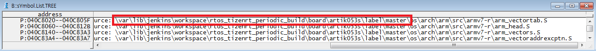
 * You can see the source path when compiling. Let's change this to a path on the PC that analyzes it. (sYmbol.SourcePATH.Translate <original path> <targetpc path>)
(For Example)
```
B::sYmbol.SourcePATH.Translate "\var\lib\jenkins\workspace\rtos_tizenrt_periodic_build\board\artik053s\label\master\" "Y:\data1\artik05x"
```

#### Analysis

You can see call stack : Menu -> View -> Stack frame with local

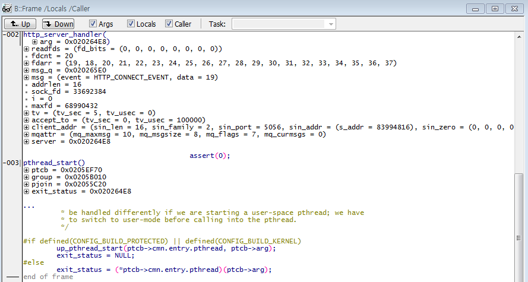

## ADB(Artik Debug Bridge)

ADB(Android Debug Bridge) is a command-line utility included with Google’s Android SDK. ADB can control your device over USB from a computer, copy files back and forth, install and uninstall apps, run shell commands, and more. Our ADB(Artik Debug Bridge) is compatible to original ADB(Android Debug Bridge) to communicate with a device on TizenRT.Unlike android, our ADB is only accessed by network connection. (Unfortunately our ARTIK05x doesn't have USB interface)

#### How adb works

Our artik05x series is adb device, can connect adb server over WIFI or SLIP(Serial Line IP). Basically Android ADB is normally working with USB interface, can notice device is being connected or not. But connection over WIFI can't notice device is connected or alive, That's why we should connect device by enforce. For more specific says, after artik05x has been booted, adb device is waiting for connection. And next, Linux, Win or MAC's adb clients can connect device over WIFI.

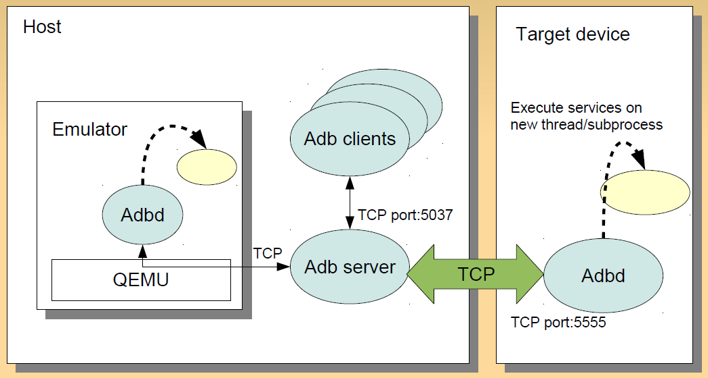

#### Build ADB

ADB is not enabled by default, you should enable feature. ADB server port is default port by android, if you change port, you should enter correct port number while connecting adb.

ADB shell stack size is related to executed command, if stack size is too short, it can be occurred stack overflow.

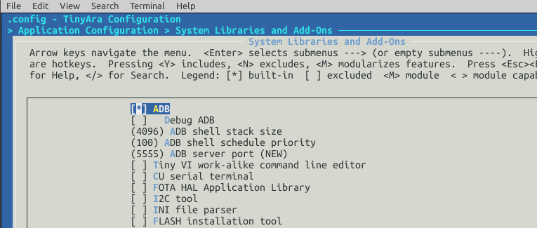

#### Connect to a device over Wi-Fi

Adb usually communicates with the device over USB, but Artik05x can't support USB interface, so you should use adb over Wi-Fi or SLIP.

 1. Set the target device to listen for a TCP/IP connection on port 5555.
```
TASH>> adb
```

 2. Connect to the device by its IP address. (If ADB port is 5555, port number can be passed)
```
TASH>> adb connect device_ip_address
```

 3. Confirm that your host computer is connected to the target device:
```bash
$ adb devices
List of devices attached
device_ip_address:5555 device
```

You're now good to go!

If the adb connection is ever lost:

 1. Make sure that your host is still connected to the same Wi-Fi network your Android device is.
 2. Reconnect by executing the adb connect step again.
 3. Or if that doesn't work, reset your adb host:
```bash
$ adb kill-server
```
or
```bash
$ adb disconnect
```
or
```bash
$ adb disconnect device_ip_address
```

Then start over from the beginning.

#### Query for devices

Before issuing adb commands, it is helpful to know what device instances are connected to the adb server. You can generate a list of attached devices using the devices command.
```bash
$ adb devices -l
```

In response, adb prints this status information for each device:

* Serial number: A string created by adb to uniquely identify the device by its port number. Here's an example ip address: 10.0.0.2:5555
* State: The connection state of the device can be one of the following:
  * offline: The device is not connected to adb or is not responding.
  * device: The device is now connected to the adb server. Note that this state does not imply that the Android system is fully booted and operational because the device connects to adb while the system is still booting. However, after boot-up, this is the normal operational state of an device.
  * no device: There is no device connected.
* Description: If you include the -l option, the devices command tells you what the device is. This information is helpful when you have multiple devices connected so that you can tell them apart.
The following example shows the `devices -l` command and its output.
```bash
$ adb devices -l
List of devices attached
10.0.0.2:5555          device product:ARTIK model:ARTIK053 device:1.0.11
```

#### Copy files to/from a device

Use the pull and push commands to copy files to and from an device. The pull and push commands let you copy arbitrary directories and files to any location in a device.

To copy a file or directory and its sub-directories from the device, do the following:
```bash
$ adb pull remote local
```

To copy a file or directory and its sub-directories to the device, do the following:
```bash
$ adb push local remote
```
Replace local and remote with the paths to the target files/directory on your development machine (local) and on the device (remote). For example:
```bash
# Host(foo.txt) → TizenRT(/mnt/foo.txt)
$ ls -al foo.txt
-rw-r--r-- 1 bt.cho bt.cho 26199  Mar 8 19:28 foo.txt

$ adb push foo.txt /mnt/foo.txt
9 KB/s (26199 bytes in 2.747s)

$ adb shell ls -l /mnt
/mnt:
 -rw-rw-rw-   26199 foo.txt

# TizenRT(/mnt/foo.txt) → Host(bar.txt)
$ adb pull /mnt/foo.txt bar.txt
200 KB/s (26199 bytes in 0.127s)

# Check file
$ diff foo.txt bar.txt
```

#### Issue shell commands

You can use the shell command to issue device commands through adb, with or without entering the adb remote shell on the device. To issue a single command without entering a remote shell, use the shell command like this:
```bash
# adb shell shell_command
$ adb shell ls
/:
 dev/
 mnt/
 proc/
 var/
$ adb shell cd mnt
$ adb shell ls
/mnt:
```

Or enter a remote shell on a device like this:
```bash
$ adb shell
TASH>> ls
/:
 dev/
 mnt/
 proc/
 var/
TASH>> cd proc
TASH>> ls
/proc:
 0/
 1/
 2/
 3/
 4/
 6/
 8/
 9/
 10/
 11/
 12/
 fs/
 mtd
 partitions
 uptime
 version
TASH>> cat version
 Board: ARTIK053
 Version: 1.0.11
 Commit Hash: 928ba17fd2f117bc3de307f43e608942a0dc41b8
 Build User: root@testbed
 Build Time: 2018-03-14 19:34:37
TASH>> exit
```
When you are ready to exit the remote shell, press Control + D or type exit.

#### Stop the adb server

In some cases, you might need to terminate the adb server process and then restart it to resolve the problem (e.g., if adb does not respond to a command).

To stop the adb server, use the adb kill-server command. You can then restart the server by issuing any other adb command.
```bash
$ adb kill-server
```

<!-- Security -->

## ARTIK certificate uuid

You can get ARTIK uuid using `get_artik_crt_uuid` api from injected ARTIK certificate.

Please refer to the following example code.
```c
unsigned char uuid[64] = { 0x00, };
unsigned int uuid_len = 0;

get_artik_crt_uuid(uuid, &uuid_len);
```
> uuid format: `01011707-2400-000a-3ce7-fd0a1708684e`

## ARTIK Secure Boot Guide

This guide introduces secure boot for `development` and `mass production stage`. First of all, if you are using ARTIK05xs(such as ARTIK053s, ARTIK055s) models, you need to read terms of use on below link before production.

(Link : https://www.artik.io)

Please access the link and sign-up.

### Secure Boot in development

Here is the secure boot chain.
```
+-------------------------+      +--------------------------------+      +--------------------------------+
|           bl1           |      |             u-boot             |      |            TizenRT             |
+-------------------------+ ===> +--------------------------------+ ===> +--------------------------------+
| Customer KMS public key |      |     Customer APP public key    |      |        Signature of above      |
|                         |      +--------------------------------+      | (Signed by customer's APP key) |
+-------------------------+      |       Signature of above       |      +--------------------------------+
                                 | (Signed by customer's KMS key) |
                                 +--------------------------------+
```

In development, below items are used.
> * bl1 image is default image
> * Customer's KMS Key is default key
> * Customer's APP Key is default key

When you build TizenRT of s-model series, build system will sign the fw files with default keys.

### Secure Boot in mass production stage

If you are in mass production stage, you need to change some items to your own.

(If you wonder the condition of mass production please contact "codesigner@artik.io". This is email of ARTIK support team.)

Here is the list you need to change.
> * bl1 image that includes your KMS public key
> * KMS key and public key from ARTIK KMS Server
> * APP key


#### KMS key

* Please access [link](https://developer.artik.io/documentation/advanced-concepts/secure-os/kms.html).
* Above link describes how to get account of KMS and generate KMS key.
* It also describes the process how to get bl1 image including your public key.

#### bl1 image

* This [link](https://developer.artik.io/documentation/advanced-concepts/secure-os/kms.html) also describes the process how to get bl1 image including your public key.
* To operate new bl1 image, please contact "codesigner@artik.io" to get efuse app and guide.
* Here is how to enable new bl1 image.
1. Copy received “tinyara_head.bin” into “TizenRT/build/output/bin”
2. Run below command in "TizenRT/os" to sign “tinyara_head.bin” and fuse it on your artik module.
```bash
$ make download os
```
3. After fusing please run commands as below.
```
TASH>>do_aes

Writing...
Read...
RData[3~0]:0x00000000,0x00000200,0x0000060c,0xeed68e13
DO_AES Write Ok

TASH>>wwkeysel 7

Writing...
Read...
RData[3~0]:0x00000000,0x00000207,0x0000060c,0xeed68e13
WW Key Write Ok
TASH>>
```

#### APP key

APP key is used for signing TizenRT os. Here is the process.

1. Run below commands to generate private key. This is a key for signing OS.
```bash
$ openssl genrsa -3 -out rsa_private.key 2048
```
2. Copy the private key into below path. From now on, if you build, OS will be signed with your private key. Please keep it safe.

> TizenRT/build/configs/artik05x/tools/codesigner/rsa_private.key

3. Run below command to extract public key from private key. You need to inject the public key into u-boot.
```bash
$ openssl rsa -in rsa_private.key -pubout > rsa_public.key
```
4. Compile u-boot.

> Reference: https://github.com/SamsungARTIK/u-boot-artik/tree/artik-05x

5. Inject public key into u-boot.
```bash
$ ./tools/attachns2-s.py ./u-boot.bin ./u-boot.head.bin ./rsa_public.key
```
6. Upload “u-boot.head.bin” onto KMS and sign.

> Reference: https://developer.artik.io/documentation/advanced-concepts/secure-os/kms.html

7. Download signed image and copy it into below path as named `bl2.bin`. From now on, if you use `make download` command, that `bl2.bin` will be used to fuse.

> TizenRT/build/configs/artik053s/bin/bl2.bin

8. Build as guided below.

> Reference: https://github.com/SamsungARTIK/TizenRT#how-to-build

<!-- Deploy -->

## Deploying TizenRT for ARTIK05x

You can use the following command to distribute the finished build.
```bash
$ cd os
$ make
$ make package
...
archive file creation is complete image : ...
```
This `make package` command includes the `OpenOCD` for downloading the program to ARTIK05x and the completed binary files. There are also batch and script files available for Windows and Ubuntu.
* For Windows: /user_binary/openocd/fusing_a05x.bat
* For Ubuntu:  /user_binary/openocd/fusing_a05x.sh

At the end of the command execution, a compressed file will be created. You can distribute it.

<!-- Support Tool -->

## TRACE32

Another advanced feature of Debugger for the embedded systems development world is the ability to load different target components, which implements the interface with target systems. The TRACE32 Development System is introduced in this document. The [TRACE32](http://www.lauterbach.com/bdmusb3.html) is a product from Lauterbach Datentechnik GmbH.

#### How to Connect TRACE32

This is how to connect with ARTIK05x Starter Kit using TRACE32. The following is a script for ATTACH used by TRACE32.

```cmm
// T32 Attach Script

SYStem.Option ResBreak OFF          ; Halt the core after reset
SYStem.Option WaitReset 100.ms      ; Wait with JTAG activities after deasserting reset
SYStem.Option EnReset OFF           ; Allow the debugger to drive nRESET (nSRST)
SYStem.Option IMASKASM ON           ; Disable interrupts while single stepping
SYStem.Option IMASKHLL ON           ; Disable interrupts while HLL single stepping
SYStem.JtagClock 5Mhz               ; Define JTAG frequency
SYStem.CPU CORTEXR4                 ; Select the used CPU

; Configure debugger according to target topology
SYStem.CONFIG.COREBASE 0x801E0000
SYStem.CONFIG AXIACCESSPORT 0.
SYStem.CONFIG DEBUGACCESSPORT 1.
SYStem.CONFIG MEMORYACCESSPORT 5.

; Establish the communication with the target
SYStem.Mode Attach

; Load the program
Data.LOAD.Elf "Z:\TizenRT\build\output\bin\tinyara" /NoCODE
```

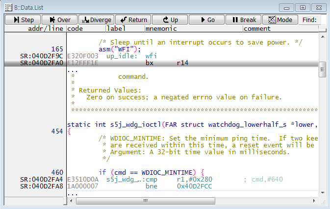

You can connect TRACE32 debug cable and ARTIK05x `CON707`. The following accessories are required.

 * JTAG (2x10 2.54mm) to SWD (2x5 1.27mm) Cable Adapter Board
 * 10-pin 2x5 Socket-Socket 1.27mm IDC (SWD) Cable

To make debugging easier, you can change the compilation options for TizenRT in menuconfig.
> * Build Setup > Optimization Level > Suppress Optimization

## J-Link

SEGGER [J-Links](https://www.segger.com/products/debug-probes/j-link/) are the most widely used line of debug probes available today. They've proven their worth for more than 10 years. This popularity stems from the unparalleled performance, extensive feature set, large number of supported CPUs, and compatibility with all popular development environments.

#### Download Ozone & SystemView Software

 * J-Link Software and Documentation Pack [J-link](https://www.segger.com/downloads/jlink/#J-LinkSoftwareAndDocumentationPack)
 * The J-Link Debugger [Ozone](https://www.segger.com/downloads/jlink/#Ozone)
 * Real-time Analysis and Visualization [SystemView](https://www.segger.com/downloads/jlink/#SystemView)

#### How to use Ozone

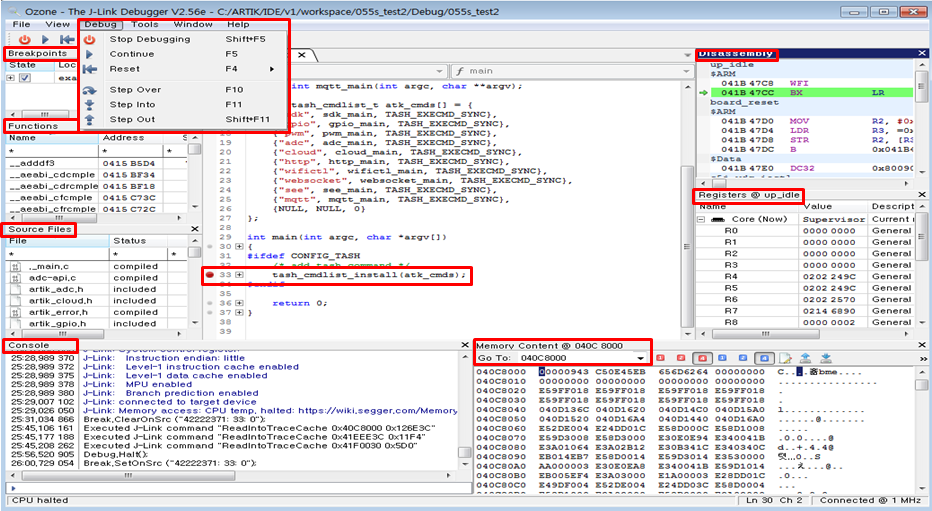

First, connect J-Link and ARTIK05X. To connect, a debug cable is required. The required cables are as follows.


 * JTAG (2x10 2.54mm) to SWD (2x5 1.27mm) Cable Adapter Board
 * 10-pin 2x5 Socket-Socket 1.27mm IDC (SWD) Cable

Then, run the Ozone program that you installed. Connect in the following order.
> * File > New > New Project Wizard
> * Target Device > Device > Select "ARTIK05X"

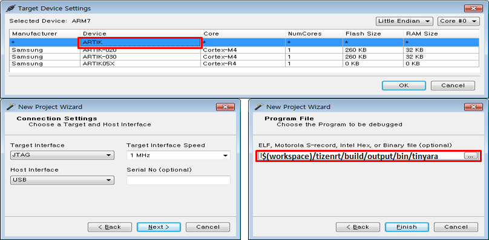

And attach it to the target module. If it is properly attached, you can check the console log.

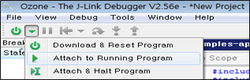

Sometimes Ozone does not find few file paths correctly. In the ozone program, press f1 to view the user manual pdf file. Refer to Section 6.4 for more precise routing.

We can debug using the Ozone, but can not fusing new TizenRT Binary. If you want to fuse binaries, please use an IDE or type “make download $(partition)” in Linux shell.

#### How to use SystemView

First, copy the support file so that SystemView can recognize TizenRT.
 * From TizenRT: $(TOPDIR)/external/sysview/SYSVIEW_TizenRT.txt
 * To SystemView: C:\Program Files (x86)\SEGGER\SystemView_V252a\Description

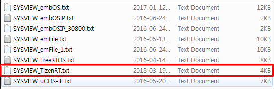

You enable SystemView in menuconfig in the following order:
> * External Functions > Select "SystemView"
> * Chip Selection > S5J Peripheral Support > Enable "TIMER2"

You can choose your preferences in SystemView.

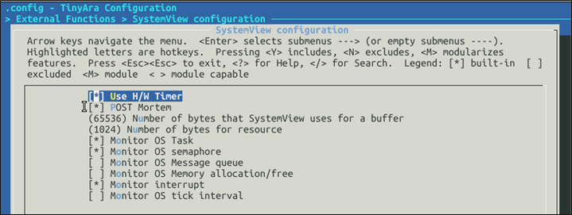

ARTIK05x now supports Single-Shot Recording only. SEGGER will support Continuous Recording in April 2018.

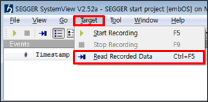
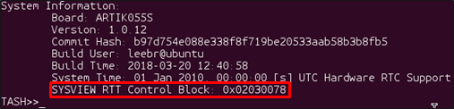
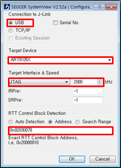

Enter the RTT address value to be output at boot time.

If the connection is successful, you can check it using the SystemView tool as follows.

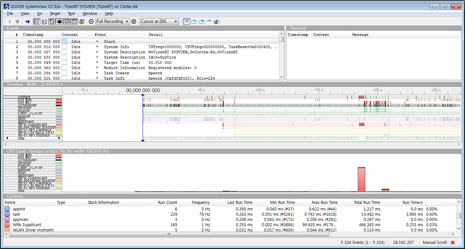

<!-- ETC -->

## Factory Reset

If you can not boot normally, you can change os to the initial version. This is possible if there is an initialization binary in memory.

#### How to Download the Initialization Binaries

You compress the compiled firmware and download it to the board.

```bash
$ cd os
$ make image factory
```
```bash
$ cd os
$ make download factory
```

#### How to enter initialization mode

When you press the RESET button (SW700) to reboot the Starter Kit, press and hold the `ARDUINO RESET` button (SW701) for 10 seconds. Enter initialization mode as follows.

#### Factory Reset Log
```
.....
Factory reset.
Erasing boot partitions...
....................................e
Erased 600 sectors
Flashing factory image...
Uncompressed size: 1258496 = 0x133400
resetting ...
.....
```

## OTA

You can use the OTA feature when updating the OS binaries externally.

#### How to create an OTA binary

Compress the compiled firmware and add the CRC information for the OTA.

```bash
$ cd os
$ make image ota
```

#### How to fusing OTA binary

##### using `UART`

```bash
$ cd os
$ make download ota
```

##### using `YMODEM` (in U-BOOT using Minicom)

```
U-BOOT > erase 0x044A0000 +0x15E000               # erase ota area
Erased 350 sectors
U-BOOT > loady 0x044A0000                         # load ymodem
## Ready for binary (ymodem) download to 0x044A0000 at 115200 bps...
                                                  # ctrl-A Z S ymodem
xyzModem - Cksum mode, 4728(SOH)/0(STX)/0(CAN) packets, 17 retries
## Total Size      = 0x00093ad1 = 604881 Bytes
U-BOOT > reset                                    # reboot
```

##### using `HTTP` (own webserver)

You need the following settings in menuconfig.
> * Application Configuration > Examples > OTA downloader

```
TASH>> ota http://192.168.1.10/ota.bin /dev/mtdblock7
TASH>> reboot
```

##### using `ARTIK CLOUD`

1) Prepare a device type in ARTIK Cloud

Log into ARTIK Cloud and go to the developer portal. Under the **Device Types section**, create a new device type (or reuse an existing one) that will be used for testing Device Management and OTA from a device manufacturer's point of view. Make sure the device type has properties enabled by clicking the **Device Management** tab of the device type.

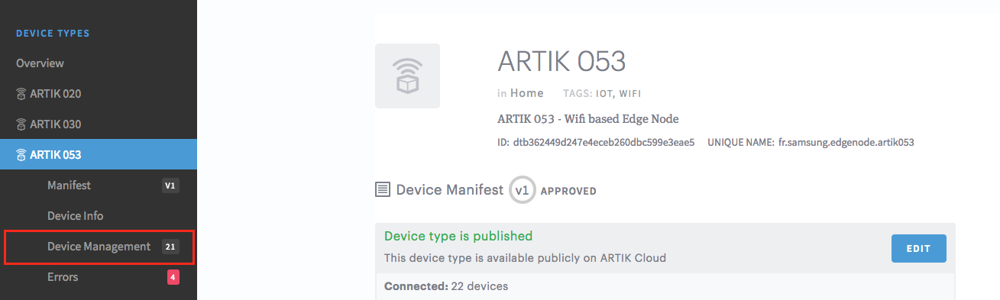

2) Configure the board

In order for the services running on the A05x to be properly configured to connect to ARTIK Cloud, a few parameters need to be changed. This needs to be done only once as parameters will be stored and reused across reboots. Type the commands below to specify the ARTIK Cloud Device Type ID that you chose for the device (the one that has properties enabled), then configure the address of a NTP server that operates well in your region.
```
TASH>> onboard dtid <device type ID>
TASH>> onboard ntp <NTP server address>
TASH>> onboard config
```

3) Onboard the board to ARTIK Cloud

Use a mobile application (available on iOS and Android) to onboard the device to ARTIK Cloud, scan its QR code then follow the instructions until the device is properly created in ARTIK Cloud. After onboarding, the board should successfully connect to ARTIK Cloud.

4) Upload the package to ARTIK Cloud

In ARTIK Cloud's developer portal, go to the Device Management tab of the relevant device type, then click the **OTA Updates** subtab, then click the **Upload new image** button.


5) Trigger the update

Go to ARTIK Cloud's developer portal, and browse to the device type's **Device Management** pane. In the devices list, identify the currently connected board by its device ID.

Check the device (or devices) you want to update, click **Execute** then **OTA update**.

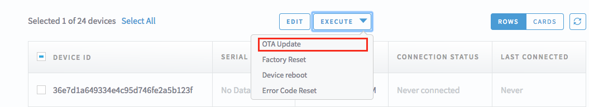

In the next window, you can select a date to schedule the update, or leave empty to launch the update right now. Click **Perform OTA Update** when ready.

#### OTA Log
```
CRC32 for 044a1000 ... 0453a3a8 ==> 3cf5a5b1
Found an update image downloaded.
....................................e
Erased 600 sectors
Updating boot partition...
Uncompressed size: 1256448 = 0x132C00
....................................e
Erased 384 sectors
Done
resetting ...
```

## Memory Map

8MB is allocated to the SPI Flash area. 1280 KB is prepared for operation in SRAM.

#### Physical Address Space

The following is the memory map of ARTIK05x.
```
             ADDRESS      CONTENTS       NOTE
           0xFFFFFFFF +---------------+
                      |  iRAM mirror  |
                      |    (64KB)     |
           0xFFFF0000 +---------------+
           0x8FFFFFFF +---------------+
                      |  SFR REGION   | Peripheral Area. (CR4) strongly-ordered
                      |    (256MB)    | (s5j_memorymap.h)
           0x80000000 +---------------+
           0x60FFFFFF +---------------+
                      |  NOR FLASH    | SFLASH Mirror area to be read only
                      |    mirror     |
                      |    (16MB)     |
           0x60000000 +---------------+
           0x04FFFFFF +---------------+
                      |  NOR FLASH    | FLASH area, default to set WBWA
                      |    (16MB)     |
                      |               |
           0x04000000 +---------------+
           0x0231FFFF +---------------+
                      |  iRAM shared  |
                      |    (128KB)    |
           0x02300000 +---------------+
           0x0215FFFF +---------------+
                      |     iRAM      |
                      |   (1280KB)    |
           0x02020000 +---------------+
           0x0000FFFF +---------------+
                      |     iROM      |
                      |    (64KB)     |
           0x00000000 +---------------+
```

#### Flash Partitions (8MB)

8MB is allocated to the SPI Flash area. After building TizenRT, refer to the following areas when downloading to the board.
```
             ADDRESS      CONTENTS       NOTE
           0x047FFFFF +---------------+
                      |    SSS R/W    | Secure Storage R/W
                      |    (512KB)    | (This area is only used in the Secure models.)
                      |               |
           0x04780000 +---------------+
                      |  WiFi NVRAM   | WiFi RAM
                      |     (8KB)     |
           0x0477E000 +---------------+
                      |   User R/W    | SmartFS
                      |    (1400KB)   |
                      |               |
           0x04620000 +---------------+
                      |  OTA download | OTA image
                      |    (1536KB)   | $ make image ota
                      |               | (build/configs/artik053/bin/ota.bin)
           0x044A0000 +---------------+
                      | Factory Reset | Factory Reset OS image
                      |    (1536KB)   | $ make image factory
                      |               | (build/configs/artik053/bin/factory.bin)
           0x04320000 +---------------+
                      |    OS AREA    | TizenRT
                      |   (TizenRT)   | (build/output/bin/tinyara_head.bin)
                      |    (2400KB)   |
                      |               |
                      |               |
                      |               |
                      |               |
                      |               |
                      |               |
           0x040C8000 +---------------+
                      |   WiFi F/W    | WiFi Firmware
                      |    (512KB)    | (build/configs/artik053/bin/wlanfw.bin)
                      |               |
           0x04048000 +---------------+
                      |    SSS F/W    | Secure Firmware
                      |     (32KB)    | (build/configs/artik053/bin/sssfw.bin)
           0x04040000 +---------------+
                      |      BL2      | 2nd stage bootloader
                      |    (192KB)    | (build/configs/artik053/bin/bl2.bin)
           0x04010000 +---------------+
                      |    SSS R/O    | Secure Storage R/O
                      |     (48KB)    |
           0x04004000 +---------------+
                      |      BL1      | 1st stage bootloader
                      |     (16KB)    | (build/configs/artik053/bin/bl1.bin)
           0x04000000 +---------------+
```

#### iRAM usage (1280KB)

Actually, BL1, OS and WiFi firmware are operated in iRAM.
```
                 **Before OS Boot**                           **After OS Boot**

        ADDRESS      CONTENTS                        ADDRESS      CONTENTS
      0x02160000 +---------------+                 0x02160000 +---------------+
                 |      BL2      |                            |     WiFi      |
                 |  Code & Data  |                            |    (320KB)    |
                 |    (1266KB)   |                            |               |
                 |               |                            |               |
                 |               |                            |               |
                 |               |                 0x02110000 +---------------+
                 |               |                            |   User Data   |
                 |               |                            |     (OS)      |
                 |               |                            |    (959KB)    |
                 |               |                            |               |
                 |               |                            |               |
                 |               |                            |               |
                 |               |        =>                  |               |
                 |               |        =>                  |               |
                 |               |                            |               |
                 |               |                            |               |
                 |               |                            |               |
      0x02023800 +---------------+                            |               |
                 |      BL1      |                            |               |
                 |     (8KB)     |                            |               |
      0x02021800 +---------------+                            |               |
                 |   Reserved    |                            |               |
                 |     (2KB)     |                            |               |
      0x02021000 +---------------+                 0x02020400 +---------------+
                 |  Vector Table |                            |  Vector Table |
                 |     (4KB)     |                            |     (1KB)     |
      0x02020000 +---------------+                 0x02020000 +---------------+
```

## U-Boot for ARTIK05x

* You can refer to the following [link](https://github.com/SamsungARTIK/u-boot-artik/blob/artik-05x/README.md).
```bash
git clone --depth=50 --branch=artik-05x https://github.com/SamsungARTIK/u-boot-artik.git
```

## Configure USB Drivers

Install and configure USB drivers, so OpenOCD is able to communicate with JTAG interface on ARTIK05x board as well as with UART interface used to upload application for flash. Follow steps below specific to your operating system.

#### Windows

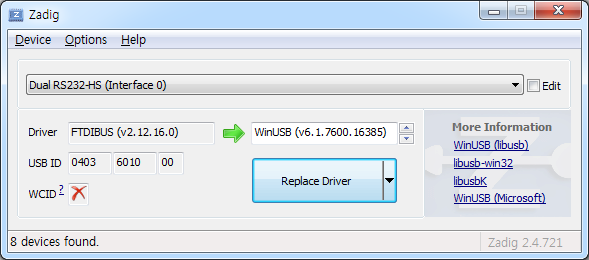

 * Using standard micro USB B cable connect ARTIK05x Starter Kit to the computer.
 * Wait until ARTIK05x Board is recognized by Windows and drives are installed. If it do not install automatically, then then download Zadig tool (Zadig_X.X.exe) from http://zadig.akeo.ie/ and run it.
 * In Zadig tool go to "Options" and check "List All Devices".
 * Check the list of devices that should contain two ARTIK05x specific USB entries: "Dual RS232-HS (Interface 0)" and "Dual RS232-HS (Interface 1)". The driver name would be "FTDIBUS (vxxxx)" and USB ID: 0403 6010.

#### Linux

 * Using standard micro USB B cable connect ARTIK05x Starter Kit to the computer.
 * Open a terminal, enter `ls -l /dev/ttyUSB*` command and check, if board's USB ports are recognized by the OS. You are looking for similar result:

```bash
$ ls -l /dev/ttyUSB*
crw-rw---- 1 root dialout 188, 0 Oct 25 13:42 /dev/ttyUSB0
crw-rw---- 1 root dialout 188, 1 Oct 25 13:42 /dev/ttyUSB1
```

 * The `/dev/ttyUSBn` interface with lower number is used for JTAG communication. The other interface is routed to ARTIK05x's serial port (UART) used for upload of application to ARTIK05x's flash.

<!-- Training -->

## Sign up for an ARTIK Cloud account

[](https://youtu.be/yPqhjR3orrI?t=0s "Sign up for an ARTIK Cloud account")

In this ARTIK training video, we show how to sign up for an ARTIK Cloud account. This is a prerequisite for any activities involving ARTIK Cloud.

## Onboard a device with the ARTIK mobile app

[](https://youtu.be/7F0EUays2hE?t=0s "Onboard a device with the ARTIK mobile app")

In this ARTIK training video, we show how to connect your ARTIK053 developer kit to ARTIK Cloud using the ARTIK mobile app. We call this "onboarding".

## Easily create a simple example

You can quickly and easily create a templete of examples. We prepared `mksampleapp.sh`.
```bash
$ cd apps/tools
$ sh mksampleapp.sh awesome_test
$ cd ../examples/awesome_test
```
Enjoy!
