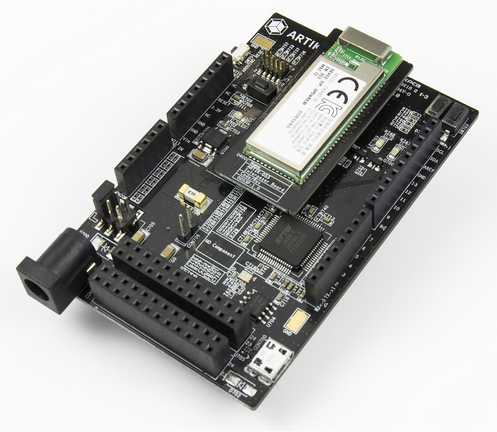

# ARTIK053s



The ARTIK053s is a SOC for Wi-Fi™ IoT solutions. The ARTIK053s has a Wi-Fi subsystem, security subsystem, and application subsystem.

## Information

The Samsung ARTIK™ 053s Module is a highly integrated module for secure Internet of Things (IoT) devices that require Wi-Fi®. It is based on an ARM® Cortex® R4 core with on-chip memories, a complete 2.4GHz Wi-Fi® Phy, MAC layer processing, a large complement of standard digital buses, a PUF-based security system and power management. The module is packaged with additional external Flash memory, a hardware Secure Element and a single integrated 2.4GHz structural antenna.
Aimed especially at power-sensitive devices needing Wi-Fi®, the ARTIK053s Module provides excellent performance in a variety of environments, with a feature set tailored specifically for IoT end nodes.

### ARTIK053s Starter Kit PinOut
#### CON710 CON711 CON708 CON709
```
                 XGPIO13(gpio42) <- SW702 | SW703 -> XGPIO15(gpio44)
                XGPIO16(gpio45) <- LED703 | LED702 -> XGPIO20(gpio49)
                                             [CON708]
                           |           |     * -> XI2C0_SCL
                           |           |     * -> XI2C0_SDA
                           |           |     * -> AREF
              [CON710]     |           |     * -> GND
               NC <- *     |           |    13 -> XSPI1_CLK
               NC <- *     |           |    12 -> XSPI1_MISO
            RESET <- *     |           |    11 -> XSPI1_MOSI
             3.3V <- *     | ARTIK053s |    10 -> XSPI1_CSN
               NC <- *     |           |     9 -> XPWMTOUT_4
              GND <- *     |           |     8 -> XGPIO21(gpio50)
              GND <- *     |           |     [CON709]
              Vin <- *     |           |     7 -> XGPIO19(gpio48)
              [CON711]     |           |     6 -> XPWMTOUT_2
            XADC0 <- A0    +-----------+     5 -> XPWMTOUT_1
            XADC1 <- A1                      4 -> XGPIO18(gpio47)
            XADC2 <- A2                      3 -> XPWMTOUT_0
            XADC3 <- A3                      2 -> XGPIO17(gpio46)
            XADC4 <- A4                      1 -> XUART0_TX
            XADC5 <- A5                      0 -> XUART0_RX

                 [CON703]
                 2  4  6  8 10 12 14 16 18 20 22 24
                 1  3  5  7  9 11 13 15 17 19 21 23
                 [CON704]
                 2  4  6  8 10 12 14 16 18 20 22 24
                 1  3  5  7  9 11 13 15 17 19 21 23
```
#### CON703
```
                              GND  VCC_EXT3P3
                     XI2C1_SDA  |  |  XSPI0_CLK
                  XI2C1_SCL  |  |  |  |  XSPI0_CSN
                   XADC7  |  |  |  |  |  |  XSPI0_MISO
                XADC6  |  |  |  |  |  |  |  |  XSPI0_MOSI
        VCC_EXT3P3  |  |  |  |  |  |  |  |  |  |  GND
                 |  |  |  |  |  |  |  |  |  |  |  |
                 2  4  6  8 10 12 14 16 18 20 22 24
                 1  3  5  7  9 11 13 15 17 19 21 23
                 |  |  |  |  |  |  |  |  |  |  |  |
        XPWMTOUT_1  |  |  |  |  |  |  |  |  |  |  XEINT0(gpio57)
           XPWMTOUT_2  |  |  |  |  |  |  |  |  XGPIO22(gpio51)
              XPWMTOUT_3  |  |  |  |  |  |  XGPIO23(gpio52)
                 XPWMTOUT_0  |  |  |  |  XGPIO24(gpio53)
                    XUART1_RXD  |  |  XGPIO25(gpio54)
                       XUART1_TXD  XGPIO26(gpio55)
```
#### CON704
```
                              GND  VCC_EXT3P3
                    XUART3_TXD  |  |  XGPIO4(gpio33)/XSPI2_CLK
                 XUART3_RXD  |  |  |  |  XGPIO5(gpio34)/XSPI2_CSN
              XUART2_TXD  |  |  |  |  |  |  XGPIO6(gpio35)/XSPI2_MISO
           XUART2_RXD  |  |  |  |  |  |  |  |  XGPIO7(gpio36)/XSPI2_MOSI
        VCC_EXT3P3  |  |  |  |  |  |  |  |  |  |  GND
                 |  |  |  |  |  |  |  |  |  |  |  |
                 2  4  6  8 10 12 14 16 18 20 22 24
                 1  3  5  7  9 11 13 15 17 19 21 23
                 |  |  |  |  |  |  |  |  |  |  |  |
        XPWMTOUT_4  |  |  |  |  |  |  |  |  |  |  XGPIO3(gpio32)
           XPWMTOUT_5  |  |  |  |  |  |  |  |  XGPIO1(gpio30)
          XEINT2(gpio59)  |  |  |  |  |  |  XGPIO2(gpio31)
             XEINT1(gpio58)  |  |  |  |  XGPIO8(gpio37)
               XGPIO12(gpio41)  |  |  XGPIO11(gpio40)
                  XGPIO10(gpio39)  XGPIO9(gpio38)
```

## How to Build

This guide is a summary. For more information, please see [here](../artik05x/README.md#how-to-build).
```bash
$ git clone https://github.com/SamsungARTIK/TizenRT.git
$ cd TizenRT
$ cd os/tools
$ ./configure.sh artik053s/nettest
$ cd ..
$ make
```
```bash
$ make download ALL
```
