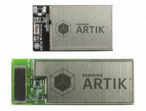
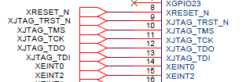
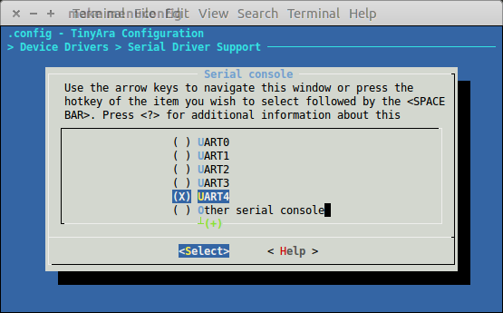
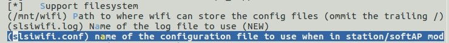
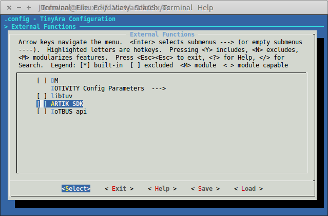
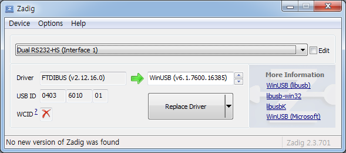

# Samsung ARTIK™ 053/053s/055s

## Contents

> * Home
>   * [Overview](#overview)
>   * [ARTIK053](../artik053/README.md)
>   * [ARTIK053s](../artik053s/README.md)
>   * [ARTIK055s](../artik055s/README.md)
> * Setup Environment
>   * [Ubuntu Development Setting](#ubuntu-development-setting)
>   * [Getting the toolchain](#getting-the-toolchain)
>   * [Set kconfig-frontends](#set-kconfig-frontends)
>   * [Getting the sources](#getting-the-sources)
>   * [On Chip Debugger installation](#on-chip-debugger-installation)
> * Development
>   * [Configuration Sets](#configuration-sets)
>   * [How to Build](#how-to-build)
>   * [How to program a binary](#how-to-program-a-binary)
>   * [How to clear flashed content on a board](#how-to-clear-flashed-content-on-a-board)
>   * [How to use JTAG equiqments](#how-to-use-jtag-equiqments)
>   * [GPIO Mapping](#gpio-mapping)
>   * [SERIAL Mapping](#serial-mapping)
>   * [How to save/restore wifi info](#how-to-saverestore-wifi-info)
>   * [How to enable the ARTIK SDK](#how-to-enable-the-artik-sdk)
> * ETC
>   * [Factory Reset](#factory-reset)
>   * [OTA](#ota)
>   * [Memory Map](#memory-map)
>   * [U-Boot for ARTIK05x](#u-boot-for-artik05x)
>   * [Configure USB Drivers](#configure-usb-drivers)
> * Training
>   * [Sign up for an ARTIK Cloud account](#sign-up-for-an-artik-cloud-account)
>   * [Onboard a device with the ARTIK mobile app](#onboard-a-device-with-the-artik-mobile-app)
>   * [Easily create a simple example](#easily-create-a-simple-example)

<!-- Home -->

## Overview

* Homepage : https://www.artik.io/modules/artik-05x/

Wi-Fi®-based IoT module with built-in hardware security for single-function “things”.

ARTIK 05x series Smart IoT Modules bring Wi-Fi to things that need compactness and connectivity, but without sacrificing hardware-based security. ARTIK053s and ARTIK055s have built-in, enterprise-grade security for a strong root of trust with Samsung Public Key Infrastructure (PKI) and mutual authentication to ARTIK cloud services.

Each Samsung ARTIK IoT module is a true System on Module (SoM), with CPUs, networking, wireless radios, and full system software stack, all build onto a single, easy-to-integrate package.

The ARTIK 05x family runs Tizen RT, a platform that includes a compact RTOS with built-in TCP/IP stack and support for Lightweight Machine-to-machine (LWM2M) protocol. This also means you can develop for ARTIK 05x using free tools like ARTIK IDE, GCC C/C++ compilers, and OpenOCD.



#### Performance and flexibility

* 32-bit ARM® Cortex® R4 @ 320MHz for applications
* 29 dedicated GPIO ports, 2 SPI, 4 UART (2-pin), 4 ADC, 1 JTAG, 2 I2C
* Input voltage: 3.3VDC (ARTIK055s), 5-12VDC (ARTIK053/053s)

#### Robust security (“s” versions)

* Completely integrated security subsystem
* Secure communication with unique, per-device key for authentication
* Secure boot to make sure only authorized software can run
* Secure storage protected by physically unclonable function (PUF)

#### Integrated and tested middleware

* TizenRT with RTOS, Wi-Fi and networking middleware
* API interface to simplify development process
* LWM2M support for device management

#### Fully integrated with ARTIK IoT Platform and ARTIK cloud services

* Mobile reference app to add modules to ARTIK cloud services easily
* Manage devices, including OTA updates, with ARTIK cloud services

<!-- Setup Environment -->

## Ubuntu Development Setting

Install the most basic packages for using TizenRT.
```bash
$ sudo apt-get update
$ sudo apt-get upgrade
$ sudo apt-get install build-essential openocd git gcc-arm-none-eabi gdb-arm-none-eabi minicom
```

## Getting the toolchain

Get the build in binaries and libraries, [gcc-arm-none-eabi-4_9-2015q3-20150921-linux.tar.bz2](https://launchpad.net/gcc-arm-embedded/4.9/4.9-2015-q3-update/+download/gcc-arm-none-eabi-4_9-2015q3-20150921-linux.tar.bz2)

Untar the archive file.
```bash
$ tar -tvf gcc-arm-none-eabi-4_9-2015q3-20150921-linux.tar.bz2
```

and export the path like.
```bash
export PATH=<Your Toolchain PATH>:$PATH
```

## Set kconfig-frontends

This package is used by the TizenRT to configure the build. You can change build environment, what is enabled as peripherals from the SoC and from the board.
```bash
$ sudo apt-get install gperf libncurses5-dev flex bison
$ git clone https://bitbucket.org/nuttx/tools.git tools
$ cd tools/kconfig-frontends
$ ./configure --enable-mconf --disable-gconf --disable-qconf --prefix=/usr
$ make
$ sudo make install
```

## Getting the sources

The main branch is `artik`.
```bash
$ git clone https://github.com/SamsungARTIK/TizenRT.git
$ cd TizenRT
```
Since then, `TizenRT` means the path where the source was cloned.

## On Chip Debugger installation

OpenOCD is used to program and debug.

OpenOCD v0.10.0 is recommended and can be installed like below, but pre-built OpenOCD binaray on `TizenRT/build/tools/openocd/linux64(or 32)` can be used without installing.
```bash
$ sudo apt-get build-dep openocd
$ git clone --depth 1 -b v0.10.0 https://git.code.sf.net/p/openocd/code openocd-code
$ cd openocd-code
$ ./bootstrap
$ ./configure
$ make
$ sudo make install
```

<!-- Development -->

## Configuration Sets

To build a TizenRT application, use the default configuration files named `defconfig` under `TizenRT/build/configs/<board>/` folder.

After configuration, you can add/remove the configuration you want via menuconfig. If you want to run menuconfig, you need to install `kconfig-frontends`.
```bash
$ cd os
$ make menuconfig
```

#### nettest

This is the basic configuration of ARTIK05x products. You can set and build the following:
```bash
$ cd os/tools
$ ./configure.sh artik053/nettest
```

#### onboard

This is the configuration for the production phase of ARTIK05x product. When you download it to the board, the `artik_onboarding` app will start automatically when it boots.
```bash
$ cd os/tools
$ ./configure.sh artik053/onboard
```

#### other configures

The following environment settings are divided into three stages and used in advance. The details are as follows.

1) minimal
```bash
$ cd os/tools
$ ./configure.sh artik053/minimal
```
> * OS kernel
> * Customized C Library
> * Security(TLS)
> * BSP(boot loader)
> * Power
> * Networking support (LWIP, DHCP Client, Wi-Fi)

2) typical
```bash
$ cd os/tools
$ ./configure.sh artik053/typical
```
> * OS kernel
> * Customized C Library
> * Security(TLS)
> * BSP(boot loader)
> * Power
> * Networking support(LWIP, DHCP Client, DHCP Server, Wi-Fi)
> * Watchdog
> * ARTIK-SDK
> * JSON
> * Tash
> * I2S
> * DMA
> * System IO(I2C, UART, GPIO, PWM, SPI)
> * Network Utilities(FTP Client, Websock, Webclient, Webserver, NTP Client)

3) extra
```bash
$ cd os/tools
$ ./configure.sh artik053/extra
```
> * OS kernel
> * Customized C Library
> * Security(TLS)
> * BSP(boot loader)
> * Power
> * Networking support (LWIP, DHCP Client, DHCP Server, Wi-Fi)
> * Watchdog
> * ARTIK-SDK
> * JSON
> * Tash
> * I2S
> * DMA
> * System IO(I2C, UART, GPIO, PWM, SPI)
> * Network Utilities(FTP Client, Websock, Webclient, Webserver, NTP Client, CoAP, MQTT)

## How to Build

Configure the build from `TizenRT/os/tools` directory
```bash
$ cd os/tools
$ ./configure.sh <board>/<configuration_set>
```
For list of boards and configuration set supported, refer belows.

Above copies the canned configuration-set for the particular board, into the `TizenRT/os` directory.

Configuration can be modified through make menuconfig from `TizenRT/os`.
```bash
$ cd os
$ make menuconfig
```

Finally, initiate build by make from `TizenRT/os`.
```bash
$ cd os
$ make
```

Built binaries are in `TizenRT/build/output/bin`.
```bash
$ cd build/output/bin
$ ls
System.map  tinyara  tinyara.bin  tinyara_head.bin  tinyara.map  tinyara_memstats.txt
```

## How to program a binary

After building TizenRT, follow below steps at `TizenRT/os` folder.

This makes complete set of binaries programmed. `make download ALL`
```bash
$ cd os
$ make download ALL
```

If you want to download only the necessary binaries, use `make download <partition_name>` as follows.
```bash
$ cd os
$ make download os
```
```bash
$ cd os
$ make download bl2
```
You can refer to the [partition_map.cfg](../artik05x/scripts/partition_map.cfg) file for the partition name.

## How to clear flashed content on a board

You can also delete the binaries on the board. You can clean the board with the following command. `make download erase ALL`
```bash
$ cd os
$ make download erase ALL
```

You can also erase only specific areas. This is especially useful for refreshing the user area (smartfs area). `make download erase <partition_name>`
```bash
$ cd os
$ make download erase os
```
```bash
$ cd os
$ make download erase user
```

## How to use JTAG equiqments


If you are using the Starter Kit, you can use the JTAG pin(CON707).



If you are using only the ARTIK05x module, you can connect it using the JTAG pin output from the module.

## GPIO Mapping

The GPIO PAD name on the schematic differs from the GPIO name of the device. Please refer to the table below.

|    XGPIO0   |    XGPIO1   |    XGPIO2   |    XGPIO3   |    XGPIO4   |    XGPIO5   |    XGPIO6   |    XGPIO7   |
|:-----------:|:-----------:|:-----------:|:-----------:|:-----------:|:-----------:|:-----------:|:-----------:|
| /dev/gpio29 | /dev/gpio30 | /dev/gpio31 | /dev/gpio32 | /dev/gpio33 | /dev/gpio34 | /dev/gpio35 | /dev/gpio36 |

|    XGPIO8   |    XGPIO9   |   XGPIO10   |   XGPIO11   |   XGPIO12   |   XGPIO13   |   XGPIO14   |   XGPIO15   |
|:-----------:|:-----------:|:-----------:|:-----------:|:-----------:|:-----------:|:-----------:|:-----------:|
| /dev/gpio37 | /dev/gpio38 | /dev/gpio39 | /dev/gpio40 | /dev/gpio41 | /dev/gpio42 | /dev/gpio43 | /dev/gpio44 |

|   XGPIO16   |   XGPIO17   |   XGPIO18   |   XGPIO19   |   XGPIO20   |   XGPIO21   |   XGPIO22   |   XGPIO23   |
|:-----------:|:-----------:|:-----------:|:-----------:|:-----------:|:-----------:|:-----------:|:-----------:|
| /dev/gpio45 | /dev/gpio46 | /dev/gpio47 | /dev/gpio48 | /dev/gpio49 | /dev/gpio50 | /dev/gpio51 | /dev/gpio52 |

|   XGPIO24   |   XGPIO25   |   XGPIO26   |   XGPIO27   |   XGPIO28   |    XEINT0   |    XEINT1   |    XEINT2   |
|:-----------:|:-----------:|:-----------:|:-----------:|:-----------:|:-----------:|:-----------:|:-----------:|
| /dev/gpio53 | /dev/gpio54 | /dev/gpio55 | /dev/gpio56 | /dev/gpio20 | /dev/gpio57 | /dev/gpio58 | /dev/gpio59 |

## SERIAL Mapping



You need the following settings in menuconfig.
 * Device Drivers > Serial Driver Support > Serial console

The mapping for the UART changes depending on the selection of the **serial console**. The default setting for the serial console is `UART4`. At this time, the device is set as follows.

|   XUART4   |   XUART0   |   XUART1   |   XUART2   |   XUART3   |
|:----------:|:----------:|:----------:|:----------:|:----------:|
| /dev/ttyS0 | /dev/ttyS1 | /dev/ttyS2 | /dev/ttyS3 | /dev/ttyS4 |

If you change the serial console to UART3, the mapping of the other device changes as follows.

|   XUART3   |   XUART0   |   XUART1   |   XUART2   |   XUART4   |
|:----------:|:----------:|:----------:|:----------:|:----------:|
| /dev/ttyS0 | /dev/ttyS1 | /dev/ttyS2 | /dev/ttyS3 | /dev/ttyS4 |

## How to save/restore wifi info



Only in case that file system is available, it stores information as file `/mnt/wifi/slsiwifi.conf`. You need the following settings in menuconfig.
 * Application Configuration > Network Utilities > SLSI Wi-Fi API > Enable "Support filesystem"

```
TASH>>wifi startsta
TASH>>wifi join <ssid> <key> <security>
TASH>>
TASH>>wifi saveconfig                        # save wifi information
TASH>>cat /mnt/wifi/slsiwifi.conf            # check wifi information
TASH>>
TASH>>reboot
TASH>>
TASH>>wifi startsta                          # restore wifi connect
TASH>>
```

## How to enable the ARTIK SDK



If you want to use the `ARTIK SDK`, you need the following settings in menuconfig.
 * External Functions > Enable "ARTIK SDK"
 * Save and exit
 * Launch the build

If you enable ARTIK SDK and then build it, it will automatically download the ARTIK SDK sources from github and build it. You do not need to download additional files.

In addition, to enable the `ARTIK SDK examples`, set the following in menuconfig:
 * Application Configuration > Examples > Enable "ARTIK SDK examples"
 * Press Enter then select all the examples you want to include in the image

<!-- ETC -->

## Factory Reset

If you can not boot normally, you can change os to the initial version. This is possible if there is an initialization binary in memory.

#### How to Download the Initialization Binaries

You compress the compiled firmware and download it to the board.

```bash
$ cd os
$ make image factory
```
```bash
$ cd os
$ make download factory
```

#### How to enter initialization mode

When you press the RESET button (SW700) to reboot the Starter Kit, press and hold the `ARDUINO RESET` button (SW701) for 10 seconds. Enter initialization mode as follows.

#### Factory Reset Log
```
.....
Factory reset.
Erasing boot partitions...
....................................e
Erased 600 sectors
Flashing factory image...
Uncompressed size: 1258496 = 0x133400
resetting ...
.....
```

## OTA

You can use the OTA feature when updating the OS binaries externally.

#### How to create an OTA binary

Compress the compiled firmware and add the CRC information for the OTA.

```bash
$ cd os
$ make image ota
```

#### How to fusing OTA binary

##### using `UART`

```bash
$ cd os
$ make download ota
```

##### using `YMODEM` (in U-BOOT using Minicom)

```
U-BOOT > erase 0x044A0000 +0x15E000               # erase ota area
Erased 350 sectors
U-BOOT > loady 0x044A0000                         # load ymodem
## Ready for binary (ymodem) download to 0x044A0000 at 115200 bps...
                                                  # ctrl-A Z S ymodem
xyzModem - Cksum mode, 4728(SOH)/0(STX)/0(CAN) packets, 17 retries
## Total Size      = 0x00093ad1 = 604881 Bytes
U-BOOT > reset                                    # reboot
```

##### using `HTTP` (own webserver)

You need the following settings in menuconfig.
 * Application Configuration > Examples > OTA downloader

```
TASH>>ota http://192.168.1.10/ota.bin /dev/mtdblock7
TASH>>reboot
```

#### OTA Log
```
CRC32 for 044a1000 ... 0453a3a8 ==> 3cf5a5b1
Found an update image downloaded.
....................................e
Erased 600 sectors
Updating boot partition...
Uncompressed size: 1256448 = 0x132C00
....................................e
Erased 384 sectors
Done
resetting ...
```

## Memory Map

8MB is allocated to the SPI Flash area. 1280 KB is prepared for operation in SRAM.

#### Physical Address Space

The following is the memory map of ARTIK05x.
```
             ADDRESS      CONTENTS       NOTE
           0xFFFFFFFF +---------------+
                      |  iRAM mirror  |
                      |    (64KB)     |
           0xFFFF0000 +---------------+
           0x8FFFFFFF +---------------+
                      |  SFR REGION   | Peripheral Area. (CR4) strongly-ordered
                      |    (256MB)    | (s5j_memorymap.h)
           0x80000000 +---------------+
           0x60FFFFFF +---------------+
                      |  NOR FLASH    | SFLASH Mirror area to be read only
                      |    mirror     |
                      |    (16MB)     |
           0x60000000 +---------------+
           0x04FFFFFF +---------------+
                      |  NOR FLASH    | FLASH area, default to set WBWA
                      |    (16MB)     |
                      |               |
           0x04000000 +---------------+
           0x0231FFFF +---------------+
                      |  iRAM shared  |
                      |    (128KB)    |
           0x02300000 +---------------+
           0x0215FFFF +---------------+
                      |     iRAM      |
                      |   (1280KB)    |
           0x02020000 +---------------+
           0x0000FFFF +---------------+
                      |     iROM      |
                      |    (64KB)     |
           0x00000000 +---------------+
```

#### Flash Partitions (8MB)

8MB is allocated to the SPI Flash area. After building TizenRT, refer to the following areas when downloading to the board.
```
             ADDRESS      CONTENTS       NOTE
           0x047FFFFF +---------------+
                      |  SSS R/W Key  | Secure Storage
                      |    (512KB)    |
                      |               |
           0x04780000 +---------------+
                      |  WiFi NVRAM   | WiFi RAM
                      |     (8KB)     |
           0x0477E000 +---------------+
                      |   User R/W    | SmartFS
                      |    (1400KB)   |
                      |               |
           0x04620000 +---------------+
                      |  OTA download | OTA image
                      |    (1536KB)   |
                      |               |
           0x044A0000 +---------------+
                      | Factory Reset | Factory Reset OS image
                      |    (1536KB)   | You have to compress the OS image and download it.
                      |               |
           0x04320000 +---------------+
                      |    OS AREA    | TizenRT
                      |   (TizenRT)   | (build/output/bin/tinyara_head.bin)
                      |    (2400KB)   |
                      |               |
                      |               |
                      |               |
                      |               |
                      |               |
                      |               |
           0x040C8000 +---------------+
                      |   WiFi F/W    | WiFi Firmware
                      |    (512KB)    | (build/configs/artik053/bin/wlanfw.bin)
                      |               |
           0x04048000 +---------------+
                      |    SSS F/W    | Secure Firmware
                      |     (32KB)    | (build/configs/artik053/bin/sssfw.bin)
           0x04040000 +---------------+
                      |      BL2      | 2nd stage bootloader
                      |    (192KB)    | (build/configs/artik053/bin/bl2.bin)
           0x04010000 +---------------+
                      |   SSS R/O Key | Secure boot key
                      |     (48KB)    |
           0x04004000 +---------------+
                      |      BL1      | 1st stage bootloader
                      |     (16KB)    | (build/configs/artik053/bin/bl1.bin)
           0x04000000 +---------------+
```

#### iRAM usage (1280KB)

Actually, BL1, OS and WiFi firmware are operated in iRAM.
```
                 **Before OS Boot**                           **After OS Boot**

        ADDRESS      CONTENTS                        ADDRESS      CONTENTS
      0x02160000 +---------------+                 0x02160000 +---------------+
                 |      BL2      |                            |     WiFi      |
                 |  Code & Data  |                            |    (320KB)    |
                 |    (1266KB)   |                            |               |
                 |               |                            |               |
                 |               |                            |               |
                 |               |                 0x02110000 +---------------+
                 |               |                            |   User Data   |
                 |               |                            |     (OS)      |
                 |               |                            |    (959KB)    |
                 |               |                            |               |
                 |               |                            |               |
                 |               |                            |               |
                 |               |        =>                  |               |
                 |               |        =>                  |               |
                 |               |                            |               |
                 |               |                            |               |
                 |               |                            |               |
      0x02023800 +---------------+                            |               |
                 |      BL1      |                            |               |
                 |     (8KB)     |                            |               |
      0x02021800 +---------------+                            |               |
                 |   Reserved    |                            |               |
                 |     (2KB)     |                            |               |
      0x02021000 +---------------+                 0x02020400 +---------------+
                 |  Vector Table |                            |  Vector Table |
                 |     (4KB)     |                            |     (1KB)     |
      0x02020000 +---------------+                 0x02020000 +---------------+
```

## U-Boot for ARTIK05x

* You can refer to the following [link](https://github.com/SamsungARTIK/u-boot-artik/blob/artik-05x/README.md).
```bash
git clone --depth=50 --branch=artik-05x https://github.com/SamsungARTIK/u-boot-artik.git
```

## Configure USB Drivers

Install and configure USB drivers, so OpenOCD is able to communicate with JTAG interface on ARTIK05x board as well as with UART interface used to upload application for flash. Follow steps below specific to your operating system.

#### Windows



 * Using standard micro USB B cable connect ARTIK05x Starter Kit to the computer.
 * Wait until ARTIK05x Board is recognized by Windows and drives are installed. If it do not install automatically, then then download Zadig tool (Zadig_X.X.exe) from http://zadig.akeo.ie/ and run it.
 * In Zadig tool go to "Options" and check "List All Devices".
 * Check the list of devices that should contain two ARTIK05x specific USB entries: "Dual RS232-HS (Interface 0)" and "Dual RS232-HS (Interface 1)". The driver name would be "FTDIBUS (vxxxx)" and USB ID: 0403 6010.

#### Linux

 * Using standard micro USB B cable connect ARTIK05x Starter Kit to the computer.
 * Open a terminal, enter `ls -l /dev/ttyUSB*` command and check, if board's USB ports are recognized by the OS. You are looking for similar result:

```bash
$ ls -l /dev/ttyUSB*
crw-rw---- 1 root dialout 188, 0 Oct 25 13:42 /dev/ttyUSB0
crw-rw---- 1 root dialout 188, 1 Oct 25 13:42 /dev/ttyUSB1
```

 * The `/dev/ttyUSBn` interface with lower number is used for JTAG communication. The other interface is routed to ARTIK05x's serial port (UART) used for upload of application to ARTIK05x's flash.

<!-- Training -->

## Sign up for an ARTIK Cloud account

[](https://youtu.be/yPqhjR3orrI?t=0s "Sign up for an ARTIK Cloud account")

In this ARTIK training video, we show how to sign up for an ARTIK Cloud account. This is a prerequisite for any activities involving ARTIK Cloud.

## Onboard a device with the ARTIK mobile app

[](https://youtu.be/7F0EUays2hE?t=0s "Onboard a device with the ARTIK mobile app")

In this ARTIK training video, we show how to connect your ARTIK053 developer kit to ARTIK Cloud using the ARTIK mobile app. We call this "onboarding".

## Easily create a simple example

You can quickly and easily create a templete of examples. We prepared `mksampleapp.sh`.
```bash
$ cd apps/tools
$ sh mksampleapp.sh awesome_test
$ cd ../examples/awesome_test
```
Enjoy!
