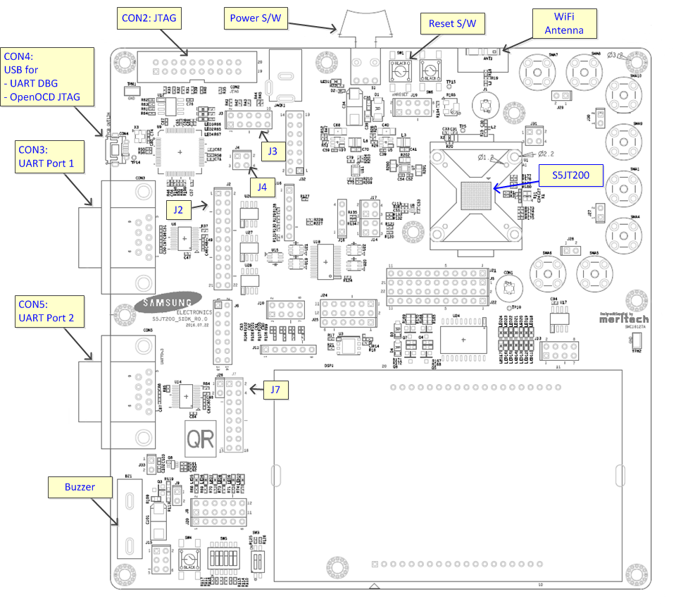
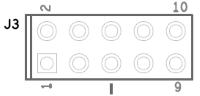
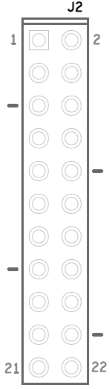

# sidk_s5jt200

Samsung IoT Development Kit for S5JT200 chipset.

## Information

will be updated

## Environment Set-up
### On Chip Debugger installation

on Ubuntu 13.10 ~ 14.xx version
```bash
sudo apt-get install -y lib32z1 lib32ncurses5 lib32bz2-1.0
```

on Ubuntu over 16.xx version
```bash
sudo dpkg --add-architecture i386
sudo apt-get update
sudo apt-get install libc6:i386 libncurses5:i386 libstdc++6:i386 lib32z1
```

### FTDI installation

Install the package for usb
```bash
sudo apt-get install libusb-dev
```

Get the package, [libftdi-0.19](http://www.intra2net.com/en/developer/libftdi/download/libftdi-0.19.tar.gz)

Untar the downloaded package
```bash
tar -zxvf libftdi-0.19.tar.gz
```

Build and install the package for libftdi
```bash
cd libftdi-0.19
./configure
make
sudo make install
```

Link the built files
```bash
cd /usr/lib
sudo ln -s /usr/local/lib/libftdi.a libftdi.a
sudo ln -s /usr/local/lib/libftdi.la libftdi.la
sudo ln -s /usr/local/lib/libftdi.so.1.19.0 libftdi.so.1.19.0
sudo ln -s /usr/local/lib/libftdi.so.1.19.0 libftdi.so
sudo ln -s /usr/local/lib/libftdi.so.1.19.0 libftdi.so.1
```

### FT2232 interface driver installation

Get the package, [libftd2xxx1.0.4](https://github.com/psi46/HDItest/tree/master/FTDI-1.0.4/libftd2xx1.0.4)

Untar the downloaded package
```bash
tar -zxvf libftd2xx1.0.4.tar.gz
```

Copy and link the files
```bash
cd libftd2xx1.0.4
sudo cp ftd2xx.h /usr/include
sudo cp WinTypes.h /usr/include
sudo cp build/x86_64/libftd2xx.so.1.0.4 /usr/local/lib
cd /usr/local/include
sudo ln -s /usr/include/ftd2xx.h ftd2xx.h
sudo ln -s /usr/include/WinTypes.h WinTypes.h
cd /usr/local/lib
sudo ln -s libftd2xx.so.1.0.4 libftd2xx.so
cd /usr/lib
sudo ln -s /usr/local/lib/libftd2xx.so.1.0.4 libftd2xx.so
```

## How to program a binary

After buiding a Tizen RT, execute below at $TIZENRT_BASEDIR/os folder.

TIZENRT_BASEDIR was set at [[Getting the sources]](../../../README.md#getting-the-sources) tab of Quick Start.
```bash
make download ALL
```

## Configuration Sets

There are three configuration sets for sidk_s5jt200, including 'hello_with_tash', 'kernel_sample', and 'tc'.

#### hello_with_tash
 for running a hello example with shell enabled

#### kernel_sample
 for running kernel functions

#### tc
 for runnig unit test cases

#### sidk_tash_aws
 for running AWS IoT SDK examples.


## Board Configuration

### Board Layout


### JTAG selection
There are two JTAG ports, one is OpenOCD through USB port and the other is normal JTAG interface like Lauterbach Trace-32.



J3 Header pin is used to select JTAG port.

Pin  | OpenOCD | Normal JTAG
---  | ------- | --------
1-2  | Connect | Open
3-4  | Connect | Open
5-6  | Connect | Open
7-8  | Connect | Open
9-10 | Connect | Open

### UART source selection for CON3
One of UART0, UART1, UART2, UART3, or UARTDBG channel could be connected to CON3 through the J2 configuration.



Pin   | UART0   | UART1   | UART2   | UART3   | UARTDBG<br>(CON3) | UARTDBG<br>(CON4)
---   | -----   | -----   | -----   | -----   | ------- | ---------------
1-2   | Open    | Open    | Open    | Open    | Connect | Open
3-4   | Open    | Open    | Open    | OPen    | Connect | Open
7-8   | Connect | Open    | Open    | OPen    | Open    | Open
9-10  | Connect | Open    | Open    | OPen    | Open    | Open
11-12 | Open    | Connect | Open    | OPen    | Open    | Open
13-14 | Open    | Connect | Open    | OPen    | Open    | Open
15-16 | Open    | Open    | Connect | OPen    | Open    | Open
17-18 | Open    | Open    | Connect | OPen    | Open    | Open
19-20 | Open    | Open    | Open    | Connect | Open    | Open
21-22 | Open    | Open    | Open    | Connect | Open    | Open

### UART source selection for CON5
UART source for CON5 could be selected through J7 configuration.


Pin   | UART0   | UART1   | UART2   | UART3
---   | -----   | -----   | -----   | -----
1-2   | Connect | Open    | Open    | OPen
3-4   | Connect | Open    | Open    | OPen
5-6   | Open    | Connect | Open    | OPen
7-8   | Open    | Connect | Open    | OPen
9-10  | Open    | Open    | Connect | OPen
11-12 | Open    | Open    | Connect | OPen
13-14 | Open    | Open    | Open    | Connect
15-16 | Open    | Open    | Open    | Connect

### Console Terminal
UARTDBG channel is being used as Console and it could be connected to CON3 or CON4 with J2 and J4 pin configuration.


Pin      | UARTDBG<br>on CON3<br>(SERIAL) | UARTDBT<br>on CON4<br>(USB)
-------- | --------------- | ---------------
J2 : 1-2 | Connect         | Open
J2 : 3-4 | Connect         | Open
J4 : 1-2 | Open            | Connect
J4 : 3-4 | Open            | Connect


