# How to develop things with Tizen Studio for RT

## Prerequisites
- Java Development Kit (JDK)  
To install the appropriate JDK version for your Ubuntu system, go to the Ubuntu Web site and follow the detailed instructions for installing the Oracle® JDK version 8.  
- Package requirements for developing applications in Ubuntu  
You must install the webkitgtk package. At the terminal prompt, enter the following command:  
	>$ sudo apt-get install libwebkitgtk-1.0-0

### 1. Install the Tizen Studio for RT
To install the Tizen Studio for RT:  
1. Accept the software license.  
2. Configure the installation directory.  
3. Install the Tizen Studio for RT.  
4. Install additional tools.  
5. Run the Tizen Studio for RT.  

More details can find at [Guide page](https://developer.tizen.org/development/tizen-studio/rt-ide/installing-tizen-studio-rt).
 
### 2. Create a Project
You can create a new SmartThings project from remote Git repositories as well as local templates. To create a new project:  
- When creating a project from a template, click the **Check if you want SmartThings functionality** check box when selecting a template:  
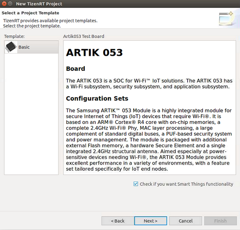  
- When importing a project from a Git repository, click the **Check if you want SmartThings functionality** check box:  
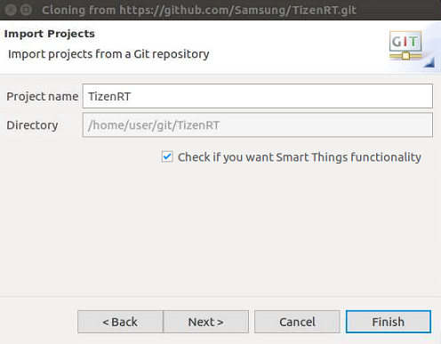

### 3. Manage Device / Resource Model
You can use the Device/Resource Model Manager to select a device model for interworking with the SmartThings service.  
With the Model Manager, you can:  
- [Check device, resource, and property information](#checking-device-resource-and-property-information)  
- [Select, add, and restore resources](#managing-resources)  
- [Import and export device models](#importing-and-exporting-device-models)  
- [Generate stub code](#generating-stub-code)  
- [Manage device model](HowToManageDeviceModel.md)
- [Manage Certificate](manage-certificate.md)

The Model Manager is displayed while creating a new project with SmartThings functionality. If you want to access the Model Manager later again, in the **Project Explorer** view, right-click the project and select **Manage ST Things Resource**.

#### **Checking Device, Resource, and Property Information**
To access information:  
- Select a device model in the **Device Name** list of the **Device/Platform** section to see device, platform, and resource information.  
- Select a resource in the left panel of the **Resource/Property** section to see the its description and property information.  
- Select a property in the right panel of the **Resource/Property** section to see its description.  
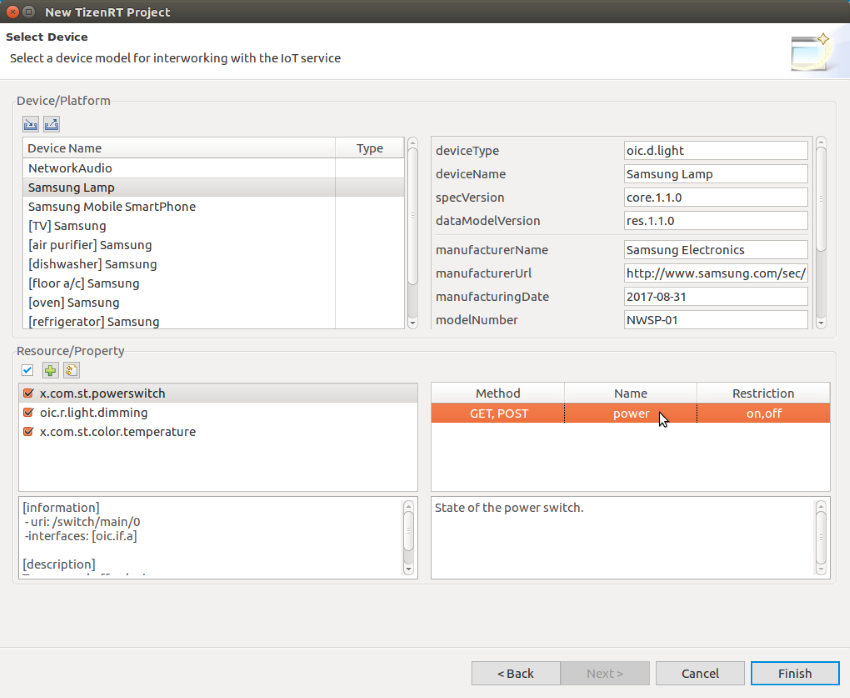  
- Input your MNID & Vender ID assigned by SmartThings website. Refer [[here]](https://smartthings.developer.samsung.com/develop/workspace/ide/create-a-cloud-connected-device.html).  
- if you want to connect the device through cloud, should register your device info first.
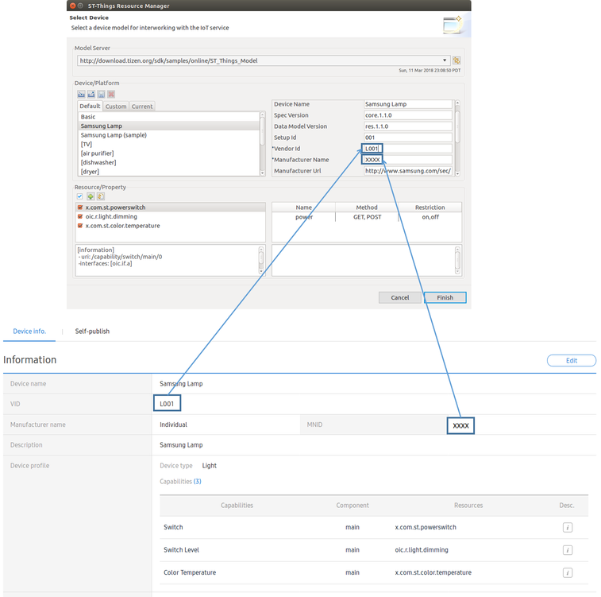

#### **Managing Resources**
You can select, add, and restore resources:  
- To select all resources, click the checkbox on the **Resource/Property** toolbar.  
  
- To add a new resource:  
   1. Click **Add Resource**.  
     
   2. In the Add Resource window, select the type of resource to be added, edit its information, and click **OK**.  
     
   The new resource appears in the list in the **Resource/Property** section of the Model Manager main view.  
- To restore the resources, click **Restore default**. This restores the initial resource state of the device, deleting all changes that have been made.

#### **Generating Stub Code**
When you click **Finish** in the Model Manager, the code for processing the resource is automatically created for the selected device.  
  
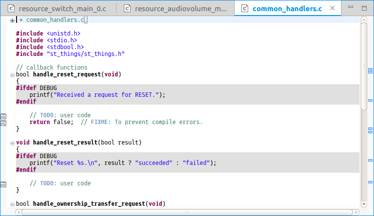  
When the project is created, template code for the selected device and resources is automatically generated and opened for editing:  
```
<common_handlers.c>
- Reset, ownership transfer, and status change handlers
- You need to write additional code for the functionality you want.

<resource_<uri>.c>
- Get and set handlers for a resource
- You need to write additional code for the functionality you want.
- Refer to annotation or TODO in the resource file.

<Makefile> and <Make.defs>
- Makefile for building the project

<st_things_main.c>, <things.c>, <things.h>
- Project initialization, handler registration, and main loop
```
If you edit the SmartThings resources in your project later on, the Model Manager automatically backs the existing source files with a **.bak** extension.  
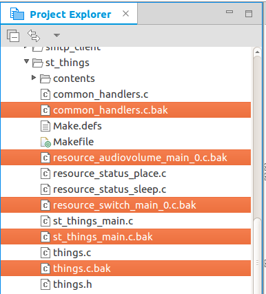

### 4. Build the Project
You must build your project before flashing or debugging it.  
You can build a TizenRT project in 2 ways: [using a batch build](#Using-Batch-Build) or [build project command](#Using-Build-Project).

#### Using Batch Build
To build your project using the batch build command:  
1. Select the project in the **Project Explorer** view.  
2. To build the selected project, use 1 of the following:  
In the Tizen Studio for RT menu, select **Project > Batch Build Project**.  
In the Tizen Studio for RT toolbar, click the **Build TizenRT Project** icon.  
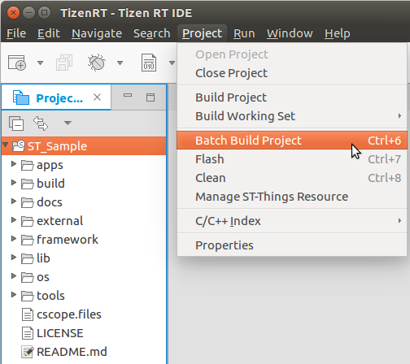  
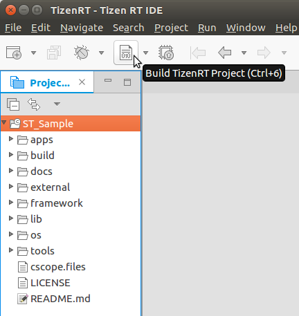  
3. In the Build TizenRT Project Wizard, select the board - **artik053** - and build option - **st_things** - for building your project, and click **OK**.  
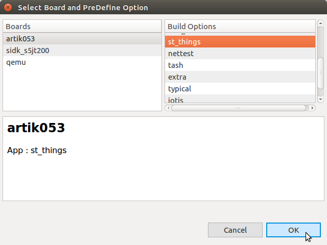  
You can check the build logs in the **Console** view.  
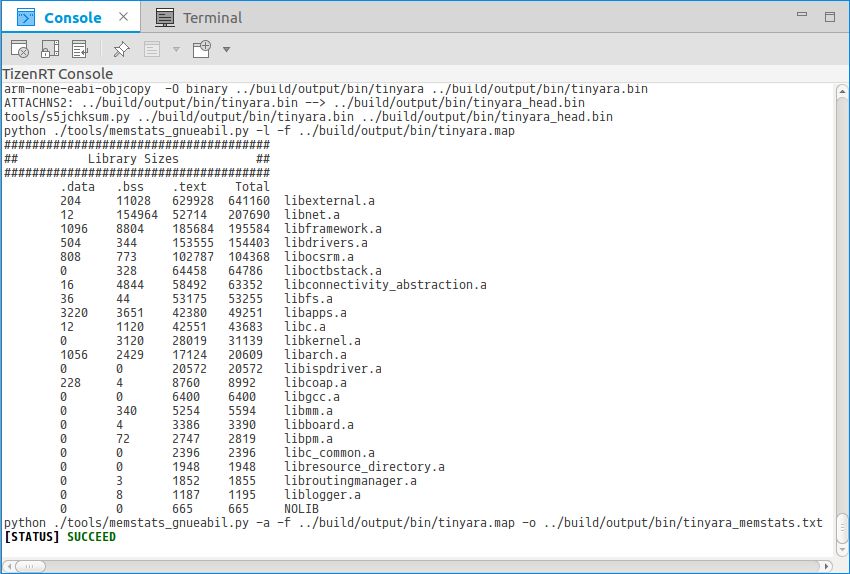  

#### Using Build Project
To build your project using the build project command:  
1. In the **Project Explorer** view, select the project.  
2. In the Tizen Studio for RT toolbar, click the arrow next to the **Build TizenRT Project icon** and **select Select Board**.  
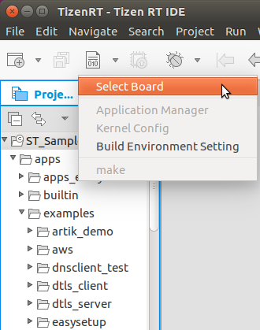  
3. In the Select Board and PreDefine Option window, select the board - **artik053** - and build option - **st_things** - for building your project, and click **OK**.  
  
4. In the Tizen Studio for RT toolbar, build the project by selecting **Project > Build Project**.  
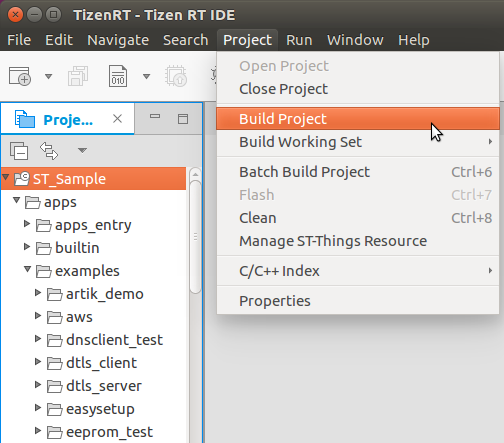  
You can check the build logs in the **Console** view.  
  

### 5. Flash the Project  
To upload your project to the board, you need to flash it:  
1. Connect the board to your computer.  
2. Select the project in the **Project Explorer** view.  
3. To flash the TizenRT project:  
     i. In the Tizen Studio for RT toolbar, click the **Flash** icon.  
    ii. Select a flash option **'ALL'** and click **OK**.  
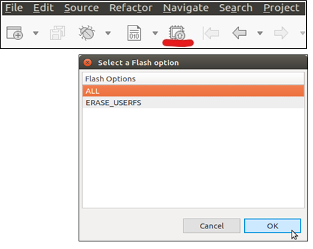  
You can see the status in the **Console** view.
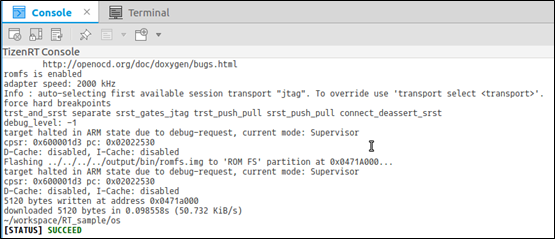  

