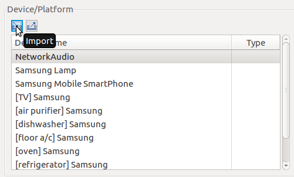
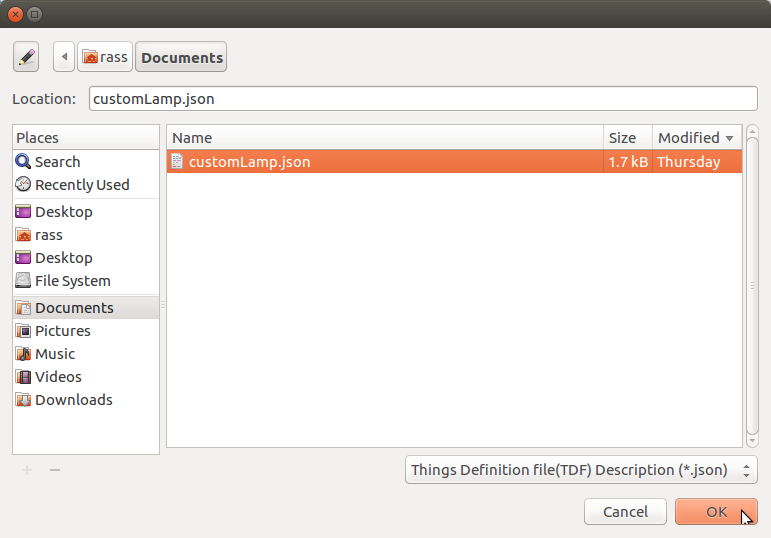
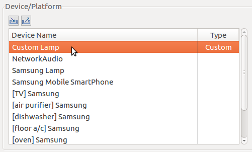
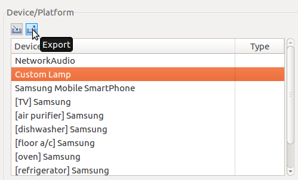
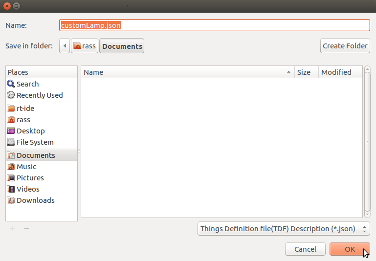

# How to manage SmartThings Things device model.  
This document describes methods to import/export Device models, as well as managing resources.
## Importing and Exporting Device Models
To import a device model:
1. Click **Import** on the **Device/Platform** toolbar.  

2. Select the JSON file containing the device model to be imported and click **OK**.  

3. The imported device shows up in the device list with the **Custom** type.  
  

To export a device model:  
1. Select the model to be exported and click **Export** on the **Device/Platform** toolbar.  
  
2. The device model is exported as a JSON file. Enter a file name for the exported model and click **OK**.  
  
