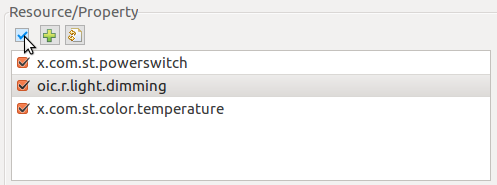
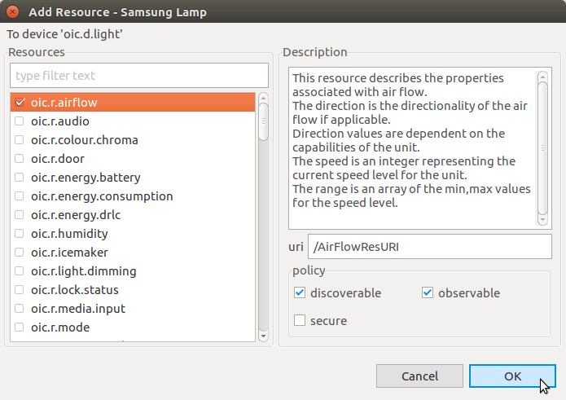

# How to manage SmartThings Things device model.  

## Importing and Exporting Device Models
To import a device model:
1. Click **Import** on the **Device/Platform** toolbar.  

2. Select the JSON file containing the device model to be imported and click **OK**.  

3. The imported device shows up in the device list with the **Custom** type.  

#### Managing Resource  
You can select, add, and restore resources:  
- To select all resources, click the checkbox on the **Resource/Property** toolbar.  
  
- To add a new resource:  
   1. Click **Add Resource**.  
     
   2. In the Add Resource window, select the type of resource to be added, edit its information, and click **OK**.  
     
   The new resource appears in the list in the **Resource/Property** section of the Model Manager main view.  
- To restore the resources, click **Restore default**. This restores the initial resource state of the device, deleting all changes that have been made.  
  

To export a device model:  
1. Select the model to be exported and click **Export** on the **Device/Platform** toolbar.  
  
2. The device model is exported as a JSON file. Enter a file name for the exported model and click **OK**.  
  
