# How to develop things using STDK based TizenRT   
STDK (Smart Things Develop Kit) is one of the features of the Smart Things ecosystem. This guide describes with an example, how to enable STDK in TizenRT and develop applications using it.

We choose a common example of a blinking Led to demonstrate how to develop a so-called LED Things and control it via a SmartThings mobile app.

## Contents
* [Prerequisites](#prerequisites)
* [Get TizenRT Source](#get-tizenrt-source)
* [Create device identity](#create-device-identity)
* [Register Device Profile on SmartThings Devworkspace](#register-device-profile-on-smartthings-devworkspace)
* [Build and Flash](#build-and-flash)
* [Try to do EasySetup and Control](#try-to-do-easysetup-and-control)
* [How to develop your STDK device](#how-to-develop-your-stdk-device)

## Prerequisites   
This section will describe the pre-requisite steps to install and build STDK for the ESP-WROVER-KIT board.   

* Board specific prerequisites [[Details]](../README.md#supported-board--emulator).   
* Toolchain installation [[Details]](https://smartthings.developer.samsung.com/docs/devices/direct-connected-devices/setup-environment.html).   

### Get TizenRT Source   
#### Clone TizenRT source code.   
```bash
git clone https://github.com/Samsung/TizenRT.git
cd TizenRT
TIZENRT_BASEDIR="$PWD"
```
#### Init submodule for STDK.   
+ Update submodule   
```bash
git submodule update --init "external/stdk/st-device-sdk-c"
git submodule update --init "external/libsodium/libsodium"
```

## Create device identity   
Your IoT device needs authentication in order to connect to the SmartThings Cloud. These data usually reside in file format. To create these  authentication data, you must know your MNID in the personal information window of [Developer Workspace](https://smartthings.developer.samsung.com/). Please sign in with Samsung Account and then check your MNID first.   

Open a terminal window and run the following stdk-keygen command to create a Device Identity.   

```bash
$ cd external/stdk/st-device-sdk-c/tools/keygen/linux
$ ./stdk-keygen -h
usage: stdk-keygen -m MNID [-f firmware_version]

$ ./stdk-keygen -m **** -f V201910       # replace '****' with your MNID
Go Device Identity of Developer Workspace.

Serial Number:
┌──────────┬──────────┐
│ STDK**** │ ce**2**3 │
└──────────┴──────────┘

Public Key:
1D********a21F********8WwP********yU/n8vFvM=

$ tree
.
├── ed25519.pubkey
├── ed25519.seckey
└── output_STDK****ce**2**3
    └── device_info.json
```
Copy the Serial Number and Public Key after running the command on your computer. You will need to upload those values to the SmartThings Cloud via [Developer Workspace](https://smartthings.developer.samsung.com/).

After you create a device identity with a command with an option like above, You can get the ready-to-use device_info.json file directly.   

## Register Device Profile on SmartThings Devworkspace   
### Sign-In to [Devworkspace](https://smartthings.developer.samsung.com/).   
Select 'Sign-In' where right-top on the page.   
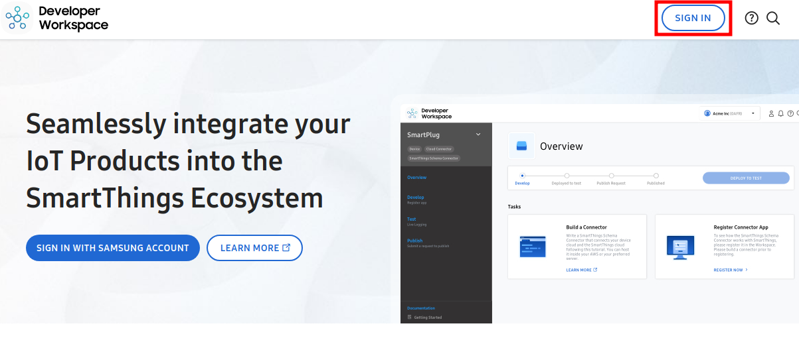   
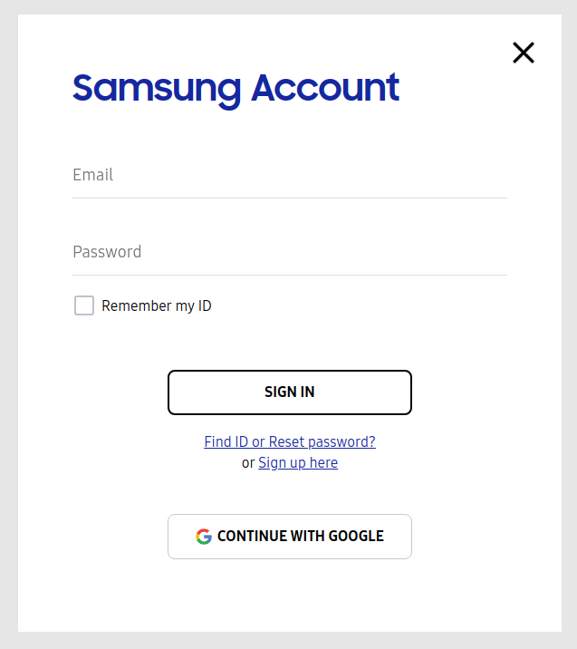   
### Create a Project on SmartThings Cloud.   
You need to register a new project to SmartThings Cloud.   

1. Create a Project.   
    1. Select 'New Project' to regist new project(or device).   
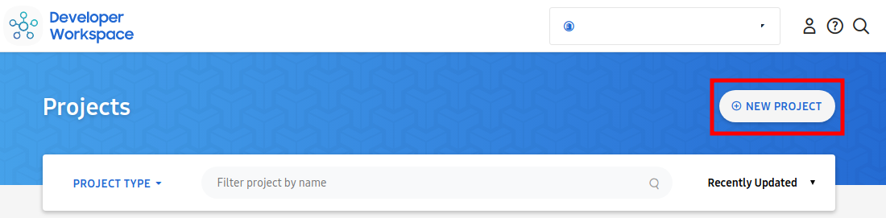   
    1. Select 'Device Integration'.   
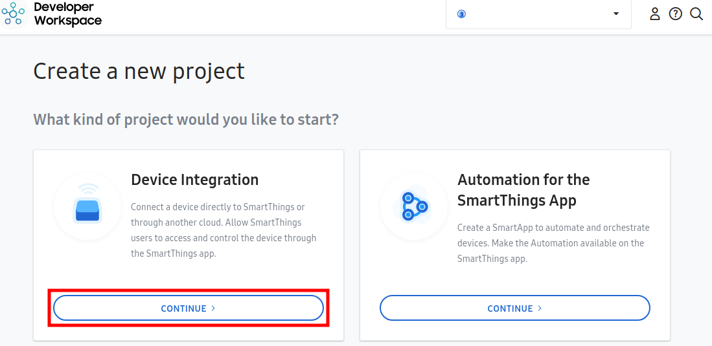   
    1. Select 'Direct-Connected' type.   
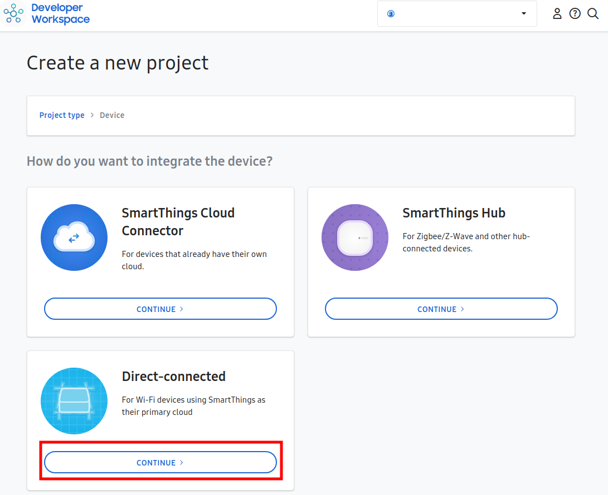   
    1. Input Device name and Select 'CREATE PROJECT'.   
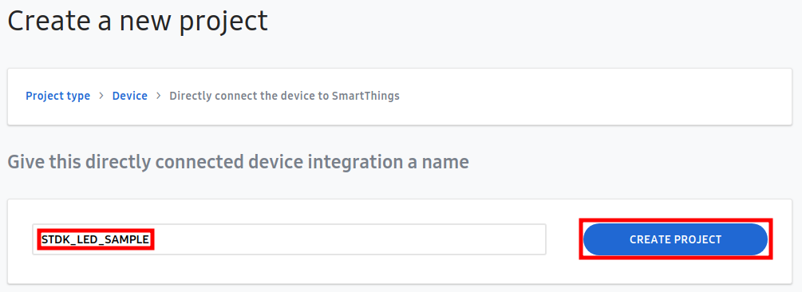   
1. Create a Device Profile.   
A device profile contains the components, capabilities, and metadata (ID, name, etc.). These information define the actions and attributes that an IoT device can perform. Click the "GO TO DEVICE PROFILE" and then, enter the all remaining information required.   

    1. Select 'Add a Device Profile'.   
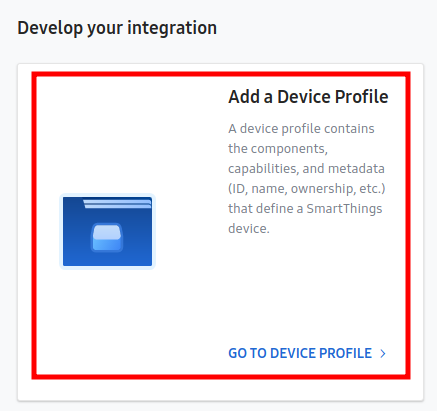  
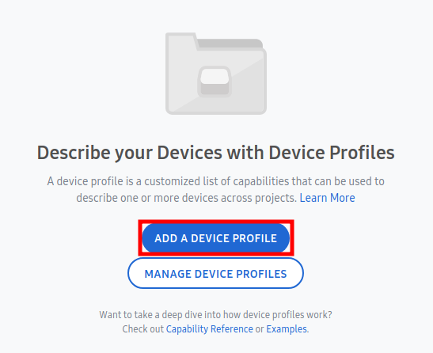   
    A device profile contains the components, capabilities, and metadata (ID, name, etc.). This information defines the actions and attributes that an IoT device can perform.   
   
        - Create a new profile to add it to project.   
        Fill properties of device and select 'NEXT'.   
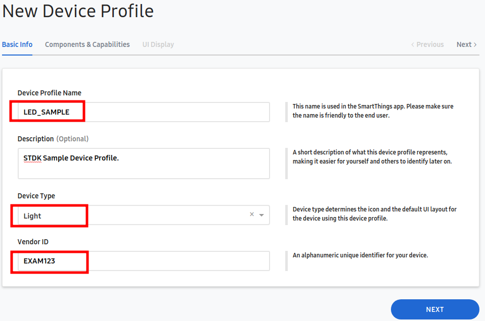   
        - Add copabilities for device.   
        Select 'ADD CAPABILITY'. And add Capabilities like switch, switch level, color control and health check. 
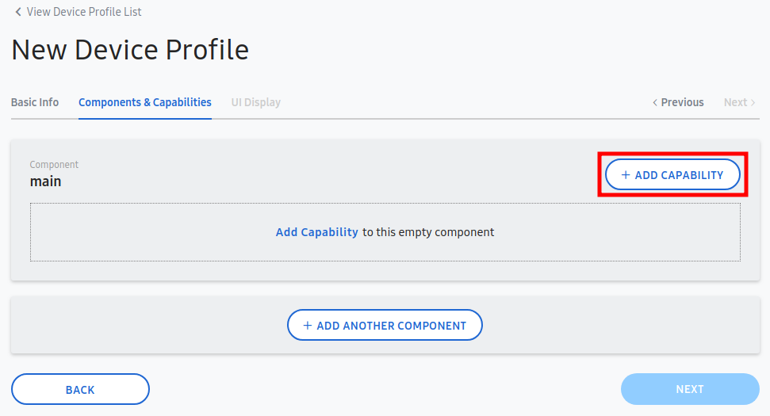   
        At this time, please note that you will need to add a "Health Check" capability to update the connectivity status of a device. It is only required on the main component.   
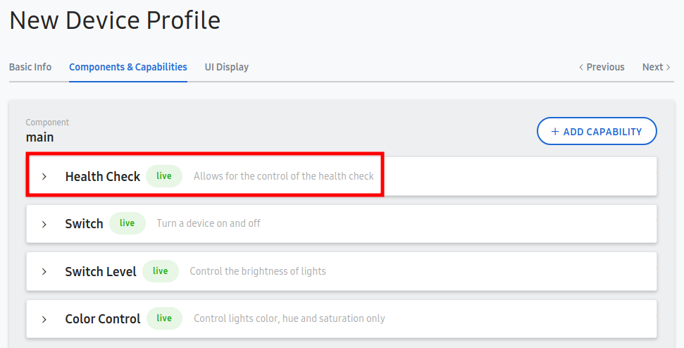   
        - Select UI Display.   
        Select Main State and Action.   
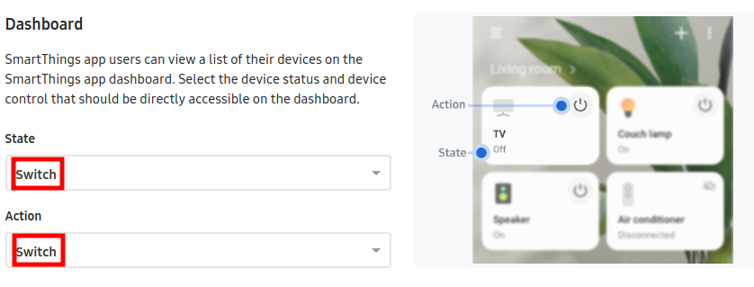   
    1. Select 'Add Device Onboarding'.  
    This defines information to support the initial connection process between IoT device and SmartThings Cloud.   
    Click the "GO TO DEVICE ONBOARDING" and then, enter the all remaining information required.   
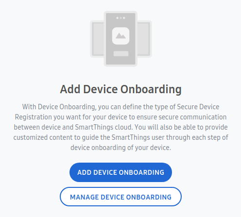   
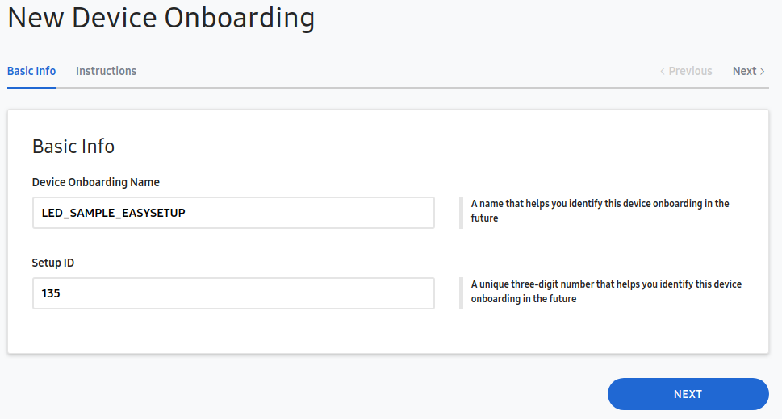   
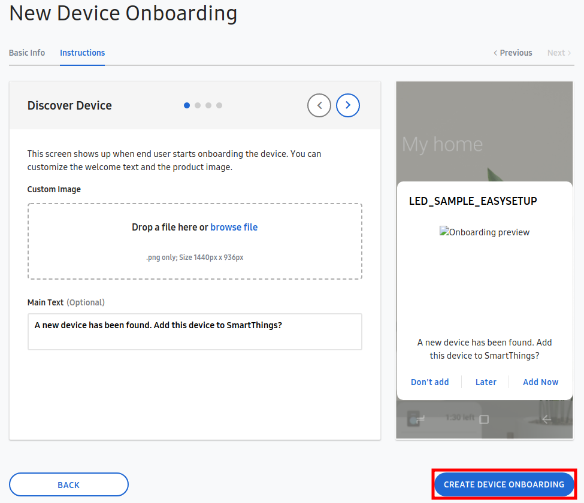   
    1. Select 'Deploy Device Profile to test'.  
    You can publish your device to the SmartThings platform for testing. And then you will be able to access your device through the SmartThings app. Actually this step is for self-testing. If you want to officially publish your device with enrolled organizations ID(e.g. company MNID), please refer to the process below.   
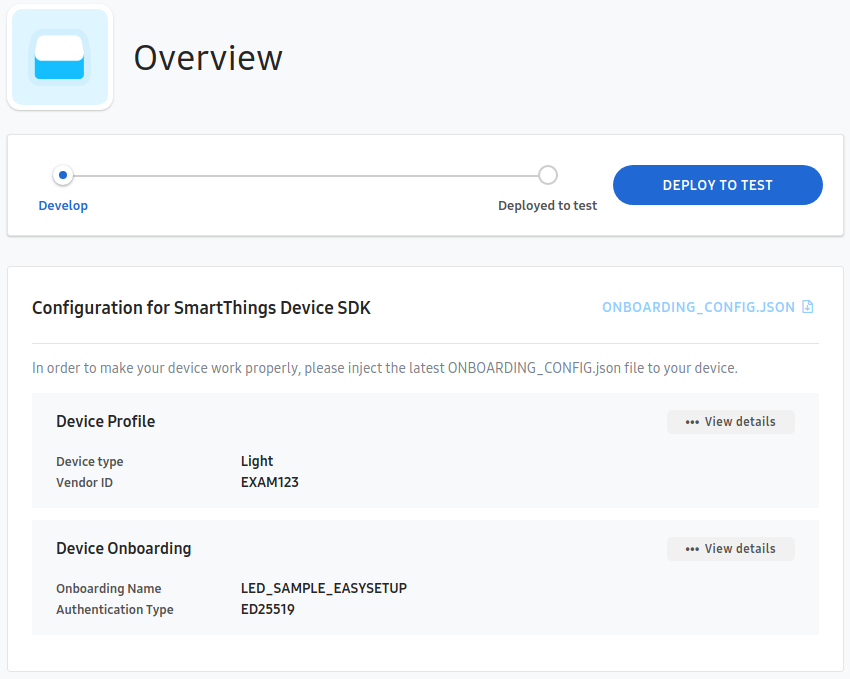   
    1. Register Device Identity.
    This step uploads device identity data generated in the Create device identity phase.
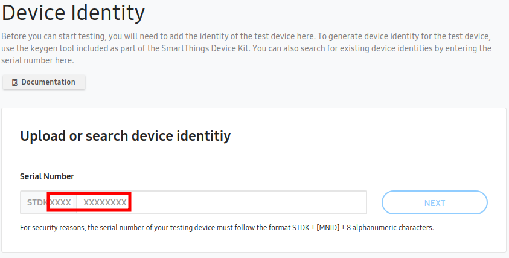   
        Paste the public key that copied key in the Public Key value box that appears. And then, click ADD button.
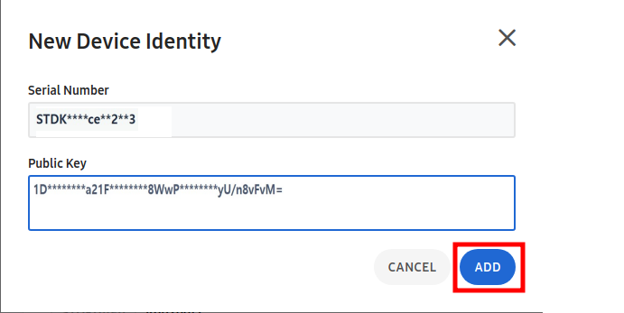   

### Build and Flash   
#### Put device information into sample application folder.   
1. Download onboarding data.   
Download "onboarding_config.json" file into "[TizenRT]/apps/examples/stdk_smart_lamp/"   
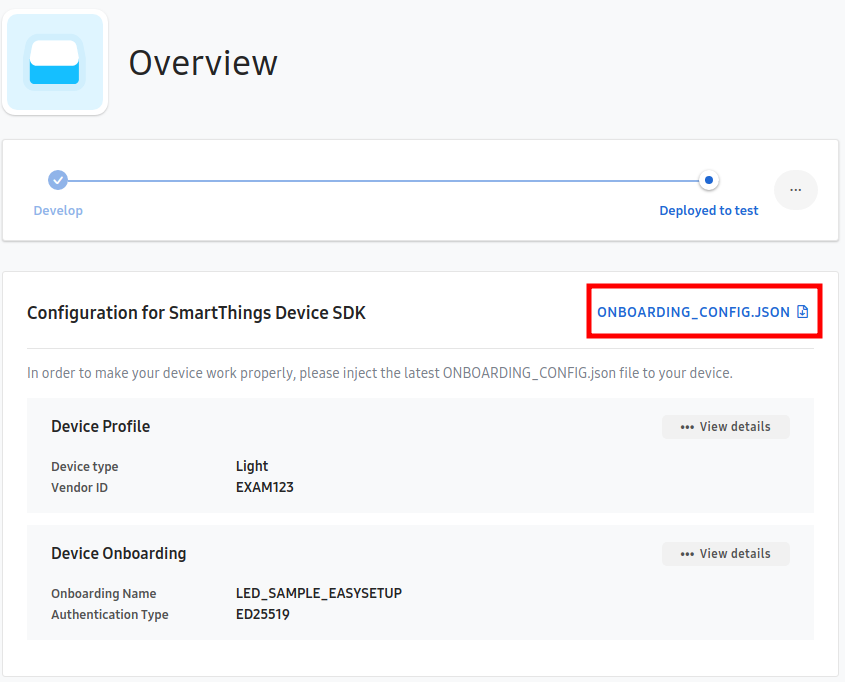   
1. Copy Device Identity file into application folder.   
```bash   
// in [TizenRT]/external/stdk/st-device-sdk-c/tools/keygen/linux
$ cd external/stdk/st-device-sdk-c/tools/keygen/linux

$ cat output_STDK****ce**2**3/device_info.json   
{
  "deviceInfo": {
    "firmwareVersion": "V201910",
    "privateKey": "3d********AOyY********ezJQ********TMKLGxzbQ=",
    "publicKey": "1D********a21F********8WwP********yU/n8vFvM=",
    "serialNumber": "STDK****ce**2**3"
  }
}
// Copy device info file under "[TizenRT]/apps/examples/stdk_smart_lamp/apps/examples/stdk_smart_lamp/".
$ cp ./output_STDK****ce**2**3/device_info.json ../../../../../../apps/examples/stdk_smart_lamp/apps/examples/stdk_smart_lamp/   
```

#### Set configuration and build.   
We will use 'esp_wrover_kit/stdk' config which is included the smart led application. and you can set it through "./dbuild menu" command.   
Please follow below steps.

1. Configuration
```bash
// In [TizenRT]/os
$ ./dbuild.sh menu
======================================================
  "Select Board"
======================================================
  ...
  "6. esp_wrover_kit"
  ...
  "x. EXIT"
======================================================
6               // Select 'esp_wrover_kit'.

esp_wrover_kit is selected
==================================================
  "Select Configuration of esp_wrover_kit"
==================================================
  ...
  "6. STDK"
  ...
==================================================
6               // Select "STDK".

STDK is selected
  Copy build environment files
 
  CAUTION!! To download esp_wrover_kit/STDK built image, genromfs should be installed
  Find details at https://github.com/Samsung/TizenRT/blob/master/docs/HowToUseROMFS.md
 
  Configuration is Done!
======================================================
  "Select build Option"
======================================================
  "1. Build with Current Configurations"
  "2. Re-configure"
  "3. Menuconfig"
  "4. Build Clean"
  "5. Build Dist-Clean"
  "6. Build SmartFS Image"
  "x. Exit"
======================================================
1               // Select "Build with Current Configurations"

...
######################################
##          Library Sizes           ##
######################################
    .data   .bss    .text    Total
    356     12560   222108  235024  libexternal.a
    340     8544    118702  127586  libnet80211.a
...
    0   1036    2164    3200    NOLIB
    24  380     2076    2480    libmm.a
    4   4   1904    1912    librtc.a
    0   24  980     1004    libwque.a
    0   42  800     842     libcore.a
    0   0   796     796     libboard.a
    0   0   102     102     libsoc.a
    4   1   0   5   libwpa2.a
    0   1   0   1   libwps.a
======================================================
  "Select build Option"
======================================================
  "1. Build with Current Configurations"
  "2. Re-configure"
  "3. Menuconfig"
  "4. Build Clean"
  "5. Build Dist-Clean"
  "6. Build SmartFS Image"
  "d. Download"
  "x. Exit"
======================================================
d               // Select "Download"
==================================================
  "Select download option"
==================================================
  "1. ALL"
  "2. OS"
  "4. BOOTLOADER"
  "5. ROMFS"
  "6. ERASE_ALL"
  "u. USBrule"
  "x. Exit"
==================================================
1               // Select "All"
 ALL
make -C ../build/tools/esp32  ALL
...
Leaving...
Hard resetting via RTS pin...
make[1]: Leaving directory '/home/tizenrt/ws/public/priv/TizenRT/build/tools/esp32'

                // DONE
```
Now, the device is ready onboarding.

### Try to do EasySetup and Control   
You can download [SmartThings Application](https://play.google.com/store/apps/details?id=com.samsung.android.oneconnect) via Google play app store.   

Developer mode should be enabled through settings of app before try to make a connection between mobile and your device via easysetup.   
* [How to enable developer mode](https://smartthings.developer.samsung.com/docs/testing/developer-mode.html).   

Try to do easysetup.   
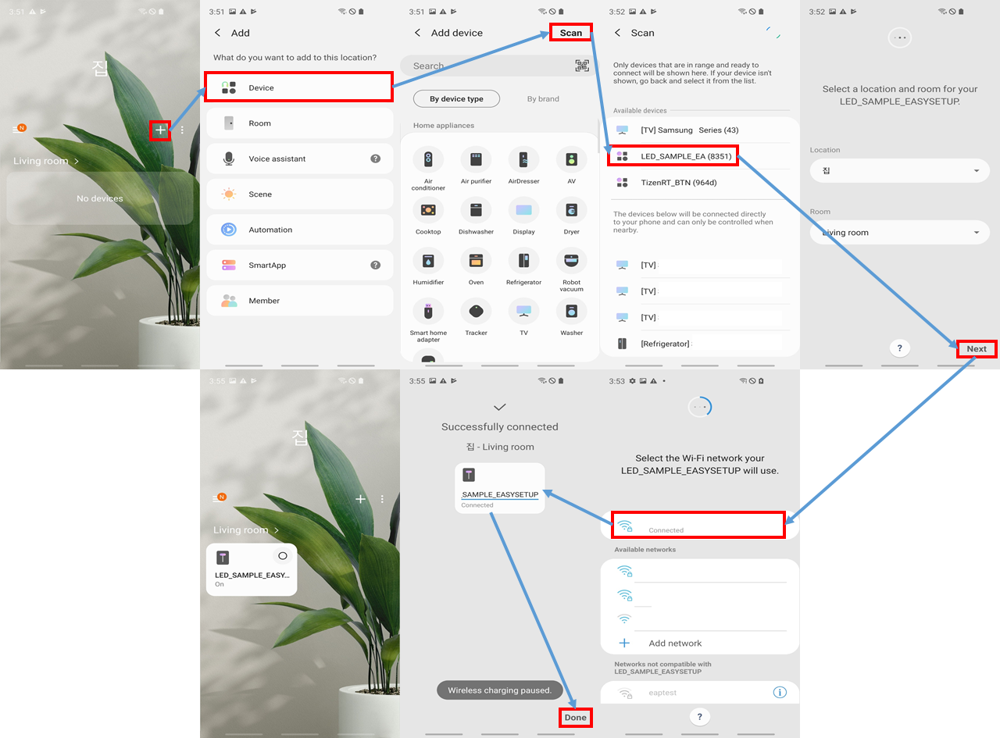  
Now you can control smart led device(sample) through SmartThings mobile application.

## How to develop your STDK device   
You can see a more detailed build approach in ['Getting started'](https://github.com/SmartThingsCommunity/st-device-sdk-c-ref/blob/master/doc/getting_started.md).