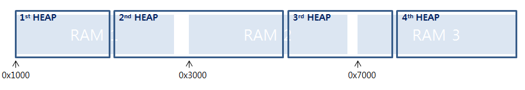
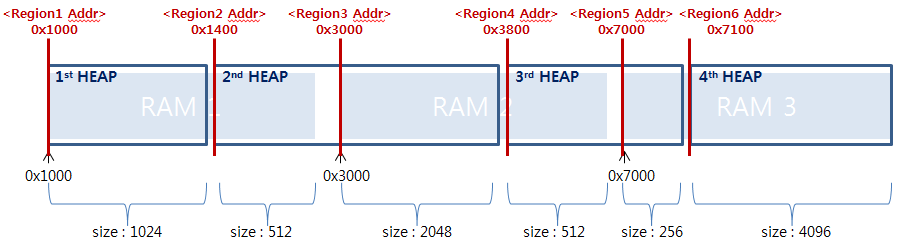

# How to use(add) Multi-heap

There are two cases to use multi-heap.
- continuous physical RAM but want to split regions
- separated physical RAMs but want to use for heap  

## Contents
- [Enabling multi-heap](#enabling-multi-heap)
- [Using multi-heap](#using-multi-heap)


## Enabling multi-heap
To enable multi-heap, please find three steps as shown below:
- [Set number of Regions](#1-set-number-of-regions)
- [Set number of Heaps](#2-set-number-of-heaps)
- [Set Region start address, size and heap index](#3-set-region-start-address-size-and-heap-index)

## Using multi-heap
To use multi-heap, please find a link as shown below:  
[Supported APIs](#supported-apis)

## 1. Set number of Regions

In menuconfig, Set **CONFIG_MM_REGIONS** value which shows how many regions are.  
	```
	Memory Management -> Number of memory regions -> change a number over 2
	```

## 2. Set number of Heaps

In menuconfig, Set **CONFIG_MM_NHEAPS** value which indicates how many heaps are.  
	```
	Memory Management -> Number of heaps -> change a number over 2
	```

For a detailed description of **REGION** and **HEAP**, please refer to [Terms for REGION and HEAP](#example-of-multi-heap-usage)  

## 3. Set Region start address, size and heap index

In menuconfig, set start addresses, 
**CONFIG_RAM_REGIONx_START** with hexa values, set sizes, **CONFIG_RAM_REGIONx_SIZE** with decimal values(in bytes) of new heap, and
set indexes, **CONFIG_RAM_REGIONx_HEAP_INDEX** with decimal values of new heap. **CONFIG_RAM_REGIONx_HEAP_INDEX** can be start from 0.  
```
Hardware Configuration -> Chip Selection -> List of start address for RAM region -> set values
Hardware Configuration -> Chip Selection -> List of size for RAM region -> set values
Hardware Configuration -> Chip Selection -> List of heap index for RAM region -> set values
```  
Each region is separated by `','` and all config should be in `" "` as shown below example:
```
"0x02000000,0x04000000,0x07000000"
"100,400,200"
"0,1,0"
```

Based on above configurations, *up_addregion()* function sets new regions automatically.

## Example of Multi-heap Usage
If there are three physical RAMs, and want to use them as four heaps like below.  
  
In this case, **CONFIG_MM_REGIONS** should be set to 6, and **CONFIG_MM_NHEAPS** should be set to 4.  

```
CONFIG_MM_REGIONS=6
CONFIG_MM_NHEAPS=4
CONFIG_RAM_REGIONx_START="0x1000,0x1400,0x3000,0x3800,0x7000,0x7100"
CONFIG_RAM_REGIONx_SIZE="1024,512,2048,512,256,4096"
CONFIG_RAM_REGIONx_HEAP_INDEX="0,1,1,2,2,3"
```

## Supported APIs
A header file [mm.h](../os/include/tinyara/mm/mm.h) provides following APIs which support to allocate memory for a specific heap as shown below:
```
void *malloc_at(int heap_index, size_t size);
void *calloc_at(int heap_index, size_t n, size_t elem_size);
void *memalign_at(int heap_index, size_t alignment, size_t size);
void *realloc_at(int heap_index, void *oldmem, size_t size);
void *zalloc_at(int heap_index, size_t size);
```
The difference between Xalloc and Xalloc_at is like below :  
Xalloc_at tries to allocate memory for a specific heap which passed by api argument. If there is no enough space to allocate, it will return NULL.  
Xalloc tries to allocate memory for base heap which heap index is 0. If there is no enough space to allocate, it will try to allocate in order from the next index for whole heaps.
