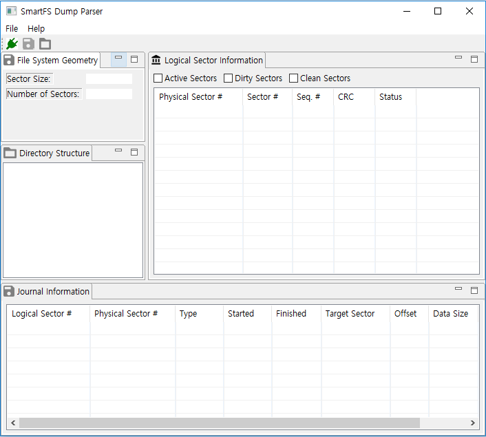
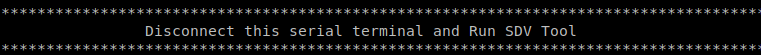
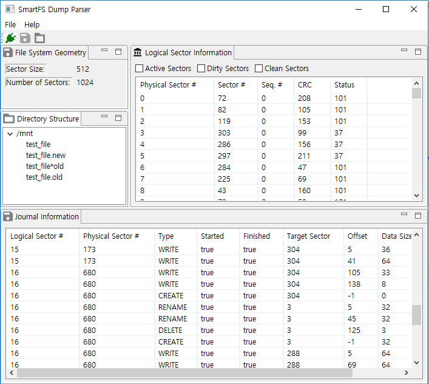

# How to use SmartFS Dump visualizer (SDV)

## What is SDV?

There are two main functions in SmartFS Dump Visualizer (SDV).
1. Auto-dump
   : Automatically dump a SmartFS partition from a board (Artik053, imxrt1020)
     - A dump file can also be manually specified and opened by users.
2. SmartFS Analysis
   : Parse and visualize the following contents of SmartFS.
     1) Logical Sector information (Sector ID, sequence number, CRC value, and sector status)
     2) Journaling information (Target sector, transaction type/status, offset, data size)
     3) SmartFS Geometry (Total number of sectors, sector size)
     4) Directory Hierarchy (Directory and file tree which will be shown on TASH)

## How to run SDV?
To run SDV, please download and install Java 8 (or the latest Java) to a target PC first.
[Java Download](https://www.java.com/ko/download/manual.jsp)

>**Note** To use TizenRT IDE together, Java 8 should be installed.

SDV can be released now for Linux (Ubuntu) and Windows (Some functions are constrained).

>**Note** Mac OS release is also possible but not yet released.

After downloading the SDV release (zip/tar.gz) from the following links,
[Ubuntu](../tools/fs/FS_Dump_Parser/Release/SDV_v2.0_20200210_Ubuntu.tar.gz)
[Windows](../tools/fs/FS_Dump_Parser/Release/SDV_v1.1_20190903_Windows.zip)

Decompress the release file and execute SDV or SDV.exe for Windows or Ubuntu, respectively.

## SDV Usage Example
After starting SDV, an initial screen is shown as below.

Auto-dump can be executed by clicking the green plug button in toolbar (upper-left side)
after a board crash happens. Guide messages will be shown as follows.

>**Note** Existing serial screens should be closed.  
>         Otherwise, the partition contents generated by a dump daemon are just  
>         printed to the serial screens instead of being dropped to SDV.

After all SmartFS contents are dumped, analysis is performed and information extracted from a board will be shown in SDV views.

>**Note** Please wait until SDV displays SmartFS information  
>         since the dumping takes a few minutes..

The contents of a smartfs dump file* can also be shown by opening it through "open" menu.

>**Note** Auto-dump can now only be possible in Artik053 and imxrt1020 boards now.
>         Therefore, for MediaTek and STM board, please dump SmartFS contents from boards first  
>         by using 'Airoha IoT Flash Tool' and 'STM32 CubeProgrammer' respectively.
