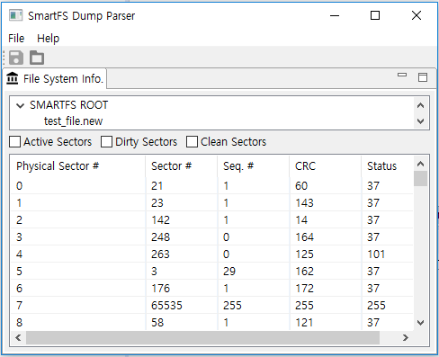

# How to use SmartFS Dump visualizer (SDV)

## What is SDV?

There are three main functions in SmartFS Dump Visualizer (SDV).
1. Display smartfs header contents of all physical sectors.
2. Filter the headers by sector status.
3. Display directory hierarchy of the current smartfs.

## How to run SDV?
To run SDV, please download and install Java 8 (or the latest Java) to a target PC first.
[Java Download](https://www.java.com/ko/download/manual.jsp)

>**Note** To use TizenRT IDE together, Java 8 should be installed.

SDV can be released for Windows, Linux (Ubuntu), and Mac OS.

After downloading the SDV release (zip/tar.gz) from the following links,
[Windows](../tools/fs/FS_Dump_Parser/Release/SDV_v1.1_20190903_Windows.zip)
[Ubuntu](../tools/fs/FS_Dump_Parser/Release/SDV_v1.1_20190903_Ubuntu.tar.gz)

Decompress the release file and execute SDV.exe/SDV.

## Example of SDV Usage
After starting the tool, an initial screen is shown like below.  

The contents of a smartfs dump file* can be shown by opening it through "open" menu.

>**Note** Now dump files can be obtained only though tools provided by board manufacturers.
>  For example, 'NXP MCU Boot Utility' for NXP board, 
>               'Airoha IoT Flash Tool' for MediaTek board, and
>               'STM32 CubeProgrammer' for STM board.

The following is an example screen when a smartfs dump file is opened.  

