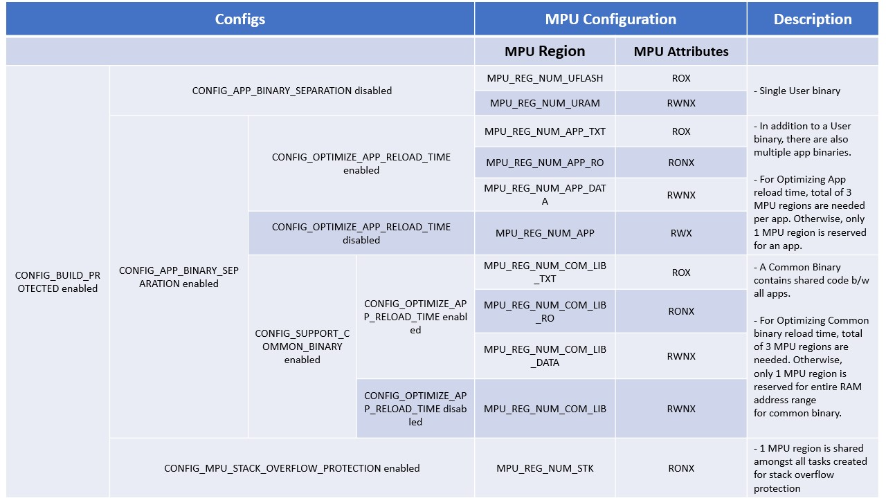

# Developer guide for Usage of MPU Regions in TizenRT

## CONTENTS
- [Overview](#overview)
- [How to enable MPU](#how-to-enable-mpu)
- [How to control MPU](#how-to-control-mpu)
- [MPU Usages of platform](#mpu-usages-of-platform)
- [Sample memory layout of MPU regions](#sample-memory-layout-of-mpu-regions)
- [Appendix](#appendix)

## Overview
- The main purpose of MPU is to protect memory regions by defining different access permissions, attributes, etc in privileged and unprivileged access levels.
- TizenRT divides available MPU regions into below specific use cases:
	- Board specific
	- Application binary
	- Common binary
	- Stack overflow
- Static region numbers are then allocated for each of the above MPU types which are then configured.

## How to enable MPU

- Provided MPU is supported in a chip, the following configs need to be enabled for configuring MPU regions(for ARMv7M architecture):
```
	------------------------------------------------------------------------------------------------------------------------------
	CONFIG FLAG			VALUE		DESCRIPTION		MENU PATH
	------------------------------------------------------------------------------------------------------------------------------
	CONFIG_ARMV7M_MPU		y		MPU support		Chip Selection -> MPU Support
	CONFIG_ARMV7M_MPU_NREGIONS	16		Number of MPU regions	Chip Selection -> MPU Support -> Number of MPU Regions
	------------------------------------------------------------------------------------------------------------------------------
```

- Similarly, for ARMv8M architecture, below MPU configs should be enabled.
```
	------------------------------------------------------------------------------------------------------------------------------
	CONFIG FLAG			VALUE		DESCRIPTION		MENU PATH
	------------------------------------------------------------------------------------------------------------------------------
	CONFIG_ARMV8M_MPU		y		MPU support		Chip Selection -> MPU Support
	CONFIG_ARMV8M_MPU_NREGIONS	8		Number of MPU regions	Chip Selection -> MPU Support -> Number of MPU Regions
	------------------------------------------------------------------------------------------------------------------------------
```

## How to control MPU
1. **MPU usage overview**
	- Logical mapping of MPU regions to their respective memory segments is done statically using below structure in common mpu.h header file (os/include/tinyara/mpu.h).
	```c
	struct mpu_usages_s {
	        uint8_t nregion_board_specific;
	        uint8_t nregion_common_bin;
	        uint8_t nregion_app_bin;
	        uint8_t nregion_stackovf;
	        uint8_t max_nregion;
	};
	```
	- This structure holds the region number range used for each type of mpu region (board specific, application binary, common binary, etc) and these are initialized during system boot using below API:
	```c
	void mpu_region_initialize(struct mpu_usages_s *mpu)

	offset += NUM_APP_REGIONS;
	mpu->nregion_xxx_xx = offset;
	```
2. **Board specific MPU region reservation**
	- In order to support few regions for the board specific purpose, below API is provided to reserve the first *num* number of regions:
	```c
	void mpu_set_nregion_board_specific(uint8_t num);
	```
	Above function shall be called during board initialization after the board specific MPU regions have been configured. The TizenRT MPU regions are configured after *num* number of board MPU regions.

3. **How to register TizenRT MPU region to real MPU hardware**
	- Below list of functions is available in TizenRT for registering MPU region to MPU hardware.
		- Several functions of mpu_xxxx format are available in architecture specific mpu.h file (eg. os/arch/arm/src/armv7-m/mpu.h) for one-time configuration of MPU regions.
			- Example: For configuring MPU regions for User Flash and User Internal SRAM, below functions are available.
			```c
			/****************************************************************************
			 * Name: mpu_user_flash
			 *
			 * Description:
			 *   Configure a region for user program flash
			 *
			 * Params:
			 *  region : MPU region number
			 *  base   : MPU region base address
			 *  size   : MPU region size
			 ****************************************************************************/
			static inline void mpu_userflash(uint32_t region, uintptr_t base, size_t size);
			```
			```c
			/****************************************************************************
			 * Name: mpu_userintsram
			 *
			 * Description:
			 *   Configure a region as user internal SRAM
			 *
			 * Params:
			 *  region : MPU region number
			 *  base   : MPU region base address
			 *  size   : MPU region size
			 ****************************************************************************/
			static inline void mpu_userintsram(uint32_t region, uintptr_t base, size_t size);
			```
			- Below are links to ARM architecture specific mpu.h files in TizenRT that provide functions for MPU region configuration:
				- [ARMv7-M MPU functions](../os/arch/arm/src/armv7-m/mpu.h)
				- [ARMv7-R MPU functions](../os/arch/arm/src/armv7-r/mpu.h)
				- [ARMv8-M MPU functions](../os/arch/arm/src/armv8-m/mpu.h)
		- For repeated/customized configuration of a MPU region, a three-step process should be applied using below functions:
			1. In the first step, get the region number to be configured using the below API:
			```c
			uint8_t nregion = mpu_get_nregion_info(MPU_REGION_xx);
			```
			Following enum provides possible mpu types to use in above API:
			```c
			enum mpu_region_usages_e {
			        MPU_REGION_BOARD_SPECIFIC,
			        MPU_REGION_COMMON_BIN,
			        MPU_REGION_APP_BIN,
			        MPU_REGION_STACKOVF,
			        MPU_REGION_MAX
			};
			```
			2. In the second step, obtain the mpu register values and store them in an array using below function:
			```c
			/****************************************************************************
			 * Name: mpu_get_register_config_value
			 *
			 * Description:
			 *   Configure the user application SRAM mpu settings into the tcb variables
			 *
			 * Params:
			 *  regs     : pointer to array in which to store the values to be configured
			 *  region   : number of the region to be configured
			 *  base     : start address for the region
			 *  size     : size of the region in bytes
			 *  readonly : true indicates a readonly region
			 *  execute  : true indicates that the region has execute permission
			 ****************************************************************************/

			void mpu_get_register_config_value(uint32_t *regs, uint32_t region, uintptr_t base, size_t size, uint8_t readonly, uint8_t execute);
			```
			where,  
			The 2nd parameter (region) values are used from the one obtained in step 1 above. These span from (nregion - 1) to (nregion - x) based on three separate MPU regions (text, ro and rw) to optimize reloading time or just one MPU region for all of section data.  
			3. In the third step, the values in the array are used to configure the mpu using below function.
			```c
			/****************************************************************************
			 * Name: up_mpu_set_register
			 *
			 * Description:
			 *   Set MPU register values to real mpu h/w
			 *
			 ****************************************************************************/
			void up_mpu_set_register(uint32_t *mpu_regs);
			```

4. **How to add new MPU region**
	- If a new type of MPU usage is to be added, then another entry has to be done in the below enum in common mpu.h header file (os/include/tinyara/mpu.h).
	```c
	enum mpu_region_usages_e {
	        MPU_REGION_BOARD_SPECIFIC,
	        MPU_REGION_COMMON_BIN,
	        MPU_REGION_APP_BIN,
	        MPU_REGION_STACKOVF,
	        MPU_REGION_MAX
	};
	```
	- The ordering of MPU regions is kept as above taking into consideration below rule:
		- In armv7-m, for overlapping address range between MPU regions, attributes of higher MPU region number will override those set by lower numbered MPU region.
		- In armv8-m, since overlapping regions are not allowed, the ordering of MPU regions does not matter.
	- The new MPU region(nregion_xx) other than the existing usages of board specific, common binary, app binary & stack overflow should be added in the structure above.

5. **Example : Adding new MPU region, MPU_REGION_MYREGION, with RO setting**
	1. Add the MPU region type MPU_REGION_MYREGION in enum mpu_region_usages_e in common mpu.h file.
	```c
	enum mpu_region_usages_e {
	 ....
	 MPU_REGION_STACKOVF,
	 MPU_REGION_MYREGION,
	 MPU_REGION_MAX
	};
	```
	2. Add a variable nregion_myregion to store the MPU region value in struct mpu_usages_s in common mpu.h file.
	```c
	struct mpu_usages_s {
	 ....
	 uint8_t nregion_stackovf;
	 uint8_t nregion_myregion;
	 uint8_t max_nregion;
	};
	```
	3. Initialized the MPU region to its respective number during MPU initialization in mpuinit.c file.
	```c
	void mpu_region_initialize(struct mpu_usages_s *mpu) {
	...
	 offset += 1;
	 mpu->nregion_myregion = offset;
	}
	```
	4. To get MPU region number use mpu_get_nregion_info(usages) API.
	```c
	uint8_t nregion = mpu_get_nregion_info(MPU_REGION_MYREGION);
	```
	5. To configure this MPU region as RO:
		1. Use mpu_get_register_value function to obtain mpu register values.
			- Declare a *regs* array variable (of size 3\*(uint32_t)) and pass it as first argument.
			- Pass region number obtained in the third step as second argument.
			- Pass readonly argument as *True*.
			- Pass proper values for MPU region base address, size and execute permissions.
			```c
			uint8_t nregion = mpu_get_nregion_info(MPU_REGION_MYREGION);
			mpu_get_register_config_value(regs, nregion - 1,  base_address, size, True,  execute);
			```
		2. Use up_mpu_set_register function to set obtained mpu register values to mpu h/w for configuring region.
		```c
		up_mpu_set_register(regs);
		```

## MPU Usages of platform
- In Protected Build, kernel runs in privileged mode, has access to all memory ranges and defines memory access permissions for unprivileged user code using MPU regions.
- Below table describes MPU configurations for various TizenRT features (enabled by their respective configs).


## Sample memory layout of MPU regions

- Below diagram is an example of memory layout for MPU regions.
- For this example, below Boolean configs were enabled:
	1. CONFIG_APP_BINARY_SEPARATION
	2. CONFIG_OPTIMIZE_APP_RELOAD_TIME
	3. CONFIG_SUPPORT_COMMON_BINARY
	4. CONFIG_MPU_STACK_OVERFLOW_PROTECTION

```
		RAM

	+===============+
	|	 	|
	|		|
Kernel	|  Kheap/KStack |
Heap	|		|
	|===============|
	|		|
	|		|  MPU_APP_TEXT(ROX) MPU_APP_RO(RONX) MPU_APP_DATA(RWNX)    MPU_STACK(RONX)    RWNX            RONX           RWNX
	|		|     +------------------------------------------------------------------------------------------------------------------+
App1	|  Utext/Udata/	| ==> | Utext    |   Uro/Udata    |   Udata/Ubss/Uheap    | Guard Region | Task1 Ustack  | Guard Region | Task2 Ustack   |
Heap	|  Ubss/Uheap/	|     +------------------------------------------------------------------------------------------------------------------+
	|  Ustack	|
	|		|
	|===============|
	|		|
	|		|  MPU_APP_TEXT(ROX) MPU_APP_RO(RONX) MPU_APP_DATA(RWNX)    MPU_STACK(RONX)    RWNX             RONX          RWNX
	|		|     +------------------------------------------------------------------------------------------------------------------+
App2	|  Utext/Udata/	| ==> |  Utext    |   Uro/Udata    |   Udata/Ubss/Uheap    | Guard Region | Task3 Ustack  | Guard Region | Task4 Ustack  |
Heap	|  Ubss/Uheap/	|     +------------------------------------------------------------------------------------------------------------------+
	|  Ustack	|
	|		|
	|===============|
	|		|
	|		|           MPU_COM_LIB_TEXT(ROX)          MPU_COM_LIB_RO(RONX)         MPU_COM_LIB_DATA(RWNX)
	|		|     +-------------------------------------------------------------------------------------------+
Common	|  Utext/Udata/	| ==> |           Utext             |         Uro/Udata           |     Udata/Ubss/Uheap/Ustack   |
Binary	|  Ubss/Uheap/	|     +-------------------------------------------------------------------------------------------+
Heap	|  Ustack	|
	|		|
	+===============+
```

## Appendix
- Currently, only ARMV7M and ARMV8M MPUs are supported in TizenRT.
	- ARMV8M MPU support is implemented but not verified on any board.
- For configuring a MPU region, we need to set below ARM MPU registers (defined in architecture specific mpu.h file, eg. os/arch/arm/src/armv7-m/mpu.h):
	1. **MPU_RNR** : MPU Region Number register
	2. **MPU_RBAR** : MPU Region Base Address register
	3. **MPU_RASR** : MPU Region Attribute and Size Register
- ARMV7M MPU has following features:
	- MPU supports a configurable number of programmable regions between zero to sixteen regions.
	- MPU memory region base address must be aligned to an integer multiple of the region size.
	- MPU region size must be a power of two but cannot be smaller than 32 bytes.
- ARMV8M MPU has following features:
	- The MPU supports a configurable number of programmable regions between zero and sixteen regions per security state.
	- The smallest size that can be programmed for an MPU region is 32 bytes.
	- The maximum size of any MPU region is 4GB, but the size must be a multiple of 32 bytes.
	- All regions must begin on a 32 byte aligned address.
- For more details about ARM MPU, refer below document:
	- [Memory Protection Unit (MPU)](https://static.docs.arm.com/100699/0100/armv8m_architecture_memory_protection_unit_100699_0100_00_en.pdf)
