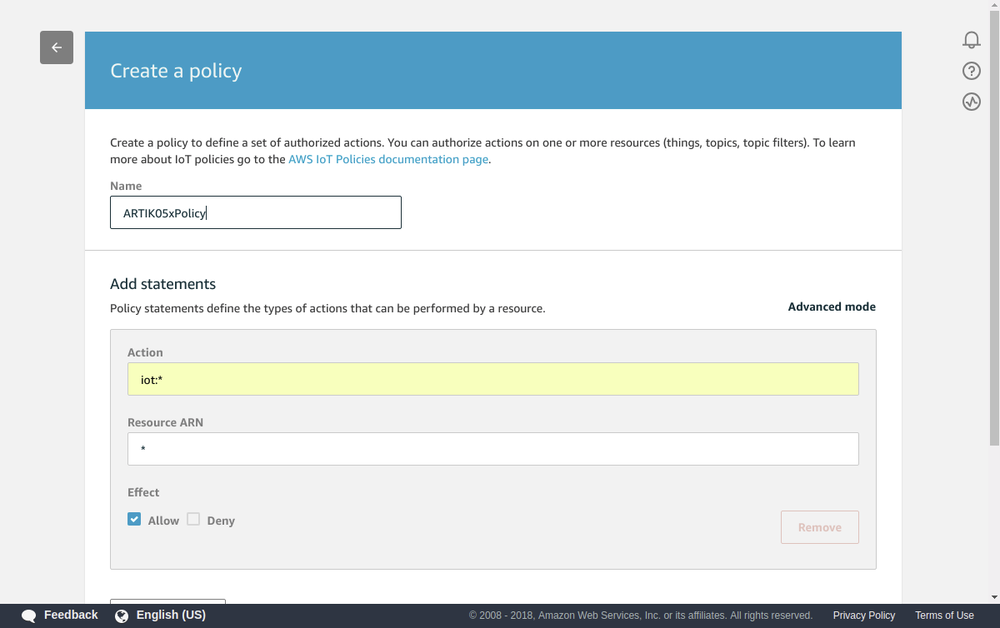
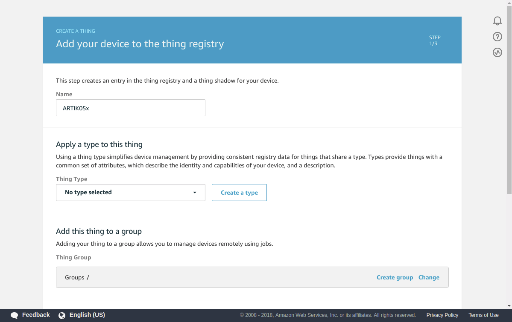
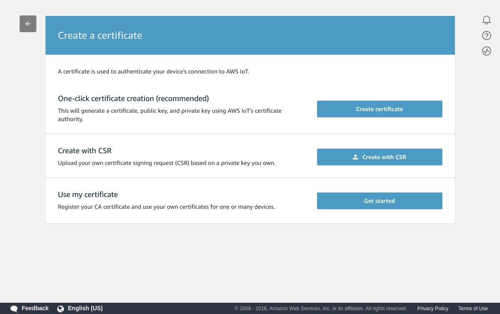
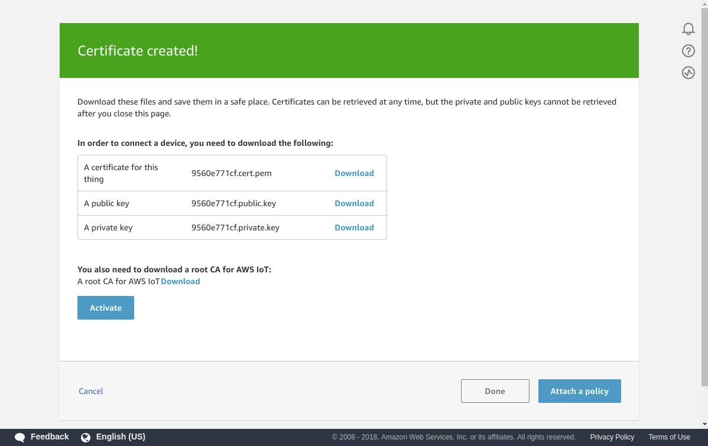

## AWS IoT Embedded C SDK

This manual connects the ARTIK05x to the AWS IoT. After following the steps in this guide, you can connect to the AWS IoT platform and run the sample app included with these AWS IoT SDKs.

The current version of the `AWS IoT Embedded C SDK` ported to TizenRT is **3.0.1**.

This content was created with reference to [here](https://docs.aws.amazon.com/iot/latest/developerguide/sdk-tutorials.html).

### Sign in to the AWS IoT Console

1. Sign in to the AWS Management Console and open the AWS IoT console at https://console.aws.amazon.com/iot.

2. Secure -> Policies -> Create -> You have to make Name, Action, Resource ARN, Effect.
 * Name: ARTIK05xPolicy (Example)
 * Action: iot:*
 * Resource ARN: *
 * Effect: Allow



3. Manage -> Create -> Create a single thing -> You have to make Name. -> Next



4. One-click certificate creation "Create certificate"



5. Download "A certificate for this thing" & "A private key" & "root CA"



 For the "root CA" file, download the file from the link below.

  * RSA 2048 bit key: [VeriSign Class 3 Public Primary G5 root CA certificate](https://www.symantec.com/content/en/us/enterprise/verisign/roots/VeriSign-Class%203-Public-Primary-Certification-Authority-G5.pem)

6. Push "Activate" and "Attach a policy"

7. Select Policy -> Register Thing

8. Manage -> Things -> [Your Things] -> Interact -> Copy Rest API Endpoint.

### Using the AWS IoT Embedded C SDK

ARTIK05x is not easy to insert certificate files. Therefore, you must put the certificate content in the source.

We provide a script to convert the certificate contents to c-source.
You can create the `certData.c` file with the following script:
```bash
$ cd TizenRT/external/aws/certs
$ sh mkcertData.sh <root CA file> <certificate file> <private key file>
```

If you want to use the 'AWS IoT Core', you need the following settings in menuconfig.
> * External Functions > Enable "AWS SDK"
> * Input Rest API Endpoint in "Customer specific MQTT HOST". (ex. abcde.iot.ap-northeast-2.amazonaws.com)
> * Fix "Thing Name of the Shadow". This is a your thing name.
> * Application Configuration > Examples > Enable "aws examples"
> * Save and exit

### Run AWS Example

1. Set date.
```
TASH>> date -s <current date>
```

2. Run ARTIK05x and confirm you have an Internet connection.
```
TASH>> wifi startsta
TASH>> wifi join <ssid> <key> <security>
TASH>> ifconfig wl1 dhcp
```

3. Run aws
```
TASH>> aws <sample select>
```
