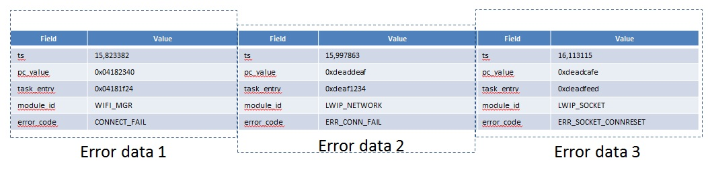
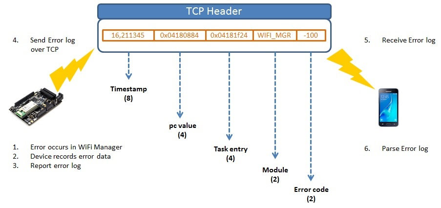

# Introduction

IoT devices that are deployed in production have limited means of accounting for errors by themselves. In reality, failures are imminent at runtime, therefore a failing device needs to provide as much context as possible for debugging purposes. To this end, the Error Reporting feature is introduced in TizenRT with the following objectives:

1. Facilitating offline debugging of errors, especially when the device running TizenRT is unhooked from serial terminal or other developer-friendly interfaces
2. Capturing a temporal sequence of errors that can be mapped to a failure at the system level. This can be used in future by a reasoning model to perform either a root-cause analysis or failure prediction.

At present, TizenRT supports error reporting for WiFi Manager and LWIP network socket layer. However, the concept of error reporting is generic enough to allow support for other modules in the future. Section [TizenRT's Error Reporting System Model](#tizenrt's-error-reporting-system-model) describes the system model for TizenRT's Error Reporting and illustrates its workflow using a representative example. Section [Guidelines to use Error Reporting](#guidelines-to-use-error-reporting) provides detailed guidelines for configuring TizenRT modules to report errors. Readers interested in a quick demo may directly jump to Section [TizenRT Error Reporting Demo](#tizenrt-error-reporting-demo) that describes a TizenRT application that uses TizenRT's error reporting module.

# TizenRT's Error Reporting System Model
The design of TizenRT's Error Reporting rests on the following considerations:
1. Error reporting in TizenRT does not address crash faults. This influences a important design choice for the feature, that is, all error records are stored in RAM
2. However, the amount of RAM that we can use for error reporting is limited. So, we opt for a simple policy where newer error records overwrite the oldest stored error records
3. At present, error reporting is not a functional module, but a feature that can be accessed by existing TizenRT modules via API calls
4. Error reports can be sent to multiple endpoint servers for analysis. This requires the error reporting API to accommodate endpoint-specific parameters (such as IP address, Port etc)
5. Error records coming from a device have to be sequenced in time, in order to have a meaningful context. However, it is not strictly required to have accurate timestamp information -- jitter in the order of milliseconds is tolerable.

Note that the considerations listed above are not final, they will be revisited over time to accommodate new features. The following section describes the system model for TizenRT's Error Reporting feature.

## How Error Reporting works in TizenRT
Based on the considerations listed above, TizenRT's error reporting stores errors as contiguous records in memory, as shown in **Figure 1** below.

**Figure 1: Error records stored in RAM**

The error report is therefore, a list of error records ordered naturally by the times at which they occur. Conceptually, each error record corresponds to a given TizenRT module (such as *WiFi Manager*, or *LWIP Socket API*), and an error id associated with that module. Structurally, each error record comprises the following elements:
### Timestamp of occurrence
As described earlier, timestamps need not be accurate to the the order of microseconds, however, they should capture errors within milliseconds of having occurred. The error reporting feature uses TizenRT's ```gettimeofday``` API for this purpose.
Timestamps are therefore relative, and a server needs to order timestamps from various such devices to provide a global temporal context.
### Program Counter
In many cases, it is desirable to know the exact address in program memory where errors occur. To this end, TizenRT's error reporting feature extracts the program counter value from the underlying hardware and stores it in memory.
### Task Address
In certain cases, especially involving callback routines in the network stack, it is desirable to know which task is responsible for the error. The Task Address captures the entry point of the concerned task, using TizenRT's scheduler APIs to index into the list of globally defined tasks at runtime.
### Module Id
The error record includes a pre-defined identifier associated with the TizenRT module at fault
### Error Code
The error record includes a pre-defined identifier associated with the Error Code for the above-mentioned module.

**Figure 2** below shows an example of Error Reporting in TizenRT's WiFi Manager.

**Figure 2: Example of Error Reporting**

The six steps shown in **Figure 2** illustrate in a point-wise fashion, the internals of TizenRT's error reporting. These steps are achieved by Error Reporting API calls, which are summarized below for convenience:

1. ```error_report_init``` - Initializes the error reporting module. This API is called when the device boots
2. ```error_report_data_create``` - Creates a new error record, and stores it in RAM, with an overwrite policy when memory is limited. Parameters to this API include the Module Id, Error Code and the Program Counter value
3. ```error_report_data_read``` - Reads the error records from RAM into a serial buffer
4. ```error_report_send``` - Sends the serialized error records from ```error_report_data_read``` over a TCP connection to the specified server endpoint
5. ```error_report_deinit``` - Suspends the error reporting module. Using error reporting API in the deinit state should be avoided.

# Guidelines to use Error Reporting
In this section, we cover three aspects on how to use Error Reporting feature in TizenRT, namely configuring an existing module for error reporting, adding a new module, and placing API calls for error record creation. As a context, the error reporting source and header files reside at ```external/error_report``` and ```external/include/error_report``` respectively.

## Configure Existing Module
The ```menuconfig``` parameters for Error Reporting are defined in ```external/error_report/Kconfig``` file. Specifically, Error Reporting must be enabled by setting ```CONFIG_ERROR_REPORT``` to ```y```. When enabled, the ```menuconfig``` will display additional parameters as shown below:

1. ```CONFIG_ERROR_REPORT_NENTRIES``` - Maximum number of error records that will be stored in RAM
2. ```CONFIG_DEBUG_ERR_REPORT_ERROR``` - Debug Error Reporting for errors
3. ```CONFIG_DEBUG_ERR_REPORT_WARN``` - Debug Error Reporting for warnings
4. ```CONFIG_DEBUG_ERR_REPORT_INFO``` - Debug Error Reporting in verbose mode
5. ```CONFIG_<MODULE_NAME>_ERROR_REPORT``` - Enable Error Reporting for module *<MODULE_NAME>*. At present, WiFi Manager and LWIP sockets use Error Reporting feature
6. ```CONFIG_EIPADDR_ERROR_REPORT``` - IPv4 address of default server endpoint
7. ```CONFIG_EPORT_ERROR_REPORT``` - Port of default server endpoint

Having set the parameters above, type ```make``` to build TizenRT.

## Add New Module
In order to add a new module, we need to modify the header file, namely ```external/error_report/error_report.h```. Specifically, we need to create a new id for the module, as shown below as an example:

```
enum error_module_id_e {
	ERRMOD_WIFI_MANAGER,
	ERRMOD_WPA_SUPPLICANT,
	ERRMOD_LWIP_CORE,
	ERRMOD_LWIP_SOCKET,
	ERRMOD_<MODULE_NAME>,
};

```

Ideally, Error Codes from a module must be contained in the module implementation itself. If, however, the Error Codes do not cover the error scenarios witnessed in production runs, we can define the additional Error Codes in ```error_report.h```, using ```enum``` declarations. Please note that this declaration is optional, and should be avoided when module-specific Error Codes already exist. Following example shows one such declaration template:

```
#ifdef CONFIG_<MODULE_NAME>_REPORT
enum error_code_<module_name>_e {
	ERR_<module_name>_<reason1> = -100,
	ERR_<module_name>_<reason2>,
	ERR_<module_name>_<reason3>,
};
typedef enum error_code_<module_name>_e error_code_<module_name>_t;
#endif
```

## Create Error Records
Having defined the Module Id and the associated Error Codes, we have to insert error reporting API calls (mostly ```error_report_data_create```) at appropriate places in the module source code. For simplicity, the API call to ```error_report_data_create``` can be done using a macro ```ERR_DATA_CREATE``` defined in ```error_report.h```. ```ERR_DATA_CREATE``` takes in the Module Id and Error Code and adds in the program counter value, before calling the ```error_report_data_create``` API, as shown below:

```
#define ERR_DATA_CREATE(module_id, reason_code)	    \
do {                                                                   \
	uint32_t pc_value;                                                 \
	__asm volatile ("mov %[result], r15":[result] "=r" (pc_value));    \
	if (error_report_data_create(module_id, reason_code, pc_value) == NULL) {\
		printf("Failed to create error log\n");                        \
	}                                                                  \
} while(0)
```

Within a module, macro calls to ```ERR_DATA_CREATE``` takes in the same *module_id* as parameter, so an additional simplification is possible by defining a module-specific macro as shown below:

```
#ifdef CONFIG_<MODULE_NAME>_ERROR_REPORT
#include <error_report/error_report.h>
#define <module>ADD_ERR_RECORD(reason_code)	ERR_DATA_CREATE(ERRMOD_<MODULE_NAME>, reason_code)
#else
#define <module>ADD_ERR_RECORD(reason_code)
#endif
```

See ```WIFIADD_ERR_RECORD``` macro definition in ```framework/src/wifi_manager/wifi_manager.c``` as an example for the template given above. Finally, having added the error reporting feature to the module, follow the steps above for configuring TizenRT build.


# TizenRT Error Reporting Demo
TizenRT features a Error Reporting demo application under ```apps/examples/error_report``` folder. This application sends error records from WiFi Manager and LWIP sockets to a server running on Linux. We now describe the steps to be followed on the client and server side to verify the application.

## On the Client Device
To quickly verify error reporting in TizenRT, follow the steps below:

1. Configure TizenRT build for error reporting, following the steps in Section [Configure Existing Module](#configure-existing-module)
2. Using ```menuconfig```, include ```Error Report Test``` application under ```> Application Configuration > Examples```, and type ```make```
3. After successful build and download of the binary on the target board, press the reset button and get to the TASH console.

Assuming that the device can connect to a WiFi AP nearby, and there is an endpoint server waiting for error records, you are ready to run the ```error_report``` application. Type ```error_report test <endpoint_addr>:<endpoint_port>```, where ```<endpoint_addr>:<endpoint_port>``` correspond respectively to the ipv4 address and port of the server. At the end of the execution, you should see the following log:

```
3 out of 3 cases passed.
```

## On the Server Side
Assuming a Linux PC with connection capabilities to TizenRT client end-devices, run the Python script ```error_report.py``` that is located in the ```tools/error_report``` folder. The syntax for running the script is as shown below:

```
./error_report.py -p <endpoint_port> -a <endpoint_addr> <path_to_tinyara_binary>
Example: ./error_report.py -p 8586 -a 192.168.0.25 ../build/output/bin/tinyara
```
