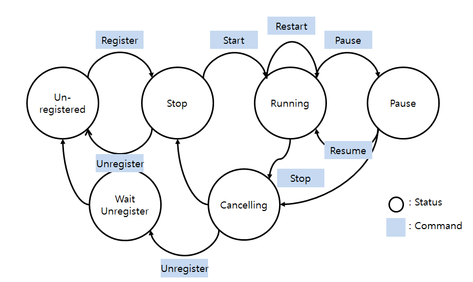

# Task Manager

Task manager provides the following Application Management functionalities: registration, control, message, and information.  
At present, task manager works only for builtin applications.   
Please find details in [API List](#api-list) and [Builtin Feature for Registration](#builtin-feature-for-registration).    
Task manager in TizenRT is particularly useful under the following scenarios.  
 - Bixby needs to start the Alarm application, having processed voice command.  
 - When Wi-Fi disconnection message is broadcasted, applications can receive the broadcast message.

## Details
### API List
| Functionality | APIs                               |
|---------------|------------------------------------|
| Registration  | task_manager_register()            |
|               | task_manager_unregister()          |
| Control       | task_manager_start()               |
|               | task_manager_restart()             |
|               | task_manager_terminate()           |
|               | task_manager_termination_cb()      |
|               | task_manager_pause()               |
|               | task_manager_resume()              |
| Message       | task_manager_unicast()             |
|               | task_manager_broadcast()           |
|               | task_manager_set_unicast_cb()      |
|               | task_manager_set_broadcast_cb()    |
| Information   | task_manager_getinfo_with_name()   |
|               | task_manager_getinfo_with_handle() |
|               | task_manager_getinfo_with_group()  |
|               | task_manager_clean_info()          |
|               | task_manager_clean_infolist()      |

Please find APIs' details on header file, [task_manager.h](https://github.com/Samsung/TizenRT/tree/master/framework/include/task_manager/task_manager.h)

### Permission
All registered applications have their own permission, and the task manager checks the permission for every management request.  
If controller application does not have proper permission for controllee applications, it can't manage the controllee applications.  
- Permission types
	- TM_TASK_PERMISSION_ALL : Any application can control this application.  
	- TM_TASK_PERMISSION_GROUP : Only same group application can control this application.  
		(*group : Tasks set which registered from same parent task)  
	- TM_TASK_PERMISSION_DEDICATE : Only a application which requested to register that application can control this application.  

### State
Task Manager manages each application with four states, unregistered, stop, running and paused.  
Please find below how to move each state by APIs.  


## Prerequisites
### Configuration
Enable configuration of task manager with menuconfig
```bash
cd $TIZENRT_BASEDIR
cd os
make menuconfig
```
Select menu
```bash
Task Manager -> [*] Enable Task Manager
```

### Builtin Feature for Registration
Task manager can manage only builtin applications.  
Builtin information should follow the [format](https://github.com/Samsung/TizenRT/tree/master/apps/builtin).  


## Sample Application
[Task Manager Sample](https://github.com/Samsung/TizenRT/tree/master/apps/examples/task_manager_sample) covers all of above mentioned functionality. Please find sample's details on [README](https://github.com/Samsung/TizenRT/blob/master/apps/examples/task_manager_sample/README.md).

