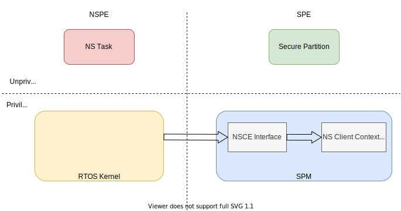
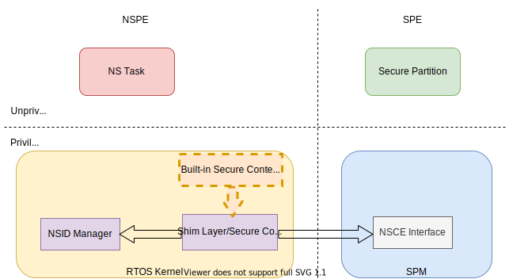

#############################################
Non-secure Client Extension Integration Guide
#############################################

This document introduces TF-M Non-secure Client Extension (NSCE) and how to
integrate it with Non-secure Processing Environment (NSPE) RTOS.

****************
What is NSCE for
****************

Besides the secure services provided via PSA APIs, there are two interactions
between TF-M and NSPE RTOS.

- Non-secure context management in TF-M

  When a NS task calls a secure service, a context is maintained in TF-M. If
  TF-M supports multiple secure service calls, the context needs to be loaded
  and saved with the corresponding NS task when the RTOS kernel (the kernel)
  does scheduling.

- Non-secure client ID (NSID) management

  As per PSA Firmware Framework specification, NSID is required for a secure
  service call from the NSPE. The NSID can be managed by either SPM (the same
  NSID must be used for all connections) or the NSPE RTOS. For the latter case,
  the NSPE RTOS must provide the NSID for each connection.

NSCE is implemented to support the interactions above.

- Provide the interface to NSPE RTOS for managing the context in TF-M.

- Provide a mechanism to NSPE RTOS for providing the NSID for each connection.

**********************
NSCE component diagram
**********************

  Non-secure Client Extension Component Diagram

This diagram shows the components of NSCE.

- NSCE interface: The NSCE API interface to NSPE RTOS.

- NS Client Context Manager: It is the internal component of SPM that is used to
  manage the NS client context. It is not accessible to NSPE.

******************************
Group-based context management
******************************

NSCE introduces a group-based context management for NS clients. The purpose is
to support diverse use scenarios in the IoT world.

For rich-resource devices, TF-M could assign separate contexts for each
connection. For resource-constrained devices, TF-M may support very limited
context slots. Multiple NS connections could share the same context provided
they have mutual exclusion access to the secure services.

To support this flexibility, a group ID (gid) and a thread ID (tid) are
specified for the connection of the NS client. NSCE allocates only one context
for a given group. Threads in the same group share the context.

The gid and tid are specified by NSPE RTOS via NSCE interface.

**************
NSCE interface
**************

NSCE defines a set of APIs as the interface for NSPE RTOS to manage the context
in TF-M. NSID is provided as an input parameter of `tfm_nsce_load_ctx()`.

NSCE APIs are typically called by the kernel and must be called from the
non-secure handler mode.

.. code-block:: c

  uint32_t tfm_nsce_init(uint32_t ctx_requested)

This function should be called before any other NSCE APIs below to do non-secure
context initialization in NSCE for the calling NS entity. `ctx_requested` is the
number of the contexts requested by the NS entity. The number of assigned
context will be returned. It may be equal to or smaller than the requested
context number based on the current available resource in TF-M. If
`ctx_requested` is `0`, then the maximum available context number will be
assigned and returned. If the initialization is failed, `0` should be returned.

.. Note::
  As TF-M only supports one context for now, so the return value is always `1`
  if no error. Currently, it is safe to skip calling `tfm_nsce_init()`.
  But, for future compatibility, it is recommended to do so.

.. code-block:: c

  uint32_t tfm_nsce_acquire_ctx(uint8_t group_id, uint8_t thread_id)

This function allocates a context for the NS client connection. The `gid` and
`tid` are the input paramemters. A token will be returned to the NSPE if TF-M
has an available context slot. Otherwise, `TFM_NS_CLIENT_INVALID_TOKEN` is
returned.
It is the responsibility of NSPE RTOS to assign gid and tid for each NS client.

.. code-block:: c

  uint32_t tfm_nsce_release_ctx(uint32_t token)

This function tries to release the context which was retrieved by
`tfm_nsce_acquire_ctx()`. As the context may be shared with other threads
within the same group, the context is only freed and back to the available
context pool after all threads in the same group release the context.

.. code-block:: c

  uint32_t tfm_nsce_load_ctx(uint32_t token, int32_t nsid)

This function should be called when NSPE RTOS schedules in a NS client. `token`
is returned by `tfm_nsce_acquire_ctx()`. `nsid` is the non-secure client ID
used for the following PSA service calls.

The assignment of NSID is managed by the NSPE RTOS. It is not required to use
the same NSID for a NS client when calling this function each time. This allows
the NS client changing its NSID in the lifecycle. For example, the provisioning
task may need to switch NSID to provision the keys for different NS clients
created afterwards.

.. code-block:: c

  uint32_t tfm_nsce_save_ctx(uint32_t token)

This function should be called when NSPE RTOS schedules out a NS client. The
input parameter `token` is returned by `tfm_nsce_acquire_ctx()`.
After the context is saved, no secure service call can be made from NSPE until a
context is loaded via `tfm_nsce_load_ctx()`.

**********************
NSCE integration guide
**********************

Enable NSCE in TF-M
===================

To enable NSCE in TF-M, set the build flag `TFM_NS_MANAGE_NSID` to `ON` (default
`OFF`).

.. _Support NSCE in an RTOS:

Support NSCE in an RTOS
=======================

For supporting NSCE in an RTOS, the integrator needs to do the following major
work:

- Integrate the NSCE API calls into the NS task lifecycle. For example,
  creating/scheduling/destroying a NS task.

- Manage the assignment for `gid`, `tid` and NSID.

The typical steps are listed below:

- Before programming, the integrator should plan the group assignment for
  the NS tasks that need to call secure services. If the number of tasks is less
  than or equal to TF-M non-secure context slots, then different gid can be
  assigned to each task for taking dedicated context in TF-M.
  Otherwise, the integrator need to think about grouping the tasks to share the
  context.

- In the kernel initialization stage, it calls `tfm_nsce_init()` with
  requested context number to initialize the non-secure context in TF-M. The
  actual allocated context number will be returned. `0` means initialization
  failed. The kernel could use different group assignment sets according to the
  context number allocated to it. TF-M only supports one context for now.

- The kernel calls `tfm_nsce_acquire_ctx()` when creating a new task. This
  should be done before the new task calls any secure service. A valid token
  returned should be saved as part of the task context in NSPE RTOS.

- When the kernel schedules in a task with a valid `token` associated,
  `tfm_nsce_load_ctx()` should be called before resuming the execution of that
  task. The NSID is specified by the kernel through the `nsid` parameter.
  The mapping between NSID and task is managed by the kernel.
  `tfm_nsce_load_ctx()` can be called multiple times without calling
  `tfm_nsce_save_ctx()` for switching the NSID for the same task (same tid and
  gid).

- `tfm_nsce_save_ctx()` should be called if the current task has a valid
  `token` before being switched to another task. Calling `tfm_nsce_load_ctx()`
  for another task before saving the current context may result in NS context
  lost in TF-M for the running task.

- When the task is terminated, destroyed or crashed, the kernel should call
  `tfm_nsce_release_ctx` to make sure the associated resource is back to the
  pool in TF-M.

Integration example
===================

  RTOS/NSCE integration example

This is the software module diagram of a typical RTOS/NSCE integration example.

- Built-in Secure Context Manager: An RTOS may have an existing built-in secure
  context manager with a group of secure context management APIs defined. Let's
  take RTX which uses `Armv8-M TrustZone APIs <https://www.keil.com/pack/doc/CMSIS/Core/html/group__context__trustzone__functions.html>`_
  as the example.

.. Note::
  RTOS may define the NS task context in the secure side as "secure context". It
  is the same thing as the "non-secure context" (context for a secure service
  call from NS client) from TF-M's point of view.

- Shim Layer/Secure Context Manager: If the RTOS has a "Built-in Secure Context
  Manager", then a shim layer should be provided to translate the built-in API
  calls into the NSCE API calls. A reference shim layer for RTX TrustZone APIs
  is `here <https://review.trustedfirmware.org/c/TF-M/tf-m-tests/+/11291>`_.

  If the RTOS has no existing one, then a "Secure Context Manager" should be
  implemented based on the NSCE APIs. You can refer to the shim layer example
  above for the implementation. The timing of calling NSCE APIs in the kernel is
  introduced in the :ref:`Support NSCE in an RTOS` section above.

- NSID Manager: If NSPE RTOS manages the NSID, then this module is used by the
  secure context manager or shim layer to manage the NSID assignment for the
  NS tasks. The assignment is implementation defined. A `task name based NSID
  manager <https://review.trustedfirmware.org/c/TF-M/tf-m-tests/+/11290>`_ is \
  provided as a reference.

Integration notes
=================

- `gid`: It is a `uint8_t` value (valid range is 0 - 255). So, maximum 256
  groups (NSCE context slots) are supported by the NSCE interface.
  TF-M only supports single context for now. So, it is recommended to use
  single group ID at this stage.

- `tid`: It is a `uint8_t` value (valid range is 0 - 255). Thread ID is used to
  identify a NS client within a given group. `tid` has no special meaning for
  TF-M. So, usually the kernel only needs to ensure a NS task has a unique `tid`
  within a group.

- `gid` and `tid` management: It is the responsibility of NSPE RTOS to manage
  the assignment of `gid` and `tid`. Based on the explaination above, the `gid`
  could be assigned as a constant value. And, the `tid` can be increased
  globally when calling `tfm_nsce_acquire_ctx()` for a new task. Just notice
  `tid` may overflow.

- NSID management: It is the responsibility of NSPE RTOS to manage the
  assignment of the NSID for each task. It is highly recommended that a NS
  client uses the same NSID following a reboot or update. The binding of a NS
  client to a specific NSID will ensure the correct access to the assets. For
  example, the data saved in the protected storage.

- Integrate with the existing secure context management APIs of NSPE RTOS: The
  NSCE APIs are designed to be compatible with most known existing secure
  context management APIs. A shim layer is needed to translate the API calls.
  See the integration example above.

- `tfm_nsce_acquire_ctx()` must be called before calling
  `tfm_nsce_load_ctx()`, `tfm_nsce_save_ctx()` or `tfm_nsce_release_ctx()`.

- `tfm_nsce_release_ctx()` can be called without calling `tfm_nsce_save_ctx()`
  ahead.

--------------

*Copyright (c) 2021, Arm Limited. All rights reserved.*
