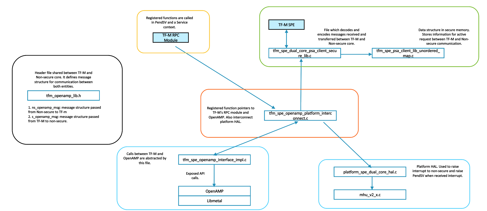
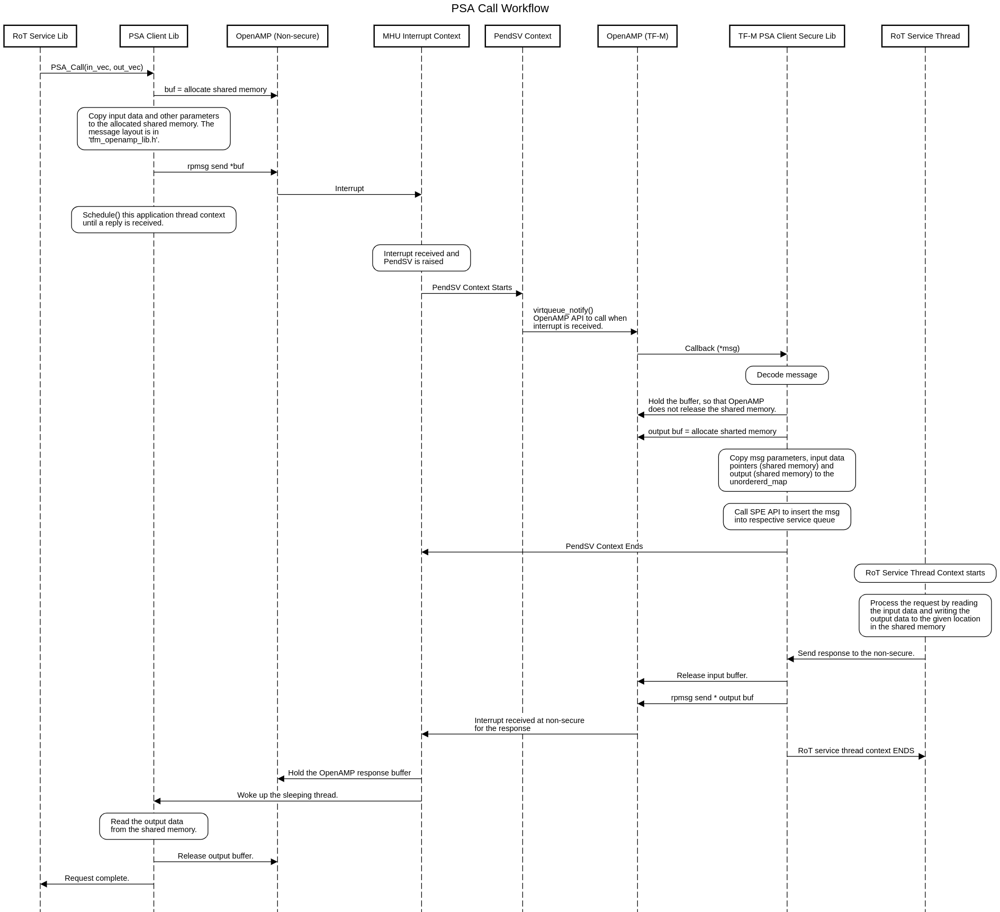

##############################
Use of OpenAMP in Corstone1000
##############################
ARM's Corstone1000 platform uses openamp for tf-m non-secure
communication. The openamp interface is used to recieve
messages and send response to the host (Linux). The
PSA Client library decodes messages received through
OpenAMP and fowards the decoded messages to TF-M's SPM.

TF-M has Mailbox solution which supports non-secure
bare-meta applications. In the Corstone1000, the non-secure side
is Linux environment so openamp is used instead.

The file naming convention used here is aligned with TF-M's
`secure_fw` naming convention. This is just to make sure
in future file name does not require change if TF-M adopts
this implementation.

**************************
Relationship between files
**************************

*********************
SQL Diagram: PSA Call
*********************

--------------

*Copyright (c) 2021, Arm Limited. All rights reserved.*
