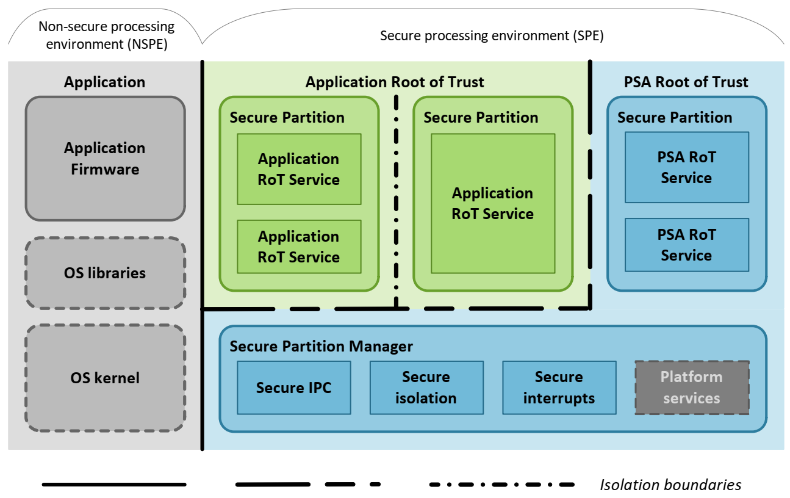
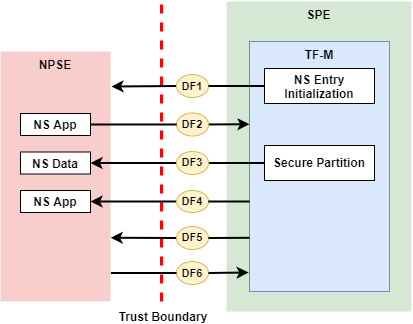

#######################################
Trusted Firmware-M Generic Threat Model
#######################################

************
Introduction
************

This document introduces a generic threat model of Trusted Firmware-M (TF-M).
This generic threat model provides an overall analysis of TF-M implementation
and identifies general threats and mitigation.

.. note::

  If you think a security vulnerability is found, please follow
  Trustedfirmware.org [Security-Incident-Process]_ to contact TF-M security
  team.

Scope
=====

TF-M supports diverse models and topologies. It also implements multiple
isolation levels. Each case may focus on different target of evaluation (TOE)
and identify different assets and threats.
TF-M implementation consists of several secure services, defined as
Root of Trust (RoT) service. Those RoT services belong to diverse RoT
(Application RoT or PSA RoT) and access different assets and hardware. Therefore
each RoT service may require a dedicated threat model.

The analysis on specific models, topologies or RoT services may be covered in
dedicated threat model documents. Those threat models are out of the scope of
this document.

Methodology
===========

The threat modeling in this document follows the process listed below to
build up the threat model.

- Target of Evaluation (TOE)
- Assets identification
- Data Flow Diagram (DFD)
- Threats Prioritization
- Threats identification

TOE is the entity on which threat modeling is performed. The logic behind this
process is to firstly investigate the TOE which could be a system, solution or
use case. This first step helps to identify the assets to be protected in TOE.

According to TOE and assets, Trust Boundaries can be determined. The Data Flow
Diagram (DFD) across Trust Boundaries is then defined to help identify the
threats.

Those threats should be prioritized based on a specific group of principals and
metrics. The principals and metrics should also be specified.

********************
Target of Evaluation
********************

A typical TF-M system diagram from a high-level overview is shown below. TF-M is
running in the Secure Processing Environment (SPE) and NS software is running in
Non-secure Processing Environment (NSPE). For more details, please refer to
Platform Security Architecture Firmware Framework for M (FF-M) [FF-M]_ and
FF-M 1.1 Extensions [FF-M 1.1 Extensions]_.

The TOE in this general model is the SPE, including TF-M and other components
running in SPE.

The TOE can vary in different TF-M models, RoT services and usage scenarios.
Refer to dedicated threat models for the specific TOE definitions.

********************
Asset identification
********************

In this threat model, assets include the general items listed below:

- Hardware Root of Trust data, e.g.

    - Hardware Unique Key (HUK)
    - Root authentication key
    - Other embedded root keys

- Software RoT data, e.g.

    - Secure Partition Manager (SPM) code and data
    - Secure partition code and data
    - NSPE data stored in SPE
    - Data generated in SPE as requested by NSPE

- Availability of entire RoT service

- Secure logs, including event logs

Assets may vary in different use cases and implementations. Additional assets
can be defined in an actual usage scenario and a dedicated threat model.

For example, in a network camera use case, the following data can be defined as
assets too:

- Certificate for connecting to cloud
- Session keys for encryption/decryption in the communication with cloud
- Keys to encrypt/decrypt the videos and photos

*****************
Data Flow Diagram
*****************

The Trust Boundary isolates SPE from NSPE, according to the TOE definition in
`Target of Evaluation`_. The Trust Boundary mapped to block diagram is shown
in the figure below. Other modules inside SPE stay in the same TOE as TF-M does.

Valid Data flows across the Trust Boundary are also shown in the figure below.
This threat model only focuses on the data flows related to TF-M.

More details of data flows are listed below.

.. _data-flow-table:

.. table:: TF-M Data Flows between NSPE and SPE

  +-----------+----------------------------------------------------------------+
  | Data flow | Description                                                    |
  +===========+================================================================+
  | ``DF1``   | TF-M initializes NS entry and activates NSPE.                  |
  |           |                                                                |
  |           | - On single Armv8-M core platforms, TF-M will hand over the    |
  |           |   control to Non-secure state.                                 |
  |           | - On dual-cpu platforms, Secure core starts NS core booting.   |
  +-----------+----------------------------------------------------------------+
  | ``DF2``   | NSPE requests TF-M RoT services.                               |
  |           |                                                                |
  |           | - In TF-M Library model, NS invokes Secure Function calls      |
  |           | - In TF-M IPC model, NS invokes PSA Client calls based on IPC  |
  |           |   protocol defined in [FF-M]_.                                 |
  |           |                                                                |
  |           | In single Armv8-M core scenarios, SG instruction is executed   |
  |           | in Non-secure Callable region to trigger a transition from     |
  |           | Non-secure state to Secure state.                              |
  |           |                                                                |
  |           | On dual-cpu platforms, non-secure core sends PSA Client calls  |
  |           | to secure core via mailbox.                                    |
  +-----------+----------------------------------------------------------------+
  | ``DF3``   | Secure Partitions fetch input data from NS and write back      |
  |           | output data to NS.                                             |
  |           |                                                                |
  |           | In TF-M IPC model, as required in [FF-M]_, Secure Partitions   |
  |           | should not directly access NSPE memory. Instead, RoT services  |
  |           | relies on TF-M SPM to access NSPE memory.                      |
  +-----------+----------------------------------------------------------------+
  | ``DF4``   | TF-M returns RoT service results to NSPE after NS request to   |
  |           | RoT service is completed.                                      |
  |           |                                                                |
  |           | In single Armv8-M core scenarios, it also trigger a transition |
  |           | from Secure state back to Non-secure state.                    |
  |           |                                                                |
  |           | On dual-cpu platforms, secure core returns the result to       |
  |           | non-secure core via mailbox.                                   |
  +-----------+----------------------------------------------------------------+
  | ``DF5``   | Non-secure interrupts preempt SPE execution in single Armv8-M  |
  |           | core scenarios.                                                |
  +-----------+----------------------------------------------------------------+
  | ``DF6``   | Secure interrupts preempt NSPE execution in single Armv8-M     |
  |           | core scenarios.                                                |
  +-----------+----------------------------------------------------------------+

.. note::

  All the other data flows across the Trusted Boundary besides the valid ones
  mentioned above should be prohibited by default.
  Proper isolation must be configured to prevent NSPE directly accessing SPE.

  Threats irrelevant to data flows in
  :ref:`TF-M Data Flows between NSPE and SPE <data-flow-table>` may be specified
  in `Miscellaneous threats`_.

Data flows inside SPE (informative)
===================================

Since all the SPE components stay in the TOE within the same Trust Boundary in
this threat model, the data flows between SPE components are not covered in this
threat model. Instead, those data flows and corresponding threats will be
identified in the dedicated threat model documents of TF-M RoT services and
usage scenarios.

Those data flows inside SPE include following examples:

- Data flows between TF-M and BL2
- Data flows between RoT services and SPM
- Data flows between RoT services and corresponding secure hardware and assets,
  such as secure storage device, crypto hardware accelerator and Hardware Unique
  Key (HUK).

*********************
Threat identification
*********************

Threat priority
===============

Threat priority is indicated by the score calculated via Common Vulnerability
Scoring System (CVSS) Version 3.1 [CVSS]_. The higher the threat scores, the
greater severity the threat is with and the higher the priority is.

CVSS scores can be mapped to qualitative severity ratings defined in CVSS 3.1
specification [CVSS_SPEC]_. This threat model follows the same mapping between
CVSS scores and threat priority rating.

As a generic threat model, this document focuses on *Base Score* which reflects
the constant and general severity of a threat according to its intrinsic
characteristics.

The *Impacted Component* defined in [CVSS_SPEC]_ refers to the assets listed in
`Asset identification`_.

Threats and mitigation list
===========================

This section lists generic threats and corresponding mitigation, based on the
the analysis of data flows in `Data Flow Diagram`_.

Threats are identified following ``STRIDE`` model. Please refer to [STRIDE]_ for
more details.

The field ``CVSS Score`` reflects the threat priority defined in
`Threat priority`_. The field ``CVSS Vector String`` contains the textual
representation of the CVSS metric values used to score the threat. Refer to
[CVSS_SPEC]_ for more details of CVSS vector string.

.. note::

  A generic threat may have different behaviors and therefore require different
  mitigation, in diverse TF-M models and usage scenarios.

  This threat model document focuses on general analysis of the following
  threats. For the details in a specific configuration and usage scenario,
  please refer to the dedicated threat model document.

NS entry initialization
-----------------------

This section identifies threats on ``DF1`` defined in `Data Flow Diagram`_.

.. table:: TFM-GENERIC-NS-INIT-T-1
  :widths: 10 50

  +---------------+------------------------------------------------------------+
  | Index         | **TFM-GENERIC-NS-INIT-T-1**                                |
  +---------------+------------------------------------------------------------+
  | Description   | The NS image can be tampered by an attacker                |
  +---------------+------------------------------------------------------------+
  | Justification | An attack may tamper the NS image to inject malicious code |
  +---------------+------------------------------------------------------------+
  | Category      | Tampering                                                  |
  +---------------+------------------------------------------------------------+
  | Mitigation    | By default TF-M relies on MCUBoot to validate NS image.    |
  |               | The validation of NS image integrity and authenticity is   |
  |               | completed in secure boot before jumping to NS entry or     |
  |               | booting up NS core.                                        |
  |               | Refer to [SECURE-BOOT]_ for more details.                  |
  |               |                                                            |
  |               | The validation may vary in diverse vendor platforms        |
  |               | specific Chain of Trust (CoT) implementation.              |
  +---------------+------------------------------------------------------------+
  | CVSS Score    | 3.5 (Low)                                                  |
  +---------------+------------------------------------------------------------+
  | CVSS Vector   | CVSS:3.1/AV:P/AC:L/PR:N/UI:N/S:U/C:L/I:L/A:N               |
  | String        |                                                            |
  +---------------+------------------------------------------------------------+

.. table:: TFM-GENERIC-NS-INIT-T-2
  :widths: 10 50

  +---------------+------------------------------------------------------------+
  | Index         | **TFM-GENERIC-NS-INIT-T-2**                                |
  +---------------+------------------------------------------------------------+
  | Description   | An attacker may replace the current NS image with an older |
  |               | version.                                                   |
  +---------------+------------------------------------------------------------+
  | Justification | The attacker downgrades the NS image with an older version |
  |               | which has been deprecated due to known security issues.    |
  |               |                                                            |
  |               | The older version image can pass the image signature       |
  |               | validation and its vulnerabilities can be exploited by     |
  |               | attackers.                                                 |
  +---------------+------------------------------------------------------------+
  | Category      | Tampering                                                  |
  +---------------+------------------------------------------------------------+
  | Mitigation    | TF-M relies on MCUBoot to perform anti-rollback            |
  |               | protection.                                                |
  |               |                                                            |
  |               | TF-M defines a non-volatile counter API to support         |
  |               | anti-rollback. Each platform must implement it using       |
  |               | specific trusted hardware non-volatile counters.           |
  |               | For more details, refer to [ROLLBACK-PROTECT]_.            |
  |               |                                                            |
  |               | The anti-rollback protection implementation can vary on    |
  |               | diverse platforms.                                         |
  +---------------+------------------------------------------------------------+
  | CVSS Score    | 3.5 (Low)                                                  |
  +---------------+------------------------------------------------------------+
  | CVSS Vector   | CVSS:3.1/AV:P/AC:L/PR:N/UI:N/S:U/C:L/I:L/A:N               |
  | String        |                                                            |
  +---------------+------------------------------------------------------------+

.. table:: TFM-GENERIC-NS-INIT-T-I-1
  :widths: 10 50

  +---------------+------------------------------------------------------------+
  | Index         | **TFM-GENERIC-NS-INIT-T-I-1**                              |
  +---------------+------------------------------------------------------------+
  | Description   | If SPE doesn't complete isolation configuration before     |
  |               | NSPE starts, NSPE can access secure regions which it is    |
  |               | disallowed to.                                             |
  +---------------+------------------------------------------------------------+
  | Justification | Secure data can be tampered or disclosed if NSPE is        |
  |               | activated and accesses secure regions before isolation     |
  |               | configuration is completed by SPE.                         |
  +---------------+------------------------------------------------------------+
  | Category      | Tampering/Information disclosure                           |
  +---------------+------------------------------------------------------------+
  | Mitigation    | SPE must complete and enable proper isolation to protect   |
  |               | secure regions from being accessed by NSPE, before jumping |
  |               | to NS entry or booting up NS core.                         |
  |               |                                                            |
  |               | TF-M executes isolation configuration at early stage of    |
  |               | secure initialization before NS initialization starts.     |
  |               |                                                            |
  |               | On dual-cpu platform, platform specific initialization     |
  |               | must halt NS core until isolation is completed, as defined |
  |               | in [DUAL-CPU-BOOT]_.                                       |
  |               |                                                            |
  |               | TF-M defines isolation configuration HALs for platform     |
  |               | implementation. The specific isolation configuration       |
  |               | depends on platform specific implementation.               |
  +---------------+------------------------------------------------------------+
  | CVSS Score    | 9.0 (Critical)                                             |
  +---------------+------------------------------------------------------------+
  | CVSS Vector   | CVSS:3.1/AV:L/AC:L/PR:N/UI:N/S:C/C:H/I:H/A:N               |
  | String        |                                                            |
  +---------------+------------------------------------------------------------+

.. table:: TFM-GENERIC-NS-INIT-T-I-2
  :widths: 10 50

  +---------------+------------------------------------------------------------+
  | Index         | **TFM-GENERIC-NS-INIT-T-I-2**                              |
  +---------------+------------------------------------------------------------+
  | Description   | If SPE doesn't complete isolation configuration before     |
  |               | NSPE starts, NSPE can control devices or peripherals which |
  |               | it is disallowed to.                                       |
  +---------------+------------------------------------------------------------+
  | Justification | On some platforms, devices and peripherals can be          |
  |               | configured as Secure state in runtime. If security status  |
  |               | configuration of those device and peripherals are not      |
  |               | properly completed before NSPE starts, NSPE can control    |
  |               | those device and peripherals and may be able to tamper     |
  |               | data or access secure data.                                |
  +---------------+------------------------------------------------------------+
  | Category      | Tampering/Information disclosure                           |
  +---------------+------------------------------------------------------------+
  | Mitigation    | SPE must complete and enable proper configuration and      |
  |               | isolation to protect critical devices and peripherals from |
  |               | being accessed by NSPE, before jumping to NS entry or      |
  |               | booting up NS core.                                        |
  |               |                                                            |
  |               | TF-M executes isolation configuration of devices and       |
  |               | peripherals at early stage of secure initialization before |
  |               | NS initialization starts.                                  |
  |               |                                                            |
  |               | The specific isolation configuration depends on platform   |
  |               | specific implementation.                                   |
  +---------------+------------------------------------------------------------+
  | CVSS Score    | 9.0 (Critical)                                             |
  +---------------+------------------------------------------------------------+
  | CVSS Vector   | CVSS:3.1/AV:L/AC:L/PR:N/UI:N/S:C/C:H/I:H/A:N               |
  | String        |                                                            |
  +---------------+------------------------------------------------------------+

.. table:: TFM-GENERIC-NS-INIT-I-2
  :widths: 10 50

  +---------------+------------------------------------------------------------+
  | Index         | **TFM-GENERIC-NS-INIT-I-2**                                |
  +---------------+------------------------------------------------------------+
  | Description   | If SPE leaves some SPE information in non-secure memory    |
  |               | or shared registers when NSPE starts, NSPE may access      |
  |               | those SPE information.                                     |
  +---------------+------------------------------------------------------------+
  | Justification | If NSPE can access those SPE information from shared       |
  |               | registers or non-secure memory, secure information may be  |
  |               | disclosed.                                                 |
  +---------------+------------------------------------------------------------+
  | Category      | Information disclosure                                     |
  +---------------+------------------------------------------------------------+
  | Mitigation    | SPE must clean up the secure information from shared       |
  |               | registers before NS starts.                                |
  |               |                                                            |
  |               | TF-M invalidates registers not banked before handing over  |
  |               | the system to NSPE on single Armv8-M platform.             |
  |               |                                                            |
  |               | On dual-cpu platforms, shared registers are implementation |
  |               | defined, such as Inter-Processor Communication registers.  |
  |               | Dual-cpu platforms must not store any data which may       |
  |               | disclose secure information in the shared registers.       |
  |               |                                                            |
  |               | SPE must avoid storing SPE information in non-secure       |
  |               | memory.                                                    |
  +---------------+------------------------------------------------------------+
  | CVSS Score    | 4.3 (Medium)                                               |
  +---------------+------------------------------------------------------------+
  | CVSS Vector   | CVSS:3.1/AV:L/AC:L/PR:N/UI:N/S:C/C:L/I:N/A:N               |
  | String        |                                                            |
  +---------------+------------------------------------------------------------+

.. table:: TFM-GENERIC-NS-INIT-D-1
  :widths: 10 50

  +---------------+------------------------------------------------------------+
  | Index         | **TFM-GENERIC-NS-INIT-D-1**                                |
  +---------------+------------------------------------------------------------+
  | Description   | An attacker may block NS to boot up                        |
  +---------------+------------------------------------------------------------+
  | Justification | An attacker may block NS to boot up, such as by corrupting |
  |               | NS image, to stop the whole system from performing normal  |
  |               | functionalities.                                           |
  +---------------+------------------------------------------------------------+
  | Category      | Denial of service                                          |
  +---------------+------------------------------------------------------------+
  | Mitigation    | No SPE information will be disclosed and TF-M won't be     |
  |               | directly impacted.                                         |
  |               |                                                            |
  |               | It relies on NSPE and platform specific implementation to  |
  |               | mitigate this threat. It is out of scope of this threat    |
  |               | model.                                                     |
  +---------------+------------------------------------------------------------+
  | CVSS Score    | 4.0 (Medium)                                               |
  +---------------+------------------------------------------------------------+
  | CVSS Vector   | CVSS:3.1/AV:L/AC:L/PR:N/UI:N/S:U/C:N/I:N/A:L               |
  | String        |                                                            |
  +---------------+------------------------------------------------------------+

NSPE requests TF-M secure service
---------------------------------

This section identifies threats on ``DF2`` defined in `Data Flow Diagram`_.

.. table:: TFM-GENERIC-REQUEST-SERVICE-S-1
  :widths: 10 50

  +---------------+------------------------------------------------------------+
  | Index         | **TFM-GENERIC-REQUEST-SERVICE-S-1**                        |
  +---------------+------------------------------------------------------------+
  | Description   | A malicious NS application may pretend as a secure client  |
  |               | to access secure data which NSPE must not directly access. |
  +---------------+------------------------------------------------------------+
  | Justification | [FF-M]_ defines ``Client ID`` to distinguish clients which |
  |               | request RoT services. Secure clients are assigned with     |
  |               | positive IDs and non-secure clients are assigned with      |
  |               | negative ones.                                             |
  |               |                                                            |
  |               | A malicious NS application may provide a positive          |
  |               | ``Client ID`` to pretend as a secure client to access      |
  |               | secure data.                                               |
  +---------------+------------------------------------------------------------+
  | Category      | Spoofing                                                   |
  +---------------+------------------------------------------------------------+
  | Mitigation    | TF-M checks the ``Client ID`` from NSPE. If the NS         |
  |               | ``Client ID`` is not a valid one, TF-M will report this as |
  |               | a security error.                                          |
  +---------------+------------------------------------------------------------+
  | CVSS Score    | 8.4 (High)                                                 |
  +---------------+------------------------------------------------------------+
  | CVSS Vector   | CVSS:3.1/AV:L/AC:L/PR:L/UI:N/S:C/C:H/I:H/A:N               |
  | String        |                                                            |
  +---------------+------------------------------------------------------------+

.. table:: TFM-GENERIC-REQUEST-SERVICE-T-1
  :widths: 10 50

  +---------------+------------------------------------------------------------+
  | Index         | **TFM-GENERIC-REQUEST-SERVICE-T-1**                        |
  +---------------+------------------------------------------------------------+
  | Description   | An attacker in NSPE may tamper the service request input   |
  |               | or output vectors between check and use                    |
  |               | (Time-Of-Check-to-Time-Of-Use (TOCTOU)).                   |
  +---------------+------------------------------------------------------------+
  | Justification | If SPE validates the content in input/output vectors       |
  |               | locally in NSPE memory, an attacker in NSPE can have a     |
  |               | chance to tamper the content after the validation          |
  |               | successfully passes. Then SPE will provide RoT service     |
  |               | according to the corrupted parameters and it may cause     |
  |               | further security issues.                                   |
  +---------------+------------------------------------------------------------+
  | Category      | Tampering                                                  |
  +---------------+------------------------------------------------------------+
  | Mitigation    | In TF-M implementation, the validation of NS input/output  |
  |               | vectors are only executed after those vectors are copied   |
  |               | from NSPE into SPE. It prevents an attack from NSPE to     |
  |               | tamper those parameters after validation in TF-M.          |
  +---------------+------------------------------------------------------------+
  | CVSS Score    | 7.8 (High)                                                 |
  +---------------+------------------------------------------------------------+
  | CVSS Vector   | CVSS:3.1/AV:L/AC:H/PR:N/UI:N/S:C/C:H/I:H/A:N               |
  | String        |                                                            |
  +---------------+------------------------------------------------------------+

.. table:: TFM-GENERIC-REQUEST-SERVICE-T-2
  :widths: 10 50

  +---------------+------------------------------------------------------------+
  | Index         | **TFM-GENERIC-REQUEST-SERVICE-T-2**                        |
  +---------------+------------------------------------------------------------+
  | Description   | A malicious NS application may request to tamper data      |
  |               | belonging to SPE.                                          |
  +---------------+------------------------------------------------------------+
  | Justification | A malicious NS application may request SPE RoT services to |
  |               | write malicious value to SPE data. The malicious NS        |
  |               | application may try to tamper SPE assets, such as keys, or |
  |               | modify configurations in SPE. The SPE data belongs to      |
  |               | components in SPE and must not be accessed by NSPE.        |
  +---------------+------------------------------------------------------------+
  | Category      | Tampering                                                  |
  +---------------+------------------------------------------------------------+
  | Mitigation    | TF-M executes memory access check to all the RoT service   |
  |               | requests. If a request doesn't have enough permission to   |
  |               | access the target memory region, TF-M will refuse this     |
  |               | request and assert a security error.                       |
  +---------------+------------------------------------------------------------+
  | CVSS Score    | 7.1 (High)                                                 |
  +---------------+------------------------------------------------------------+
  | CVSS Vector   | CVSS:3.1/AV:L/AC:L/PR:N/UI:N/S:C/C:N/I:H/A:N               |
  | String        |                                                            |
  +---------------+------------------------------------------------------------+

.. table:: TFM-GENERIC-REQUEST-SERVICE-R-1
  :widths: 10 50

  +---------------+------------------------------------------------------------+
  | Index         | **TFM-GENERIC-REQUEST-SERVICE-R-1**                        |
  +---------------+------------------------------------------------------------+
  | Description   | A NS application may repudiate that it has requested       |
  |               | services from a RoT service.                               |
  +---------------+------------------------------------------------------------+
  | Justification | A malicious NS application may call a RoT service to       |
  |               | access critical data in SPE, which it is disallowed to,    |
  |               | via a non-public vulnerability. It may refuse to admit     |
  |               | that it has accessed that data.                            |
  +---------------+------------------------------------------------------------+
  | Category      | Repudiation                                                |
  +---------------+------------------------------------------------------------+
  | Mitigation    | TF-M implements an event logging secure service to record  |
  |               | the critical events, such as the access to critical data.  |
  +---------------+------------------------------------------------------------+
  | CVSS Score    | 0.0 (None)                                                 |
  +---------------+------------------------------------------------------------+
  | CVSS Vector   | CVSS:3.1/AV:L/AC:L/PR:N/UI:N/S:C/C:N/I:N/A:N               |
  | String        |                                                            |
  +---------------+------------------------------------------------------------+

.. table:: TFM-GENERIC-REQUEST-SERVICE-I-1
  :widths: 10 50

  +---------------+------------------------------------------------------------+
  | Index         | **TFM-GENERIC-REQUEST-SERVICE-I-1**                        |
  +---------------+------------------------------------------------------------+
  | Description   | A malicious NS application may request to read data        |
  |               | belonging to SPE.                                          |
  +---------------+------------------------------------------------------------+
  | Justification | A malicious NS application may request SPE RoT services to |
  |               | copy SPE data to NS memory. The SPE data belongs to        |
  |               | components in SPE and must not be disclosed to NSPE, such  |
  |               | as root keys.                                              |
  +---------------+------------------------------------------------------------+
  | Category      | Information disclosure                                     |
  +---------------+------------------------------------------------------------+
  | Mitigation    | TF-M executes memory access check to all the RoT service   |
  |               | requests. If a request doesn't have enough permission to   |
  |               | access the target memory region, TF-M will refuse this     |
  |               | request and assert a security error.                       |
  +---------------+------------------------------------------------------------+
  | CVSS Score    | 7.1 (High)                                                 |
  +---------------+------------------------------------------------------------+
  | CVSS Vector   | CVSS:3.1/AV:L/AC:L/PR:N/UI:N/S:C/C:H/I:N/A:N               |
  | String        |                                                            |
  +---------------+------------------------------------------------------------+

.. table:: TFM-GENERIC-REQUEST-SERVICE-T-I-1
  :widths: 10 50

  +---------------+------------------------------------------------------------+
  | Index         | **TFM-GENERIC-REQUEST-SERVICE-T-I-1**                      |
  +---------------+------------------------------------------------------------+
  | Description   | A malicious NS application may request to control secure   |
  |               | device and peripherals, on which it doesn't have the       |
  |               | permission.                                                |
  +---------------+------------------------------------------------------------+
  | Justification | A malicious NS application may request RoT services to     |
  |               | control secure device and peripherals, on which it doesn't |
  |               | have the permission.                                       |
  +---------------+------------------------------------------------------------+
  | Category      | Tampering/Information disclose                             |
  +---------------+------------------------------------------------------------+
  | Mitigation    | TF-M performs client check to validate whether the client  |
  |               | has the permission to access the secure device and         |
  |               | peripherals.                                               |
  +---------------+------------------------------------------------------------+
  | CVSS Score    | 9.0 (Critical)                                             |
  +---------------+------------------------------------------------------------+
  | CVSS Vector   | CVSS:3.1/AV:L/AC:L/PR:N/UI:N/S:C/C:H/I:H/A:N               |
  | String        |                                                            |
  +---------------+------------------------------------------------------------+

.. table:: TFM-GENERIC-REQUEST-SERVICE-D-1
  :widths: 10 50

  +---------------+------------------------------------------------------------+
  | Index         | **TFM-GENERIC-REQUEST-SERVICE-D-1**                        |
  +---------------+------------------------------------------------------------+
  | Description   | A Malicious NS applications may frequently call secure     |
  |               | services to block secure service requests from other NS    |
  |               | applications.                                              |
  +---------------+------------------------------------------------------------+
  | Justification | TF-M runs on IoT devices with constrained resource. Even   |
  |               | though multiple outstanding NS PSA Client calls can be     |
  |               | supported in system, the number of NS PSA client calls     |
  |               | served by TF-M simultaneously are still limited.           |
  |               |                                                            |
  |               | Therefore, if a malicious NS application or multiple       |
  |               | malicious NS applications continue calling TF-M secure     |
  |               | services frequently, it may block other NS applications to |
  |               | request secure service from TF-M.                          |
  +---------------+------------------------------------------------------------+
  | Category      | Denial of service                                          |
  +---------------+------------------------------------------------------------+
  | Mitigation    | TF-M is unable to manage behavior of NS applications.      |
  |               | Assets are not disclosed and TF-M is neither directly      |
  |               | impacted in this threat.                                   |
  |               |                                                            |
  |               | It relies on NS OS to enhance scheduling policy and        |
  |               | prevent a single NS application to occupy entire CPU time. |
  |               | It is beyond the scope of this threat model.               |
  +---------------+------------------------------------------------------------+
  | CVSS Score    | 4.0 (Medium)                                               |
  +---------------+------------------------------------------------------------+
  | CVSS Vector   | CVSS:3.1/AV:L/AC:L/PR:N/UI:N/S:U/C:N/I:N/A:L               |
  | String        |                                                            |
  +---------------+------------------------------------------------------------+

.. table:: TFM-GENERIC-REQUEST-SERVICE-D-2
  :widths: 10 50

  +---------------+------------------------------------------------------------+
  | Index         | **TFM-GENERIC-REQUEST-SERVICE-D-2**                        |
  +---------------+------------------------------------------------------------+
  | Description   | A malicious NS application may provide invalid NS memory   |
  |               | addresses as the addresses of input and output data in RoT |
  |               | service requests.                                          |
  +---------------+------------------------------------------------------------+
  | Justification | SPE may be unable to achieve full knowledge of NS memory   |
  |               | mapping. SPE may fail to capture those invalid NS memory   |
  |               | addresses during memory access check since those invalid   |
  |               | addresses may not be included in isolation configuration.  |
  |               |                                                            |
  |               | In that case, SPE will access those invalid NS memory      |
  |               | addresses later to read or write data. It may trigger a    |
  |               | system error to crash the whole system immediately.        |
  |               |                                                            |
  |               | The malicious NS application may be blocked by NS MPU from |
  |               | directly accessing that invalid NS memory address. But it  |
  |               | may manipulate SPE to access that address instead.         |
  +---------------+------------------------------------------------------------+
  | Category      | Denial of service                                          |
  +---------------+------------------------------------------------------------+
  | Mitigation    | TF-M executes memory access check to the memory addresses  |
  |               | in all the NS requests.                                    |
  |               |                                                            |
  |               | On single Armv8-M core platforms, TF-M invokes ``TT``      |
  |               | instructions to execute memory address check. If a NS      |
  |               | memory area is not matched in any valid SAU or MPU region, |
  |               | it will be marked as invalid and any access permission is  |
  |               | disallowed. Therefore, SPM will reject any NS request      |
  |               | containing invalid NS memory addresses and reports it as   |
  |               | as a security error.                                       |
  |               |                                                            |
  |               | On dual-core platforms, TF-M implements a default memory   |
  |               | access check. If a NS memory area is not found in any      |
  |               | memory region configured for isolation, it will be marked  |
  |               | as invalid and therefore SPM will reject the corresponding |
  |               | NS request. It will be reported as a security error.       |
  |               |                                                            |
  |               | Dual-core platforms may implement platform specific memory |
  |               | check to replace the default one. It relies on platform    |
  |               | specific implementation to capture invalid memory address. |
  |               | It is out of the scope of this document.                   |
  +---------------+------------------------------------------------------------+
  | CVSS Score    | 3.2 (Low)                                                  |
  +---------------+------------------------------------------------------------+
  | CVSS Vector   | CVSS:3.1/AV:L/AC:H/PR:N/UI:N/S:C/C:N/I:N/A:L               |
  | String        |                                                            |
  +---------------+------------------------------------------------------------+

RoT services read and write NS data
-----------------------------------

This section identifies threats on ``DF3`` defined in `Data Flow Diagram`_.

In Library model, RoT services directly read and write NS memory to simplify
the implementation and decrease latency.

In TF-M IPC model, RoT services can either directly access NS memory or rely on
TF-M SPM to obtain NS input data and send response data back to NS memory.

.. _TFM-GENERIC-SECURE-SERVICE-RW-T-1:

.. table:: TFM-GENERIC-SECURE-SERVICE-RW-T-1
  :widths: 10 50

  +---------------+------------------------------------------------------------+
  | Index         | **TFM-GENERIC-SECURE-SERVICE-RW-T-1**                      |
  +---------------+------------------------------------------------------------+
  | Description   | An attacker may tamper NS input data while the RoT service |
  |               | is processing those data.                                  |
  +---------------+------------------------------------------------------------+
  | Justification | A RoT service may access NS input data multiple times      |
  |               | during its data processing. For example, it may validate   |
  |               | or authenticate the NS input data before it performs       |
  |               | further processing.                                        |
  |               |                                                            |
  |               | If the NS input data remains in NSPE memory during the RoT |
  |               | service execution, an attacker may tamper the NS input     |
  |               | data in NSPE memory after the validation passes.           |
  +---------------+------------------------------------------------------------+
  | Category      | Tampering                                                  |
  +---------------+------------------------------------------------------------+
  | Mitigation    | In TF-M IPC model, if RoT services request SPM to read and |
  |               | write NS data. TF-M SPM follows [FF-M]_ to copy the NS     |
  |               | input data into SPE memory region owned by the RoT         |
  |               | service, before the RoT service processes the data.        |
  |               | Therefore, the NS input data is protected during the RoT   |
  |               | service execution from being tampered.                     |
  |               |                                                            |
  |               | If RoT services can directly access NS memory and read NS  |
  |               | input data multiple times during data processing, it is    |
  |               | required to review and confirm the implementation of the   |
  |               | RoT service copies NS input data into SPE memory area      |
  |               | before it processes the data.                              |
  +---------------+------------------------------------------------------------+
  | CVSS Score    | 3.2 (Low)                                                  |
  +---------------+------------------------------------------------------------+
  | CVSS Vector   | CVSS:3.1/AV:L/AC:H/PR:N/UI:N/S:C/C:N/I:L/A:N               |
  | String        |                                                            |
  +---------------+------------------------------------------------------------+

.. _TFM-GENERIC-SECURE-SERVICE-RW-T-2:

.. table:: TFM-GENERIC-SECURE-SERVICE-RW-T-2
  :widths: 10 50

  +---------------+------------------------------------------------------------+
  | Index         | **TFM-GENERIC-SECURE-SERVICE-RW-T-2**                      |
  +---------------+------------------------------------------------------------+
  | Description   | A malicious NS application may embed secure memory         |
  |               | addresses into a structure in RoT service request input    |
  |               | vectors, to tamper secure memory which the NS application  |
  |               | must not access.                                           |
  +---------------+------------------------------------------------------------+
  | Justification | [FF-M]_ limits the total number of input/output vectors to |
  |               | 4. If a RoT service requires more input/output vectors, it |
  |               | may define a parameter structure which embeds multiple     |
  |               | input/output buffers addresses.                            |
  |               |                                                            |
  |               | However, as a potential security risk, a malicious NS      |
  |               | application can put secure memory addresses into a valid   |
  |               | parameter structure to bypass TF-M validation on those     |
  |               | memory addresses.                                          |
  |               |                                                            |
  |               | The parameter structure can pass TF-M memory access check  |
  |               | since itself is valid. However, if the RoT service parses  |
  |               | the structure and directly write malicious data from NSPE  |
  |               | to the secure memory addresses in parameter structure, the |
  |               | secure data will be tampered.                              |
  +---------------+------------------------------------------------------------+
  | Category      | Tampering                                                  |
  +---------------+------------------------------------------------------------+
  | Mitigation    | It should be avoided to embed memory addresses into a      |
  |               | single input/output vector. If more than 4 memory          |
  |               | addresses are required in a RoT service request, it is     |
  |               | recommended to split this request into two or multiple     |
  |               | service calls and therefore each service call requires no  |
  |               | more than 4 input/output vectors.                          |
  |               |                                                            |
  |               | In TF-M IPC model, if RoT services request SPM to read and |
  |               | write NS data. SPM will validate the target addresses and  |
  |               | can detect the invalid addresses to mitigate this threat.  |
  |               |                                                            |
  |               | If RoT services can directly access NS memory, it is       |
  |               | required to review and confirm the implementation of RoT   |
  |               | service request doesn't embed memory addresses.            |
  +---------------+------------------------------------------------------------+
  | CVSS Score    | 7.1 (High)                                                 |
  +---------------+------------------------------------------------------------+
  | CVSS Vector   | CVSS:3.1/AV:L/AC:L/PR:N/UI:N/S:C/C:N/I:H/A:N               |
  | String        |                                                            |
  +---------------+------------------------------------------------------------+

.. table:: TFM-GENERIC-SECURE-SERVICE-RW-I-1
  :widths: 10 50

  +---------------+------------------------------------------------------------+
  | Index         | **TFM-GENERIC-SECURE-SERVICE-RW-I-1**                      |
  +---------------+------------------------------------------------------------+
  | Description   | Similar to TFM-GENERIC-SECURE-SERVICE-RW-T-2_, a malicious |
  |               | NS application can embed secure memory addresses in a      |
  |               | parameter structure in RoT service request input vectors,  |
  |               | to read secure data which the NS application must not      |
  |               | access.                                                    |
  +---------------+------------------------------------------------------------+
  | Justification | Similar to the description in                              |
  |               | TFM-GENERIC-SECURE-SERVICE-RW-T-2_, the secure memory      |
  |               | addresses hidden in the RoT service input/output vector    |
  |               | structure may bypass TF-M validation. Without a proper     |
  |               | check, the RoT service may copy secure data to NSPE        |
  |               | according to the secure memory addresses in structure,     |
  |               | secure information can be disclosed.                       |
  +---------------+------------------------------------------------------------+
  | Category      | Information disclosure                                     |
  +---------------+------------------------------------------------------------+
  | Mitigation    | It should be avoided to embed memory addresses into a      |
  |               | single input/output vector. If more than 4 memory          |
  |               | addresses are required in a RoT service request, it is     |
  |               | recommended to split this request into two or multiple     |
  |               | service calls and therefore each service call requires no  |
  |               | more than 4 input/output vectors.                          |
  |               |                                                            |
  |               | In TF-M IPC model, if RoT services request SPM to read and |
  |               | write NS data. SPM will validate the target addresses and  |
  |               | can detect the invalid addresses to mitigate this threat.  |
  |               |                                                            |
  |               | If RoT services can directly access NS memory, it is       |
  |               | required to review and confirm the implementation of RoT   |
  |               | service request doesn't embed memory addresses.            |
  +---------------+------------------------------------------------------------+
  | CVSS Score    | 7.1 (High)                                                 |
  +---------------+------------------------------------------------------------+
  | CVSS Vector   | CVSS:3.1/AV:L/AC:L/PR:N/UI:N/S:C/C:H/I:N/A:N               |
  | String        |                                                            |
  +---------------+------------------------------------------------------------+

TF-M returns secure service result
----------------------------------

This section identifies threats on ``DF4`` defined in `Data Flow Diagram`_.

When RoT service completes the request from NSPE, TF-M returns the success or
failure error code to NS application.

In single Armv8-M core scenario, TF-M writes the return code value in the
general purpose register and returns to Non-secure state.

On dual-cpu platforms, TF-M writes the return code to NSPE mailbox message queue
via mailbox.

.. table:: TFM-GENERIC-RETURN-CODE-I-1
  :widths: 10 50

  +---------------+------------------------------------------------------------+
  | Index         | **TFM-GENERIC-RETURN-CODE-I-1**                            |
  +---------------+------------------------------------------------------------+
  | Description   | SPE may leave secure data in the registers not banked      |
  |               | after the SPE completes PSA Client calls and executes      |
  |               | ``BXNS`` to switch Armv8-M back to Non-secure state.       |
  +---------------+------------------------------------------------------------+
  | Justification | If SPE doesn't clean up the secure data in registers not   |
  |               | banked before switching into NSPE in Armv8-M core, NSPE    |
  |               | can read the SPE context from those registers.             |
  +---------------+------------------------------------------------------------+
  | Category      | Information disclosure                                     |
  +---------------+------------------------------------------------------------+
  | Mitigation    | In single Armv8-M core scenario, TF-M cleans general       |
  |               | purpose registers not banked before switching into NSPE to |
  |               | prevent NSPE probing secure context from the registers.    |
  |               |                                                            |
  |               | When FPU is enabled in TF-M, secure FP context belonging to|
  |               | a secure partition will be saved on this partition's stack |
  |               | and cleaned by hardware during context switching. Also TF-M|
  |               | cleans secure FP context in FP registers before switching  |
  |               | into NSPE to prevent NSPE from probing secure FP context.  |
  +---------------+------------------------------------------------------------+
  | CVSS Score    | 4.3 (Medium)                                               |
  +---------------+------------------------------------------------------------+
  | CVSS Vector   | CVSS:3.1/AV:L/AC:L/PR:N/UI:N/S:C/C:L/I:N/A:N               |
  | String        |                                                            |
  +---------------+------------------------------------------------------------+

NS interrupts preempts SPE execution
------------------------------------

This section identifies threats on ``DF5`` defined in `Data Flow Diagram`_.

.. table:: TFM-GENERIC-NS-INTERRUPT-I-1
  :widths: 10 50

  +---------------+------------------------------------------------------------+
  | Index         | **TFM-GENERIC-NS-INTERRUPT-I-1**                           |
  +---------------+------------------------------------------------------------+
  | Description   | Shared registers may contain secure data when NS           |
  |               | interrupts occur.                                          |
  +---------------+------------------------------------------------------------+
  | Justification | The secure data in shared registers should be cleaned up   |
  |               | before NSPE can access shared registers. Otherwise, secure |
  |               | data leakage may occur.                                    |
  +---------------+------------------------------------------------------------+
  | Category      | Information disclosure                                     |
  +---------------+------------------------------------------------------------+
  | Mitigation    | In single Armv8-M core scenario, Armv8-M architecture      |
  |               | automatically cleans up the registers not banked before    |
  |               | switching to Non-secure state while taking NS interrupts.  |
  |               |                                                            |
  |               | When FPU is enabled in TF-M, with setting of FPCCR_S.TS = 1|
  |               | besides secure FP context in FP caller registers, FP       |
  |               | context in FP callee registers will also be cleaned by     |
  |               | hardware automatically when NS interrupts occur, to prevent|
  |               | NSPE from probing secure FP context in FP registers. Refer |
  |               | to Armv8-M Architecture Reference Manual[ARM arm]_ for     |
  |               | details.                                                   |
  |               |                                                            |
  |               | On dual-cpu platforms, shared registers are implementation |
  |               | defined, such as Inter-Processor Communication registers.  |
  |               | Dual-cpu platforms must not store any data which may       |
  |               | disclose secure information in the shared registers.       |
  +---------------+------------------------------------------------------------+
  | CVSS Score    | 4.3 (Medium)                                               |
  +---------------+------------------------------------------------------------+
  | CVSS Vector   | CVSS:3.1/AV:L/AC:L/PR:N/UI:N/S:C/C:L/I:N/A:N               |
  | String        |                                                            |
  +---------------+------------------------------------------------------------+

.. table:: TFM-GENERIC-NS-INTERRUPT-D-1
  :widths: 10 50

  +---------------+------------------------------------------------------------+
  | Index         | **TFM-GENERIC-NS-INTERRUPT-D-1**                           |
  +---------------+------------------------------------------------------------+
  | Description   | An attacker may trigger spurious NS interrupts frequently  |
  |               | to block SPE execution.                                    |
  +---------------+------------------------------------------------------------+
  | Justification | In single Armv8-M core scenario, an attacker may inject a  |
  |               | malicious NS application or hijack a NS hardware to        |
  |               | frequently trigger spurious NS interrupts to keep          |
  |               | preempting SPE and block SPE to perform normal secure      |
  |               | execution.                                                 |
  +---------------+------------------------------------------------------------+
  | Category      | Denial of service                                          |
  +---------------+------------------------------------------------------------+
  | Mitigation    | It is out of scope of TF-M.                                |
  |               |                                                            |
  |               | Assets protected by TF-M won't be leaked. TF-M won't be    |
  |               | directly impacted.                                         |
  +---------------+------------------------------------------------------------+
  | CVSS Score    | 4.0 (Medium)                                               |
  +---------------+------------------------------------------------------------+
  | CVSS Vector   | CVSS:3.1/AV:L/AC:L/PR:N/UI:N/S:U/C:N/I:N/A:L               |
  | String        |                                                            |
  +---------------+------------------------------------------------------------+

Secure interrupts preempts NSPE execution
-----------------------------------------

This section identifies threats on ``DF6`` defined in `Data Flow Diagram`_.

.. table:: TFM-GENERIC-S-INTERRUPT-I-1
  :widths: 10 50

  +---------------+------------------------------------------------------------+
  | Index         | **TFM-GENERIC-S-INTERRUPT-I-1**                            |
  +---------------+------------------------------------------------------------+
  | Description   | Shared registers may contain secure data when Armv8-M core |
  |               | switches back to Non-secure state on Secure interrupt      |
  |               | return.                                                    |
  +---------------+------------------------------------------------------------+
  | Justification | Armv8-M architecture doesn't automatically clean up shared |
  |               | registers while returning to Non-secure state during       |
  |               | Secure interrupt return.                                   |
  |               |                                                            |
  |               | If SPE leaves critical data in the Armv8-M registers not   |
  |               | banked, NSPE can read secure context from those registers  |
  |               | and secure data leakage may occur.                         |
  +---------------+------------------------------------------------------------+
  | Category      | Information disclosure                                     |
  +---------------+------------------------------------------------------------+
  | Mitigation    | TF-M saves NPSE context in general purpose register R4~R11 |
  |               | into secure stack during secure interrupt entry.           |
  |               | After secure interrupt handling completes, TF-M unstacks   |
  |               | NSPE context from secure stack to overwrite secure context |
  |               | in R4~R11 before secure interrupt return.                  |
  |               |                                                            |
  |               | Armv8-M architecture will automatically unstack NSPE       |
  |               | context from non-secure stack to overwrite other registers |
  |               | not banked, such as R0~R3 and R12, during secure interrupt |
  |               | return, before NSPE software can access those registers.   |
  |               |                                                            |
  |               | When FPU is enabled in TF-M, with setting of               |
  |               | FPCCR_S.TS = 1 and FPCCR_S.CLRONRET = 1, besides secure FP |
  |               | context in FP caller registers, FP context in callee       |
  |               | registers will also be cleaned by hardware automatically   |
  |               | during S exception return, to prevent NSPE from probing    |
  |               | secure FP context in FP registers. Refer to Armv8-M        |
  |               | Architecture Reference Manual [ARM arm]_ for details.      |
  +---------------+------------------------------------------------------------+
  | CVSS Score    | 4.3 (Medium)                                               |
  +---------------+------------------------------------------------------------+
  | CVSS Vector   | CVSS:3.1/AV:L/AC:L/PR:N/UI:N/S:C/C:L/I:N/A:N               |
  | String        |                                                            |
  +---------------+------------------------------------------------------------+

Miscellaneous threats
---------------------

This section collects threats irrelevant to the valid TF-M data flows shown
above.

.. table:: TFM-GENERIC-STACK-SEAL
  :widths: 10 50

  +---------------+------------------------------------------------------------+
  | Index         | **TFM-GENERIC-STACK_SEAL**                                 |
  +---------------+------------------------------------------------------------+
  | Description   | Armv8-M processor Secure software Stack Sealing            |
  |               | vulnerability.                                             |
  +---------------+------------------------------------------------------------+
  | Justification | On Armv8-M based processors with TrustZone, if Secure      |
  |               | software does not properly manage the Secure stacks when   |
  |               | the stacks are created, or when performing non-standard    |
  |               | transitioning between states or modes, for example,        |
  |               | creating a fake exception return stack frame to            |
  |               | de-privilege an interrupt, it is possible for Non-secure   |
  |               | world software to manipulate the Secure Stacks, and        |
  |               | potentially influence Secure control flow.                 |
  |               |                                                            |
  |               | Refer to [STACK-SEAL]_ for details.                        |
  +---------------+------------------------------------------------------------+
  | Category      | Elevation of privilege                                     |
  +---------------+------------------------------------------------------------+
  | Mitigation    | TF-M has implemented common mitigation against stack seal  |
  |               | vulnerability.                                             |
  |               |                                                            |
  |               | Refer to [ADVISORY-TFMV-1]_ for details on analysis and    |
  |               | mitigation in TF-M.                                        |
  +---------------+------------------------------------------------------------+
  | CVSS Score    | 5.3 (Medium)                                               |
  +---------------+------------------------------------------------------------+
  | CVSS Vector   | CVSS:3.1/AV:L/AC:H/PR:L/UI:N/S:C/C:L/I:L/A:L               |
  | String        |                                                            |
  +---------------+------------------------------------------------------------+

.. table:: TFM-GENERIC-SVC-CALL-SP-FETCH
  :widths: 10 50

  +---------------+------------------------------------------------------------+
  | Index         | **TFM-GENERIC-SVC-CALL-SP-FETCH**                          |
  +---------------+------------------------------------------------------------+
  | Description   | Invoking Secure functions from handler mode may cause TF-M |
  |               | IPC model to behave unexpectedly.                          |
  +---------------+------------------------------------------------------------+
  | Justification | On Armv8-M based processors with TrustZone, if NSPE calls  |
  |               | a secure function via Secure Gateway (SG) from non-secure  |
  |               | Handler mode , TF-M selects secure process stack by        |
  |               | mistake for SVC handling.                                  |
  |               | It will most likely trigger a crash in secure world or     |
  |               | reset the whole system, with a very low likelihood of      |
  |               | overwriting some memory contents.                          |
  +---------------+------------------------------------------------------------+
  | Category      | Denial of service/Tampering                                |
  +---------------+------------------------------------------------------------+
  | Mitigation    | TF-M has enhanced implementation to mitigate this          |
  |               | vulnerability.                                             |
  |               |                                                            |
  |               | Refer to [ADVISORY-TFMV-2]_ for details on analysis and    |
  |               | mitigation in TF-M.                                        |
  +---------------+------------------------------------------------------------+
  | CVSS Score    | 4.5 (Medium)                                               |
  +---------------+------------------------------------------------------------+
  | CVSS Vector   | CVSS:3.1/AV:L/AC:H/PR:N/UI:N/S:C/C:N/I:L/A:L               |
  | String        |                                                            |
  +---------------+------------------------------------------------------------+

.. table:: VLLDM instruction security vulnerability
  :widths: 10 50

  +---------------+------------------------------------------------------------+
  | Index         | **TFM-GENERIC-FP-VLLDM**                                   |
  +---------------+------------------------------------------------------------+
  | Description   | Secure data in FP registers may be disclosed to NSPE when  |
  |               | VLLDM instruction is abandoned due to an exception mid-way.|
  +---------------+------------------------------------------------------------+
  | Justification | Refer to [VLLDM Vulnerability]_ for details.               |
  +---------------+------------------------------------------------------------+
  | Category      | Tampering/Information disclosure                           |
  +---------------+------------------------------------------------------------+
  | Mitigation    | In current TF-M implementation, when FPU is enabled in SPE,|
  |               | TF-M configures NSACR to disable NSPE to access FPU.       |
  |               | Therefore, secure data in FP registers is protected from   |
  |               | NSPE.                                                      |
  |               |                                                            |
  |               | Refer to [VLLDM Vulnerability]_, for details on analysis   |
  |               | and mitigation.                                            |
  +---------------+------------------------------------------------------------+
  | CVSS Score    | 3.4 (Low)                                                  |
  +---------------+------------------------------------------------------------+
  | CVSS Vector   | CVSS:3.1/AV:L/AC:L/PR:H/UI:N/S:U/C:L/I:L/A:N               |
  | String        |                                                            |
  +---------------+------------------------------------------------------------+

***************
Version control
***************

.. table:: Version control

  +---------+--------------------------------------------------+---------------+
  | Version | Description                                      | TF-M version  |
  +=========+==================================================+===============+
  | v0.1    | Initial draft                                    | TF-M v1.1     |
  +---------+--------------------------------------------------+---------------+
  | v1.0    | First version                                    | TF-M v1.2.0   |
  +---------+--------------------------------------------------+---------------+
  | v1.1    | Update version                                   | TF-M v1.5.0   |
  +---------+--------------------------------------------------+---------------+
  | v1.2    | Update details to align FP support in NSPE.      | TF-M v1.5.0   |
  +---------+--------------------------------------------------+---------------+

*********
Reference
*********

.. [Security-Incident-Process] `Security Incident Process <https://developer.trustedfirmware.org/w/collaboration/security_center/reporting/>`_

.. [FF-M] `Arm® Platform Security Architecture Firmware Framework 1.0 <https://developer.arm.com/-/media/Files/pdf/PlatformSecurityArchitecture/Architect/DEN0063-PSA_Firmware_Framework-1.0.0-2.pdf?revision=2d1429fa-4b5b-461a-a60e-4ef3d8f7f4b4>`_

.. [FF-M 1.1 Extensions] `Arm® Firmware Framework for M 1.1 Extensions <https://documentation-service.arm.com/static/600067c09b9c2d1bb22cd1c5?token=>`_

.. [DUAL-CPU-BOOT] :doc:`Booting a dual core system </technical_references/design_docs/dual-cpu/booting_a_dual_core_system>`

.. [CVSS] `Common Vulnerability Scoring System Version 3.1 Calculator <https://www.first.org/cvss/calculator/3.1>`_

.. [CVSS_SPEC] `CVSS v3.1 Specification Document <https://www.first.org/cvss/v3-1/cvss-v31-specification_r1.pdf>`_

.. [STRIDE] `The STRIDE Threat Model <https://docs.microsoft.com/en-us/previous-versions/commerce-server/ee823878(v=cs.20)?redirectedfrom=MSDN>`_

.. [SECURE-BOOT] :doc:`Secure boot </technical_references/design_docs/tfm_secure_boot>`

.. [ROLLBACK-PROTECT] :doc:`Rollback protection in TF-M secure boot </technical_references/design_docs/secure_boot_rollback_protection>`

.. [ARM arm] `Armv8-M Architecture Reference Manual <https://developer.arm.com/documentation/ddi0553/latest>`_

.. [STACK-SEAL] `Armv8-M processor Secure software Stack Sealing vulnerability <https://developer.arm.com/support/arm-security-updates/armv8-m-stack-sealing>`_

.. [ADVISORY-TFMV-1] :doc:`Advisory TFMV-1 </security/security_advisories/stack_seal_vulnerability>`

.. [ADVISORY-TFMV-2] :doc:`Advisory TFMV-2 </security/security_advisories/svc_caller_sp_fetching_vulnerability>`

.. [VLLDM Vulnerability] : `VLLDM instruction Security Vulnerability <https://developer.arm.com/support/arm-security-updates/vlldm-instruction-security-vulnerability>`_

--------------------

*Copyright (c) 2020-2022 Arm Limited. All Rights Reserved.*
