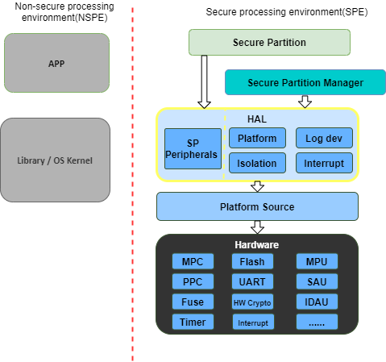

##########################
Hardware Abstraction Layer
##########################

:Organization: Arm Limited
:Contact: tf-m@lists.trustedfirmware.org

:API Version: 0.9

************
Introduction
************
:term:`TF-M` :term:`HAL` abstracts the hardware-oriented and platform specific
operations on the :term:`SPE` side and provides a set of APIs to the upper
layers such as :term:`SPM`, :term:`RoT Service`.
The :term:`HAL` aims to cover the platform different aspects whereas common
architecturally defined aspects are done generically within the common
:term:`SPE`.
In some cases, although the operations are defined architecturally,
it may not be possible to generalize implementations because lots of information
is only known to platforms.
It is more efficient to define a :term:`HAL` API for those architectural
operations as well.

.. note::
  :term:`TBSA-M` provides the hardware requirements for security purposes.
  :term:`TF-M` :term:`HAL` tries to reference :term:`TBSA-M` recommendations in
  the interfaces from the software perspective only. Please reference
  :term:`TBSA-M` for your security hardware design.

Design Goals
============
:term:`TF-M` :term:`HAL` is designed to simplify the integration efforts on
different platforms.

:term:`TF-M` :term:`HAL` is designed to make it easy to use the hardware and
develop the :term:`SPM` and :term:`RoT Service` which need to access the
devices.

:term:`TF-M` :term:`HAL` is designed to make the structure clearer and let the
:term:`TF-M` mainly focus on :term:`PSA` implementation.

********
Overview
********
This section provides an overview of the abstraction layer structure.

Here lists a minimal set of necessary functionalities:

  - **Isolation API**: Provides the necessary isolation functionalities required
    by the :term:`PSA-FF-M` and :term:`TBSA-M`, and provides APIs to :term:`SPM`
    to check the permissions of memory access.
  - **Platform API**: Provides the platform initialization, platform-specific
    memory information, system reset, etc.
  - **Log dev API**: Provides the log system functions.
  - **Interrupt API**: Provides the interrupt functions.

.. note::
  - There is a non-secure :term:`HAL` that focuses on the mailbox operation API
    for Dual-core topology. For more information about it, please refer to
    :doc:`Mailbox Design in TF-M on Dual-core System
    </technical_references/design_docs/dual-cpu/mailbox_design_on_dual_core_system>`.
  - The minimal set of :term:`TF-M` :term:`HAL` is sufficient for Secure
    Partitions by using customized peripheral interfaces. To provide easier
    portability for the Secure Partitions, a Secure Partition :term:`HAL` is
    provided in this design too.
  - The debug mechanisms give the external entity the corresponding right to
    access the system assets. :term:`TF-M` ensures that the external entity is
    permitted access to those assets. Currently, :term:`TF-M` only needs the
    debug authentication. The whole debug mechanism and related :term:`HAL` will
    be enhanced in the future. Please refer to the :doc:`Debug authentication
    settings section </platform/readme>` for more detail.

*****************
Design Principles
*****************
As :term:`TF-M` runs on resource-constrained devices, the :term:`HAL` tries to
avoid multiple level abstractions which cost more resources.

Part of the :term:`HAL` interfaces does not focus on exact hardware operations
such as power on/off or PIN manipulation.
Instead, the :term:`HAL` abstracts higher-level interfaces to reserve the
implementation flexibility for the platform vendors.

The :term:`TF-M` :term:`HAL` should be easy to deprecate APIs and provide
compatibilities.
Any API incompatibility should be detected during building.

:term:`TF-M` relies on the :term:`HAL` APIs to be implemented correctly and
trusts the :term:`HAL` APIs.
:term:`TFM` can provide assertions to detect common programming errors but
essentially no further extensive checks will be provided.

************
Source Files
************
This section describes the source file of the :term:`TF-M` :term:`HAL`,
including the header and c files.

tfm_hal_defs.h
==============
This header file contains the definitions of common macros and types used by all
:term:`HAL` APIs. Please refer to `Status Codes`_ for detailed definitions.

tfm_hal_[module].[h/c]
======================
All other headers and c files are classified by the modules, such as isolation,
platform, interrupt, devices, etc.

.. note::
  There are common files in the platform folder include the implemented
  :term:`HAL` APIs. The platform vendors can use them directly but need to
  implement all the sub APIs.

************
Status Codes
************
These are common status and error codes for all :term:`HAL` APIs.

Types
=====
tfm_hal_status_t
----------------
This is a status code to be used as the return type of :term:`HAL` APIs.

.. code-block:: c

  enum tfm_hal_status_t {
      TFM_HAL_ERROR_MEM_FAULT = SCHAR_MIN,
      TFM_HAL_ERROR_MAX_VALUE,
      TFM_HAL_ERROR_BAD_STATE,
      TFM_HAL_ERROR_NOT_SUPPORTED,
      TFM_HAL_ERROR_INVALID_INPUT,
      TFM_HAL_ERROR_NOT_INIT,
      TFM_HAL_ERROR_GENERIC,
      TFM_HAL_SUCCESS = 0
  };

Error Codes
===========
Negative values indicate an error. Zero and positive values indicate success.

Here is the general list. The detailed usages for each error code are described
in the API introduction sections.

TFM_HAL_SUCCESS
---------------
Status code to indicate general success.

TFM_HAL_ERROR_GENERIC
---------------------
Status code to indicate an error that does not correspond to any defined failure
cause.

TFM_HAL_ERROR_NOT_INIT
----------------------
Status code to indicate that the module is not initialed.

TFM_HAL_ERROR_INVALID_INPUT
---------------------------
Status code to indicate that the input is invalid.

TFM_HAL_ERROR_NOT_SUPPORTED
---------------------------
Status code to indicate that the requested operation or a parameter is not
supported.

TFM_HAL_ERROR_BAD_STATE
-----------------------
Status code to indicate that the requested action cannot be performed in the
current state.

TFM_HAL_ERROR_MAX_VALUE
-----------------------
Status code to indicate that the current number has got the max value.

TFM_HAL_ERROR_MEM_FAULT
-----------------------
Status code to indicate that the memory check failed.

***************************
API Definition for TF-M SPM
***************************
This section describes the APIs defined for :term:`TF-M` :term:`SPM`.

Platform API
============
The platform API is a higher-level abstraction layer of the platform, other than
a dedicated API set for the special hardware devices.

APIs
----
tfm_hal_platform_init()
^^^^^^^^^^^^^^^^^^^^^^^
**Prototype**

.. code-block:: c

  enum tfm_hal_status_t tfm_hal_platform_init(void)

**Description**

This API performs the platform initializations **before** the :term:`SPM`
initialization.

The initializations could include but not limited to:
- Fault handlers
- Reset configurations
- Debug init
- NVIC init

**Parameter**

- ``void`` - None.

**Return Values**

- ``TFM_HAL_SUCCESS`` - Init success.
- ``TFM_HAL_ERROR_GENERIC`` - Generic errors.

tfm_hal_system_reset()
^^^^^^^^^^^^^^^^^^^^^^
**Prototype**

.. code-block:: c

  void tfm_hal_system_reset(void)

**Description**

This API performs a system reset.

The platform can uninitialize some resources before reset.

When ``CONFIG_TFM_HALT_ON_PANIC`` is disabled this function is called to reset
the system when a fatal error occurs.

**Parameter**

- ``void`` - None

**Return Values**

- ``void`` - None

**Note**

This API should not return.

tfm_hal_system_halt()
^^^^^^^^^^^^^^^^^^^^^
**Prototype**

.. code-block:: c

  void tfm_hal_system_halt(void)

**Description**

This API enters the CPU into an infinite loop.

The platform can uninitialize some resources before looping forever.

When ``CONFIG_TFM_HALT_ON_PANIC`` is enabled this function is called to halt the
system when a fatal error occurs.

**Parameter**

- ``void`` - None

**Return Values**

- ``void`` - None

**Note**

This API should not return.

Isolation API
=============
The :term:`PSA-FF-M` defines three isolation levels and a memory access rule to
provide diverse levels of securitiy. The isolation API provides the functions to
implement these requirements.

Memory Access Attributes
------------------------
The memory access attributes are encoded as bit fields, you can logic OR them to
have a combination of the atrributes, for example
``TFM_HAL_ACCESS_UNPRIVILEGED | TFM_HAL_ACCESS_READABLE`` is unprivileged
readable. The data type is `uint32_t`.

TFM_HAL_ACCESS_EXECUTABLE
^^^^^^^^^^^^^^^^^^^^^^^^^
The memory is executable.

.. code-block:: c

  #define TFM_HAL_ACCESS_EXECUTABLE (1UL << 0)

TFM_HAL_ACCESS_READABLE
^^^^^^^^^^^^^^^^^^^^^^^
The memory is readable.

.. code-block:: c

  #define TFM_HAL_ACCESS_READABLE (1UL << 1)

TFM_HAL_ACCESS_WRITABLE
^^^^^^^^^^^^^^^^^^^^^^^
The memory is writable.

.. code-block:: c

  #define TFM_HAL_ACCESS_WRITABLE (1UL << 2)

TFM_HAL_ACCESS_UNPRIVILEGED
^^^^^^^^^^^^^^^^^^^^^^^^^^^
The memory is unprivileged mode accessible.

.. code-block:: c

  #define TFM_HAL_ACCESS_UNPRIVILEGED (1UL << 3)

TFM_HAL_ACCESS_DEVICE
^^^^^^^^^^^^^^^^^^^^^
The memory is a MMIO device.

.. code-block:: c

  #define TFM_HAL_ACCESS_DEVICE (1UL << 4)

TFM_HAL_ACCESS_NS
^^^^^^^^^^^^^^^^^
The memory is accessible from :term:`NSPE`

.. code-block:: c

  #define TFM_HAL_ACCESS_NS (1UL << 5)

APIs
----
tfm_hal_set_up_static_boundaries()
^^^^^^^^^^^^^^^^^^^^^^^^^^^^^^^^^^
**Prototype**

.. code-block:: c

  enum tfm_hal_status_t tfm_hal_set_up_static_boundaries(void)

**Description**

This API sets up the static isolation boundaries which are constant throughout
the runtime of the system.

The boundaries include:

- The SPE boundary between the :term:`SPE` and the :term:`NSPE`
- The PSA RoT isolation boundary between the PSA Root of Trust and the
  Application Root of Trust which is for isolation level 2 and 3 only.

Please refer to the :term:`PSA-FF-M` for the definitions of the isolation
boundaries.

**Return Values**

- ``TFM_HAL_SUCCESS`` - the isolation boundaries have been set up.
- ``TFM_HAL_ERROR_GENERIC`` - failed to set up the isolation boundaries.

tfm_hal_update_boundaries()
^^^^^^^^^^^^^^^^^^^^^^^^^^^
**Prototype**

.. code-block:: c

  enum tfm_hal_status_t tfm_hal_update_boundaries(
                              const struct partition_load_info_t *p_ldinf,
                              void *p_boundaries);

**Description**

This API updates the partition isolation boundary for isolation level 2 and 3.
The isolation boundary includes the thread privilege and the partition private
data.
In isolation level 2, the :term:`SPM` only updates the partition thread
privilege. In isolation level 3, the :term:`SPM` updates the partition thread
privilege, and protects each partition's private data.

The access permissions outside the boundary is platform-dependent.

**Parameter**

- ``p_ldinf`` - Partition load information.
- ``p_boundaries`` - Platform boundary handle for the partition.

**Return Values**

- ``TFM_HAL_SUCCESS`` - the isolation boundary has been set up.
- ``TFM_HAL_ERROR_GENERIC`` - failed to set upthe isolation boundary.

**Note**

This API is only for platforms using :term:`MPU` as isolation hardwares.
A generic API for all platforms will be introduced in future versions.

tfm_hal_memory_has_access()
^^^^^^^^^^^^^^^^^^^^^^^^^^^
**Prototype**

.. code-block:: c

  tfm_hal_status_t tfm_hal_memory_has_access(const uintptr_t base,
                                             size_t size,
                                             uint32_t attr)

**Description**

This API checks if the memory region defined by ``base`` and ``size`` has the
given access atrributes - ``attr``.

The Attributes include :term:`NSPE` access, privileged mode, and read-write
permissions.

**Parameter**

- ``base`` - The base address of the region.
- ``size`` - The size of the region.
- ``attr`` - The `Memory Access Attributes`_.

**Return Values**

- ``TFM_HAL_SUCCESS`` - The memory region has the access permissions.
- ``TFM_HAL_ERROR_MEM_FAULT`` - The memory region does not have the access
  permissions.
- ``TFM_HAL_ERROR_INVALID_INPUT`` - Invalid inputs.
- ``TFM_HAL_ERROR_GENERIC`` - An error occurred.

tfm_hal_bind_boundaries()
^^^^^^^^^^^^^^^^^^^^^^^^^
**Prototype**

.. code-block:: c

  enum tfm_hal_status_t tfm_hal_bind_boundaries(
                                    const struct partition_load_info_t *p_ldinf,
                                    void **pp_boundaries);

**Description**

This API binds partition with the platform via a boundary handle.

**Parameter**

- ``p_ldinf`` - Partition load information.
- ``pp_boundaries`` - Pointer of a the partition's platform boundary handle.

**Return Values**

- ``TFM_HAL_SUCCESS`` - the handle has been binded successfully.
- ``TFM_HAL_ERROR_GENERIC`` - failed to bind the handle.

.. Note::

  The platform maintains the platform-specific settings for SPM further usage,
  such as updating partition hardware boundaries or checking resource
  accessibility. The platform needs to manage the settings with an internal
  mechanism, and returns a handle to SPM. SPM delivers this handle back to
  platform when necessary. And SPM checks this handle to decide if the
  platform-specific settings need to be updated. Hence multiple partitions can
  have the same handle if they have the same platform-specific settings.

Log API
=======
The log API is used by the :term:`TF-M` :doc:`log system <tfm_log_system_design_document>`.
The log device could be uart, memory, usb, etc.

APIs
----
tfm_hal_output_partition_log()
^^^^^^^^^^^^^^^^^^^^^^^^^^^^^^
**Prototype**

.. code-block:: c

  int32_t tfm_hal_output_partition_log(const unsigned char *str, uint32_t len)

**Description**

This API is called by Secure Partition to output logs.

**Parameter**

- ``str`` - The string to output.
- ``len`` - Length of the string in bytes.

**Return Values**

- Positive values - Number of bytes output.
- ``TFM_HAL_ERROR_NOT_INIT`` - The log device has not been initialized.
- ``TFM_HAL_ERROR_INVALID_INPUT`` - Invalid inputs when ``str`` is ``NULL`` or
  ``len`` is zero.

**Note**

None.

tfm_hal_output_spm_log()
^^^^^^^^^^^^^^^^^^^^^^^^
**Prototype**

.. code-block:: c

  int32_t tfm_hal_output_spm_log(const unsigned char *str, uint32_t len)

**Description**

This API is called by :term:`SPM` to output logs.

**Parameter**

- ``str`` - The string to output.
- ``len`` - Length of the string in bytes.

**Return Values**

- Positive numbers - Number of bytes output.
- ``TFM_HAL_ERROR_NOT_INIT`` - The log device has not been initialized.
- ``TFM_HAL_ERROR_INVALID_INPUT`` - Invalid inputs when ``str`` is ``NULL``
  or ``len`` is zero.

**Note**

Please check :doc:`TF-M log system <tfm_log_system_design_document>` for more
information.

Interrupt APIs
==============

The SPM HAL interrupt APIs are intended for operations on Interrupt Controllers
of platforms.

APIs for control registers of interrupt sources are not in the scope of this set
of APIs.
Secure Partitions should define the APIs for managing interrupts with those MMIO
registers.

APIs
----

tfm_hal_irq_enable()
^^^^^^^^^^^^^^^^^^^^

**Prototype**

.. code-block:: c

  enum tfm_hal_status_t tfm_hal_irq_enable(uint32_t irq_num)

**Description**

This API enables an interrupt from the Interrupt Controller of the platform.

**Parameter**

- ``irq_num`` - the interrupt to be enabled with a number

**Return Values**

- ``TFM_HAL_ERROR_INVALID_INPUT`` - the ``irq_num`` exceeds The maximum
                                    supported number of external interrupts.
- ``TFM_HAL_ERROR_GENERIC`` - failed to enable the interrupt.
- ``TFM_HAL_SUCCESS`` - the interrupt is successfully enabled.

tfm_hal_irq_disable()
^^^^^^^^^^^^^^^^^^^^^

**Prototype**

.. code-block:: c

  enum tfm_hal_status_t tfm_hal_irq_disable(uint32_t irq_num)

**Description**

This API disables an interrupt from the Interrupt Controller of the platform.

**Parameter**

- ``irq_num`` - the interrupt to be disabled with a number

**Return Values**

- ``TFM_HAL_ERROR_INVALID_INPUT`` - the ``irq_num`` exceeds The maximum
                                    supported number of external interrupts.
- ``TFM_HAL_ERROR_GENERIC`` - failed to disable the interrupt.
- ``TFM_HAL_SUCCESS`` - the interrupt is successfully disabled.

tfm_hal_irq_clear_pending()
^^^^^^^^^^^^^^^^^^^^^^^^^^^

**Prototype**

.. code-block:: c

  enum tfm_hal_status_t tfm_hal_irq_clear_pending(uint32_t irq_num)

**Description**

This API clears an active and pending interrupt.

**Parameter**

- ``irq_num`` - the interrupt to be disabled with a number

**Return Values**

- ``TFM_HAL_ERROR_INVALID_INPUT`` - the ``irq_num`` exceeds The maximum
                                    supported number of external interrupts.
- ``TFM_HAL_ERROR_GENERIC`` - failed to clear the pending interrupt.
- ``TFM_HAL_SUCCESS`` - the pending interrupt has been cleared.

Initializations
^^^^^^^^^^^^^^^

**Prototype**

.. code-block:: c

  enum tfm_hal_status_t {source_symbol}_init(void *p_pt,
                                             struct irq_load_info_t *p_ildi)

The ``{source_symbol}`` is:

- ``irq_{source}``, if the ``source`` attribute of the IRQ in Partition manifest
  is a number
- Lowercase of ``source`` attribute, if ``source`` is a symbolic name

**Description**

Each interrupt has an initialization function individually.
The :term:`SPM` calls the functions while loading the Partitions.

The following initializations are required for each interrupt:

- Setting the priority. The value must between 0 to 0x80 exclusively.
- Ensuring that the interrupt targets the Secure State.
- Saving the input parameters for future use.

Platforms can have extra initializations as well.

**Parameter**

- ``p_pt`` - pointer to Partition runtime struct of the owner Partition
- ``p_ildi`` - pointer to ``irq_load_info_t`` struct of the interrupt

**Note**

Please refer to the
:doc: `IRQ intergration guide<tfm_secure_irq_integration_guide>`
for more information.

************************************
API Definition for Secure Partitions
************************************
The Secure Partition (SP) :term:`HAL` mainly focuses on two parts:

  - Peripheral devices. The peripherals accessed by the :term:`TF-M` default
    Secure Partitions.
  - Secure Partition abstraction support. The Secure Partition data that must be
    provided by the platform.

The Secure Partition abstraction support will be introduced in the peripheral
API definition.

ITS and PS flash API
====================
There are two kinds of flash:

  - Internal flash. Accessed by the PSA Internal Trusted Storage (ITS) service.
  - External flash. Accessed by the PSA Protected Storage (PS) service.

The ITS HAL for the internal flash device is defined in the ``tfm_hal_its.h``
header and the PS HAL in the ``tfm_hal_ps.h`` header.

Macros
------
Internal Trusted Storage
^^^^^^^^^^^^^^^^^^^^^^^^
TFM_HAL_ITS_FLASH_DRIVER
~~~~~~~~~~~~~~~~~~~~~~~~
Defines the identifier of the CMSIS Flash ARM_DRIVER_FLASH object to use for
ITS. It must have been allocated by the platform and will be declared extern in
the HAL header.

TFM_HAL_ITS_PROGRAM_UNIT
~~~~~~~~~~~~~~~~~~~~~~~~
Defines the size of the ITS flash device's physical program unit (the smallest
unit of data that can be individually programmed to flash). It must be equal to
TFM_HAL_ITS_FLASH_DRIVER.GetInfo()->program_unit, but made available at compile
time so that filesystem structures can be statically sized.

TFM_HAL_ITS_FLASH_AREA_ADDR
~~~~~~~~~~~~~~~~~~~~~~~~~~~
Defines the base address of the dedicated flash area for ITS.

TFM_HAL_ITS_FLASH_AREA_SIZE
~~~~~~~~~~~~~~~~~~~~~~~~~~~
Defines the size of the dedicated flash area for ITS in bytes.

TFM_HAL_ITS_SECTORS_PER_BLOCK
~~~~~~~~~~~~~~~~~~~~~~~~~~~~~
Defines the number of contiguous physical flash erase sectors that form a
logical filesystem erase block.

Protected Storage
^^^^^^^^^^^^^^^^^
TFM_HAL_PS_FLASH_DRIVER
~~~~~~~~~~~~~~~~~~~~~~~
Defines the identifier of the CMSIS Flash ARM_DRIVER_FLASH object to use for
PS. It must have been allocated by the platform and will be declared extern in
the HAL header.

TFM_HAL_PS_PROGRAM_UNIT
~~~~~~~~~~~~~~~~~~~~~~~~
Defines the size of the PS flash device's physical program unit (the smallest
unit of data that can be individually programmed to flash). It must be equal to
TFM_HAL_PS_FLASH_DRIVER.GetInfo()->program_unit, but made available at compile
time so that filesystem structures can be statically sized.

TFM_HAL_PS_FLASH_AREA_ADDR
~~~~~~~~~~~~~~~~~~~~~~~~~~~
Defines the base address of the dedicated flash area for PS.

TFM_HAL_PS_FLASH_AREA_SIZE
~~~~~~~~~~~~~~~~~~~~~~~~~~~
Defines the size of the dedicated flash area for PS in bytes.

TFM_HAL_PS_SECTORS_PER_BLOCK
~~~~~~~~~~~~~~~~~~~~~~~~~~~~~
Defines the number of contiguous physical flash erase sectors that form a
logical filesystem erase block.

Optional definitions
--------------------
The ``TFM_HAL_ITS_FLASH_AREA_ADDR``, ``TFM_HAL_ITS_FLASH_AREA_SIZE`` and
``TFM_HAL_ITS_SECTORS_PER_BLOCK`` definitions are optional. If not defined, the
platform must implement ``tfm_hal_its_fs_info()`` instead.

Equivalently, ``tfm_hal_its_ps_info()`` must be implemented by the platform if
``TFM_HAL_ITS_FLASH_AREA_ADDR``, ``TFM_HAL_ITS_FLASH_AREA_SIZE`` or
``TFM_HAL_ITS_SECTORS_PER_BLOCK`` is not defined.

Objects
-------
ARM_DRIVER_FLASH
^^^^^^^^^^^^^^^^
The ITS and PS HAL headers each expose a CMSIS Flash Driver instance.

.. code-block:: c

    extern ARM_DRIVER_FLASH TFM_HAL_ITS_FLASH_DRIVER

    extern ARM_DRIVER_FLASH TFM_HAL_PS_FLASH_DRIVER

The CMSIS Flash Driver provides the flash primitives ReadData(), ProgramData()
and EraseSector() as well as GetInfo() to access flash device properties such
as the sector size.

Types
-----
tfm_hal_its_fs_info_t
^^^^^^^^^^^^^^^^^^^^^
Struct containing information required from the platform at runtime to configure
the ITS filesystem.

.. code-block:: c

    struct tfm_hal_its_fs_info_t {
        uint32_t flash_area_addr;
        size_t flash_area_size;
        uint8_t sectors_per_block;
    };

Each attribute is described below:

  - ``flash_area_addr`` - Location of the block of flash to use for ITS
  - ``flash_area_size`` - Number of bytes of flash to use for ITS
  - ``sectors_per_block`` - Number of erase sectors per logical FS block

tfm_hal_ps_fs_info_t
^^^^^^^^^^^^^^^^^^^^^
Struct containing information required from the platform at runtime to configure
the PS filesystem.

.. code-block:: c

    struct tfm_hal_ps_fs_info_t {
        uint32_t flash_area_addr;
        size_t flash_area_size;
        uint8_t sectors_per_block;
    };

Each attribute is described below:

  - ``flash_area_addr`` - Location of the block of flash to use for PS
  - ``flash_area_size`` - Number of bytes of flash to use for PS
  - ``sectors_per_block`` - Number of erase sectors per logical FS block

Functions
---------
tfm_hal_its_fs_info()
^^^^^^^^^^^^^^^^^^^^^
**Prototype**

.. code-block:: c

    enum tfm_hal_status_t tfm_hal_its_fs_info(struct tfm_hal_its_fs_info_t *fs_info);

**Description**

Retrieves the filesystem configuration parameters for ITS.

**Parameter**

- ``fs_info`` - Filesystem config information

**Return values**

- ``TFM_HAL_SUCCESS`` - The operation completed successfully
- ``TFM_HAL_ERROR_INVALID_INPUT`` - Invalid parameter

**Note**

This function should ensure that the values returned do not result in a security
compromise. The block of flash supplied must meet the security requirements of
Internal Trusted Storage.

tfm_hal_ps_fs_info()
^^^^^^^^^^^^^^^^^^^^
**Prototype**

.. code-block:: c

    enum tfm_hal_status_t tfm_hal_ps_fs_info(struct tfm_hal_ps_fs_info_t *fs_info);

**Description**

Retrieves the filesystem configuration parameters for PS.

**Parameter**

- ``fs_info`` - Filesystem config information

**Return values**

- ``TFM_HAL_SUCCESS`` - The operation completed successfully
- ``TFM_HAL_ERROR_INVALID_INPUT`` - Invalid parameter

**Note**

This function should ensure that the values returned do not result in a security
compromise.

--------------

*Copyright (c) 2020-2022, Arm Limited. All rights reserved.*
