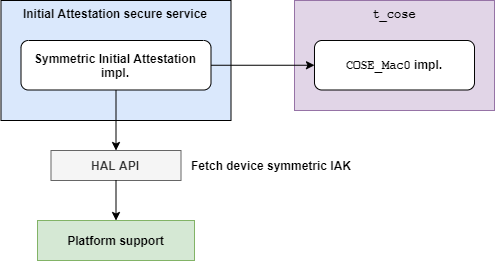
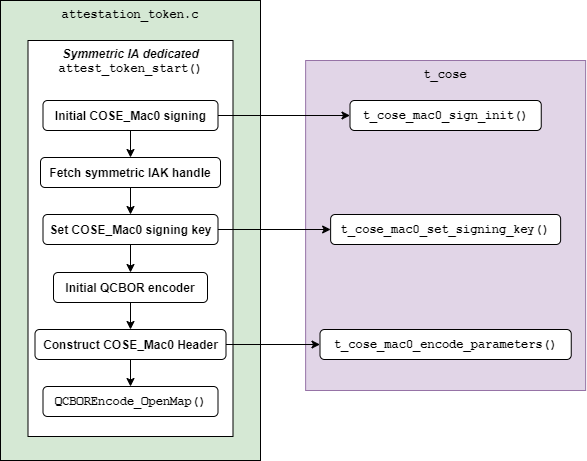
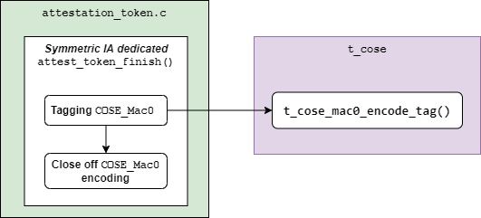
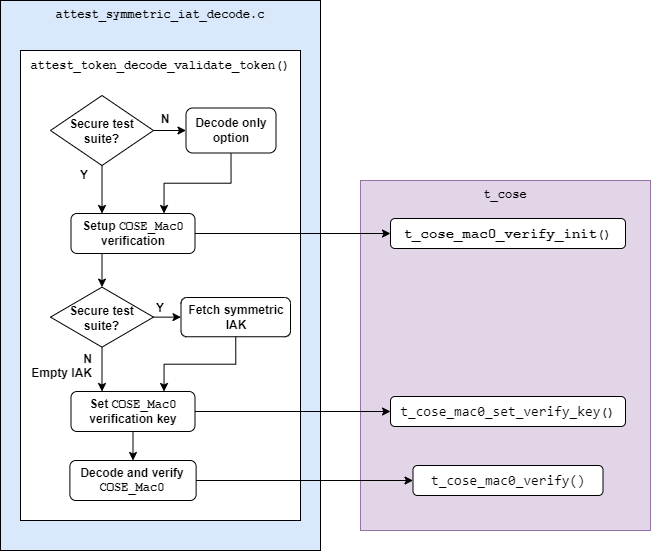

#################################################
Symmetric key algorithm based Initial Attestation
#################################################

:Author: David Hu
:Organization: Arm Limited
:Contact: david.hu@arm.com

************
Introduction
************

This document proposes a design of symmetric key algorithm based Initial
Attestation in TF-M.

Symmetric key algorithm based Initial Attestation
(*symmetric Initial Attestation* for short) signs and verifies Initial
Attestation Token (IAT) with a symmetric cryptography signature scheme, such as
HMAC.
It can reduce TF-M binary size and memory footprint on ultra-constrained devices
without integrating asymmetric ciphers.

This proposal follows PSA Attestation API document [1]_.

.. note ::

    As pointed out by PSA Attestation API [1]_, the use cases of Initial
    Attestation based on symmetric key algorithms can be limited due to
    the associated infrastructure costs for key management and operational
    complexities. It may also restrict the ability to interoperate with
    scenarios that involve third parties.

***************
Design overview
***************

The symmetric Initial Attestation follows the existing IAT generation sequence
for Initial Attestation based on asymmetric key algorithm
(*asymmetric Initial Attestation* for short).

As Profile Small design [2]_ requests, a configuration flag
``SYMMETRIC_INITIAL_ATTESTATION`` selects symmetric initial attestation during
build.

The top-level design is shown in :ref:`overall-diagram-figure` below.

.. _overall-diagram-figure:



    Overall design diagram

Symmetric Initial Attestation adds its own implementations of some steps in IAT
generation in Initial Attestation secure service. More details are covered in
`IAT generation in Initial Attestation secure service`_.

The interfaces and procedures of Initial Attestation secure service are not
affected. Refer to Initial Attestation Service Integration Guide [3]_ for
details of the implementation of Initial Attestation secure service.

Symmetric Initial Attestation invokes ``t_cose`` library to build up
``COSE_Mac0`` structure.
``COSE_Mac0`` support is added to ``t_cose`` library in TF-M since official
``t_cose`` hasn't supported ``COSE_Mac0`` yet. The design of ``COSE_Mac0``
support is covered in `COSE_Mac0 support in t_cose`_.

.. note ::

    The ``COSE_Mac0`` implementation in this proposal is a prototype only for
    Proof of Concept so far. It may be replaced after ``t_cose`` officially
    supports ``COSE_Mac0`` message.

Several HAL APIs are defined to fetch platform specific assets required by
Symmetric Initial Attestation. For example, ``tfm_plat_get_symmetric_iak()``
fetches symmetric Initial Attestation Key (IAK). Those HAL APIs are summarized
in `HAL APIs`_.

Decoding and verification of symmetric Initial Attestation is also included in
this proposal for regression test.
The test suites and IAT decoding are discussed in `TF-M Test suite`_.

``QCBOR`` library and Crypto service are also invoked. But this proposal doesn't
require any modification to either ``QCBOR`` or Crypto service. Therefore,
descriptions of ``QCBOR`` and Crypto service are skipped in this document.

****************************************************
IAT generation in Initial Attestation secure service
****************************************************

The sequence of IAT generation of symmetric Initial Attestation is shown in
:ref:`ia-service-figure` below.

.. _ia-service-figure:

.. figure:: media/symmetric_initial_attest/ia_service_flow.png
    :align: center

    Symmetric IAT generation flow in Initial Attestation secure service

In Initial Attestation secure service, symmetric Initial Attestation implements
the following steps in ``attest_create_token()``, which are different from those
of asymmetric Initial Attestation.

    - Fetch and register IAK
    - ``attest_token_start()``
    - Instance ID claims
    - ``attest_token_finish()``

If ``SYMMETRIC_INITIAL_ATTESTATION`` is selected, symmetric Initial Attestation
dedicated implementations of those steps are included in build.
Otherwise, asymmetric Initial Attestation dedicated implementations are included
instead.

Symmetric Initial Attestation implementation resides a new file
``attest_symmetric_key.c`` to handle symmetric IAK and Instance ID related
operations.
Symmetric Initial Attestation dedicated ``attest_token_start()`` and
``attest_token_finish()`` are added in ``attestation_token.c``.

The details are covered in following sections.

Register symmetric IAK
======================

Symmetric Initial Attestation dedicated ``attest_symmetric_key.c`` implements 4
major functions. The functions are listed in the table below.

.. table:: Functions in ``attest_symmetric_key.c``
    :widths: auto
    :align: center

    +-------------------------------------------------+----------------------------------------------------+
    | Functions                                       | Descriptions                                       |
    +=================================================+====================================================+
    | ``attest_register_initial_attestation_key()``   | Fetches device symmetric IAK, imports it into      |
    |                                                 | Crypto service and get the handle.                 |
    |                                                 | The handle will be used to compute the             |
    |                                                 | authentication tag of IAT.                         |
    |                                                 | Invokes HAL API ``tfm_plat_get_symmetric_iak()``   |
    |                                                 | to fetch symmetric IAK from device.                |
    |                                                 |                                                    |
    |                                                 | Refer to `HAL APIs`_ for more details.             |
    +-------------------------------------------------+----------------------------------------------------+
    | ``attest_unregister_initial_attestation_key()`` | Destroys the symmetric IAK handle after IAT        |
    |                                                 | generation completes.                              |
    +-------------------------------------------------+----------------------------------------------------+
    | ``attest_get_signing_key_handle()``             | Return the IAK handle registered in                |
    |                                                 | ``attest_register_initial_attestation_key()``.     |
    +-------------------------------------------------+----------------------------------------------------+
    | ``attest_get_instance_id()``                    | Return the Instance ID value calculated in         |
    |                                                 | ``attest_register_initial_attestation_key()``.     |
    |                                                 |                                                    |
    |                                                 | Refer to `Instance ID claim`_ for more details.    |
    +-------------------------------------------------+----------------------------------------------------+

``attest_register_initial_attestation_key()`` and
``attest_unregister_initial_attestation_key()`` share the same API declarations
with asymmetric Initial Attestation.

``attest_get_signing_key_handle()`` and ``attest_get_instance_id()`` are defined
by symmetric Initial Attestation but can be shared with asymmetric Initial
Attestation later.

.. note ::

    Only symmetric IAK for HMAC algorithm is allowed so far.

Instance ID calculation
-----------------------

In symmetric Initial Attestation, Instance ID is also calculated in
``attest_register_initial_attestation_key()``, after IAK handle is registered.
It can protect critical symmetric IAK from being frequently fetched, which
increases the risk of asset disclosure.

The Instance ID value is the output of hashing symmetric IAK raw data *twice*,
as requested in PSA Attestation API [1]_. HMAC-SHA256 may be hard-coded as the
hash algorithm of Instance ID calculation.

.. note ::

    According to RFC2104 [4]_, if a HMAC key is longer than the HMAC block size,
    the key will be first hashed. The hash output is used as the key in HMAC
    computation.

    In current design, HMAC is used to calculate the authentication tag of
    ``COSE_Mac0``. Assume that symmetric IAK is longer than HMAC block size
    (HMAC-SHA256 by default), the Instance ID is actually the HMAC key for
    ``COSE_Mac0`` authentication tag generation, if Instance ID value is the
    output of hashing IAK only *once*.
    Therefore, attackers may request an valid IAT from device and fake malicious
    ones by using Instance ID to calculate valid authentication tags, to cheat
    others.

    As a result, symmetric IAK raw data should be hashed *twice* to generate the
    Instance ID value.

The Instance ID calculation result is stored in a static buffer.
Token generation process can call ``attest_get_instance_id()`` to
fetch the data from that static buffer.

attest_token_start()
====================

Symmetric Initial Attestation dedicated ``attest_token_start()`` initializes the
``COSE_Mac0`` signing context and builds up the ``COSE_Mac0`` Header.

The workflow inside ``attest_token_start()`` is shown in
:ref:`attest-token-start-figure` below.

.. _attest-token-start-figure:



    Workflow in symmetric Initial Attestation ``attest_token_start()``

Descriptions of each step are listed below:

#. ``t_cose_mac0_sign_init()`` is invoked to initialize ``COSE_Mac0`` signing
   context in ``t_cose``.

#. The symmetric IAK handle is returned by ``attest_get_signing_key_handle()``.
   See the details in `Register symmetric IAK`_.

#. The symmetric IAK handle is set into ``COSE_Mac0`` signing context via
   ``t_cose_mac0_set_signing_key()``.

#. Initialize ``QCBOR`` encoder.

#. The header parameters are encoded into ``COSE_Mac0`` structure in
   ``t_cose_mac0_encode_parameters()``.

#. ``QCBOREncode_OpenMap()`` prepares for encoding the ``COSE_Mac0`` payload,
   which is filled with IAT claims.

All the ``COSE_Mac0`` functionalities in ``t_cose`` are covered in
`COSE_Mac0 support in t_cose`_.

Instance ID claim
=================

Symmetric Initial Attestation also implements Instance ID claims in
``attest_add_instance_id_claim()``.

The Instance ID value is fetched via ``attest_get_instance_id()``.
The value has already been calculated during symmetric IAK registration. See
`Instance ID calculation`_ for details.

The other steps are the same as those in asymmetric Initial Attestation
implementation. The UEID type byte is set to 0x01.

attest_token_finish()
=====================

Symmetric Initial Attestation dedicated ``attest_token_finish()`` calls
``t_cose_mac0_encode_tag()`` to calculate and encode the authentication tag of
``COSE_Mac0`` structure.

The whole COSE and CBOR encoding are completed in ``attest_token_finish()``.

The simplified flow in ``attest_token_finish()`` is shown in
:ref:`attest-token-finish-figure` below.

.. _attest-token-finish-figure:



    Workflow in symmetric Initial Attestation ``attest_token_finish()``

***************************
COSE_Mac0 support in t_cose
***************************

``COSE_Mac0`` supports in ``t_cose`` in TF-M include the following major
functionalities:

    - Encoding ``COSE_Mac0`` structure
    - Decoding and verifying ``COSE_Mac0`` structure
    - HMAC computation to generate and verify authentication tag
    - Short-circuit tagging for test mode

According to RFC8152 [5]_, ``COSE_Mac0`` and ``COSE_Sign1`` have similar
structures. Therefore, the prototype follows ``COSE_Sign1`` implementation to
build up ``COSE_Mac0`` file structure and implement ``COSE_Mac0`` encoding and
decoding.

Although ``COSE_Mac0`` can share lots of data types, APIs and encoding/decoding
steps with ``COSE_Sign1`` in implementation, this prototype separates
``COSE_Mac0`` implementation from ``COSE_Sign1``. ``COSE_Mac0`` owns its
dedicated signing/verification contexts, APIs and encoding/decoding process.
The purposes of separating ``COSE_Mac0`` and ``COSE_Sign1`` are listed below

- It can keep changes to ``COSE_Sign1`` as small as possible and avoid conflicts
  with development in ``COSE_Sign1```. It can decrease conflicts if ``t_cose``
  in TF-M is synchronized with original ``t_cose`` repository later.
- ``COSE_Mac0`` and ``COSE_Sign1`` are exclusive in TF-M use cases.
  It cannot decrease TF-M memory footprint by extracting the common components
  shared by ``COSE_Mac0`` and ``COSE_Sign1`` but can make the design
  over-complicated.

.. note ::

    Only HMAC is supported in current ``COSE_Mac0`` prototype.

File structure
==============

New files are added to implement the functionalities listed above. The structure
of files is shown in the table below.

.. table:: New files in ``t_cose``
    :widths: auto
    :align: center

    +---------------------+--------------------------------+----------------------------------------------+
    | Directory           | Files                          | Descriptions                                 |
    +=====================+================================+==============================================+
    | ``src``             | ``t_cose_mac0_sign.c``         | Encode ``COSE_Mac0`` structure               |
    |                     +--------------------------------+----------------------------------------------+
    |                     | ``t_cose_mac0_verify.c``       | Decode and verify ``COSE_Mac0`` structure.   |
    +---------------------+--------------------------------+----------------------------------------------+
    | ``inc``             | ``t_cose_mac0_sign.h``         | Data type definitions and function           |
    |                     |                                | declarations of encoding and signing         |
    |                     |                                | ``COSE_Mac0`` message.                       |
    |                     +--------------------------------+----------------------------------------------+
    |                     | ``t_cose_mac0_verify.h``       | Data type definitions and function           |
    |                     |                                | declarations of verifying ``COSE_Mac0``      |
    |                     |                                | message.                                     |
    +---------------------+--------------------------------+----------------------------------------------+

Other ``t_cose`` files may also be changed to add ``COSE_Mac0`` associated data
types and function declarations.

HMAC operations are added in ``crypto_adapters/t_cose_psa_crypto.c``.
Preprocessor flags are added to select corresponding crypto for COSE message
signing and verification.

    - ``T_COSE_ENABLE_SIGN1`` selects ECDSA and Hash operations for
      ``COSE_Sign1``.
    - ``T_COSE_ENABLE_MAC0`` selects HMAC operations for ``COSE_Mac0``.

Encoding COSE_Mac0
==================

Following ``COSE_Sign1`` implementation, ``COSE_Mac0`` encoding exports similar
functions to Initial Attestation secure service.
The major functions are listed below.

Initialize signing context
--------------------------

``t_cose_mac0_sign_init()`` initializes ``COSE_Mac0`` signing context and
configures option flags and algorithm used in signing.

.. code-block:: c

    static void
    t_cose_mac0_sign_init(struct t_cose_mac0_sign_ctx *me,
                          int32_t                      option_flags,
                          int32_t                      cose_algorithm_id);

The ``COSE_Mac0`` signing context is defined as

.. code-block:: c

    struct t_cose_mac0_sign_ctx {
        /* Private data structure */
        uint8_t               protected_parameters_buffer[
                                    T_COSE_MAC0_MAX_SIZE_PROTECTED_PARAMETERS];
        struct q_useful_buf_c protected_parameters; /* The encoded protected parameters */
        int32_t               cose_algorithm_id;
        struct t_cose_key     signing_key;
        int32_t               option_flags;
        struct q_useful_buf_c kid;
        ...
    };

Set signing key
---------------

``t_cose_mac0_set_signing_key()`` sets the key used in ``COSE_Mac0`` signing.
Optional ``kid``, as a key identifer, will be encoded into ``COSE_Mac0`` Header
unprotected bucket.

.. code-block:: c

    static void
    t_cose_mac0_set_signing_key(struct t_cose_mac0_sign_ctx *me,
                                struct t_cose_key            signing_key,
                                struct q_useful_buf_c        kid);

Encode Header parameters
------------------------

``t_cose_mac0_encode_parameters()`` encodes the ``COSE_Mac0`` Header parameters
and outputs the encoded context to ``cbor_encode_ctx``.

.. code-block:: c

    enum t_cose_err_t
    t_cose_mac0_encode_parameters(struct t_cose_mac0_sign_ctx *context,
                                  QCBOREncodeContext          *cbor_encode_ctx);

Calculate and add authentication tag
------------------------------------

``t_cose_mac0_encode_tag()`` calculates the authentication tag and finishes the
``COSE_Mac0`` message.

.. code-block:: c

    enum t_cose_err_t
    t_cose_mac0_encode_tag(struct t_cose_mac0_sign_ctx *context,
                           QCBOREncodeContext          *cbor_encode_ctx);

Decoding COSE_Mac0
==================

Following ``COSE_Sign1`` implementation, ``COSE_Mac0`` decoding exports similar
functions to test suite of Initial Attestation.
The major functions are listed below.

Initialize verification context
-------------------------------

``t_cose_mac0_verify_init()`` initializes ``COSE_Mac0`` verification context and
configures option flags in verification.

.. code-block:: c

    static void
    t_cose_mac0_verify_init(struct t_cose_mac0_verify_ctx *context,
                            int32_t                        option_flags);

The ``COSE_Mac0`` verification context is defined as

.. code-block:: c

    struct t_cose_mac0_verify_ctx {
        /* Private data structure */
        struct t_cose_key     verification_key;
        int32_t               option_flags;
    };

Set verification key
--------------------

``t_cose_mac0_set_verify_key()`` sets the key for verifying ``COSE_Mac0``
authentication tag.

.. code-block:: c

    static void
    t_cose_mac0_set_verify_key(struct t_cose_mac0_verify_ctx *context,
                               struct t_cose_key              verify_key);

Decode and verify COSE_Mac0
---------------------------

``t_cose_mac0_verify()`` decodes the ``COSE_Mac0`` structure and verifies the
authentication tag.

.. code-block:: c

    enum t_cose_err_t
    t_cose_mac0_verify(struct t_cose_mac0_verify_ctx *context,
                       struct q_useful_buf_c          cose_mac0,
                       struct q_useful_buf_c         *payload,
                       struct t_cose_parameters      *parameters);

Short-circuit tagging
=====================

If ``T_COSE_OPT_SHORT_CIRCUIT_TAG`` option is enabled, ``COSE_Mac0`` encoding
will hash the ``COSE_Mac0`` content and add the hash output as an authentication
tag. It is useful when critical symmetric IAK is unavailable or cannot be
accessed, perhaps because it has not been provisioned or configured for the
particular device. It is only for test and must not be used in actual use case.
The ``kid`` parameter will either be skipped in ``COSE_Mac0`` Header.

If ``T_COSE_OPT_ALLOW_SHORT_CIRCUIT`` option is enabled, ``COSE_Mac0`` decoding
will only verify the hash output, without requiring symmetric key for
authentication tag verification.

***************
TF-M Test suite
***************

Symmetric Initial Attestation adds dedicated non-secure and secure test suites.
The test suites also follow asymmetric Initial Attestation test suites
implementation but optimize the memory footprint.
Symmetric Initial Attestation non-secure and secure test suites request Initial
Attestation secure service to generate IATs. After IATs are generated
successfully, test suites decode IATs and parse the claims.
Secure test suite also verifies the authentication tag in ``COSE_Mac0``
structure.

Symmetric Initial Attestation implements its dedicated
``attest_token_decode_validate_token()`` in ``attest_symmetric_iat_decoded.c``
to perform IAT decoding required by test suites.
If ``SYMMETRIC_INITIAL_ATTESTATION`` is selected,
``attest_symmetric_iat_decoded.c`` is included in build.
Otherwise, asymmetric Initial Attestation dedicated implementations are included
instead.

The workflow of symmetric Initial Attestation dedicated
``attest_token_decode_validate_token()`` is shown below.

.. _iat-decode-figure:



    Workflow in symmetric Initial Attestation ``attest_token_decode_validate_token()``

If the decoding is required from secure test suite,
``attest_token_decode_validate_token()`` will fetch symmetric IAK to verify the
authentication tag in ``COSE_Mac0`` structure.
If the decoding is required from non-secure test suite,
``attest_token_decode_validate_token()`` will decode ``COSE_Mac0`` only by
setting ``T_COSE_OPT_DECODE_ONLY`` option flag. Non-secure must not access the
symmetric IAK.

********
HAL APIs
********

HAL APIs are summarized below.

Fetch device symmetric IAK
==========================

``tfm_plat_get_symmetric_iak()`` fetches device symmetric IAK.

  .. code-block:: c

    enum tfm_plat_err_t tfm_plat_get_symmetric_iak(uint8_t *key_buf,
                                                   size_t buf_len,
                                                   size_t *key_len,
                                                   psa_algorithm_t *key_alg);

  **Parameters:**

  +-------------+-----------------------------------------------------------+
  | ``key_buf`` | Buffer to store the symmetric IAK.                        |
  +-------------+-----------------------------------------------------------+
  | ``buf_len`` | The length of ``key_buf``.                                |
  +-------------+-----------------------------------------------------------+
  | ``key_len`` | The length of the symmetric IAK.                          |
  +-------------+-----------------------------------------------------------+
  | ``key_alg`` | The key algorithm. Only HMAC SHA-256 is supported so far. |
  +-------------+-----------------------------------------------------------+

It returns error code specified in ``enum tfm_plat_err_t``.

Get symmetric IAK key identifier
================================

``attest_plat_get_symmetric_iak_id()`` gets the key identifier of the symmetric
IAK as the ``kid`` parameter in COSE Header.

Optional if device doesn't install a key identifier for symmetric IAK.

  .. code-block:: c

    enum tfm_plat_err_t attest_plat_get_symmetric_iak_id(void *kid_buf,
                                                         size_t buf_len,
                                                         size_t *kid_len);

  **Parameters:**

  +-------------+-------------------------------------+
  | ``kid_buf`` | Buffer to store the IAK identifier. |
  +-------------+-------------------------------------+
  | ``buf_len`` | The length of ``kid_buf``.          |
  +-------------+-------------------------------------+
  | ``kid_len`` | The length of the IAK identifier.   |
  +-------------+-------------------------------------+

It returns error code specified in ``enum tfm_plat_err_t``.

*********
Reference
*********

.. [1] `PSA Attestation API 1.0 (ARM IHI 0085) <https://developer.arm.com/-/media/Files/pdf/PlatformSecurityArchitecture/Implement/IHI0085-PSA_Attestation_API-1.0.2.pdf?revision=eef78753-c77e-4b24-bcf0-65596213b4c1&la=en&hash=E5E0353D612077AFDCE3F2F3708A50C77A74B2A3>`_

.. [2] :doc:`Trusted Firmware-M Profile Small Design </technical_references/design_docs/profiles/tfm_profile_small>`

.. [3] :doc:`Initial Attestation Service Integration Guide </integration_guide/services/tfm_attestation_integration_guide>`

.. [4] `HMAC: Keyed-Hashing for Message Authentication <https://tools.ietf.org/html/rfc2104>`_

.. [5] `CBOR Object Signing and Encryption (COSE) <https://tools.ietf.org/html/rfc8152>`_

----------------

*Copyright (c) 2020-2021 Arm Limited. All Rights Reserved.*
