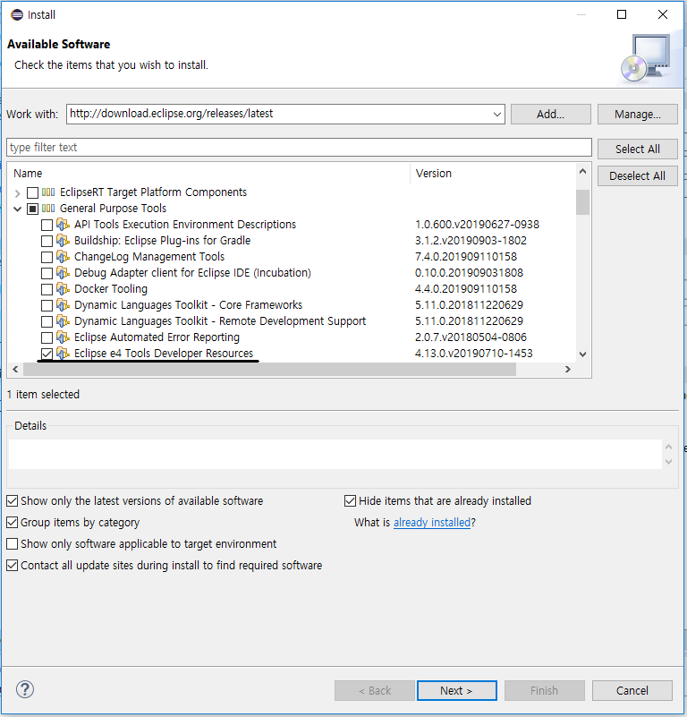
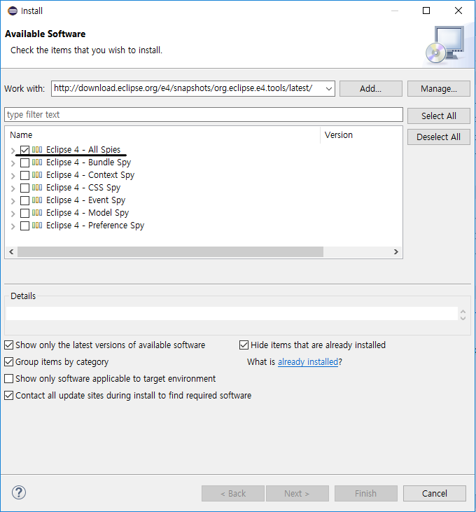
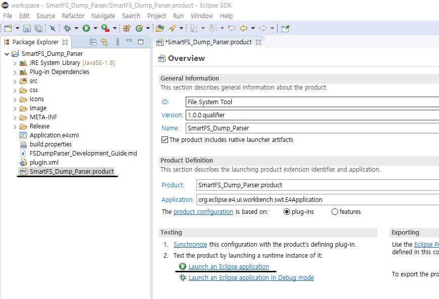

# FSDumpParser Development Guide
This tool is built on Eclipse RCP.

## Development environment setup
### 1. Download the Eclipse SDK
Download the latest release of the Eclipse SDK (Software development kit) build from the [SDK download page.](https://download.eclipse.org/eclipse/downloads/, "Eclipse SDK") Click on the link of the latest released version (the release version with the highest number).

### 2. Install Development Tools
Install the tools required for FSDumpParser development

● e4 tools - provide tools to develop Eclipse plug-ins and applications.
Use menu:[Help|Install New Software…​] and select the update site of your release.

<http://download.eclipse.org/releases/latest>

Install the tools and restart the Eclipse IDE afterwards.

***

● e4 spies - The e4 spies are helpful to analysis Eclipse plug-ins and applications. To install them, open the Eclipse update manager via Open Help  Install new software…​. You can use the following URL to install the latest tools

<http://download.eclipse.org/e4/snapshots/org.eclipse.e4.tools/latest/>

### 3. Run FSDumpParser
Run by click "Launch an Eclipse application" in "SmartFS_Dump_Parser.product"

*See the picture below

